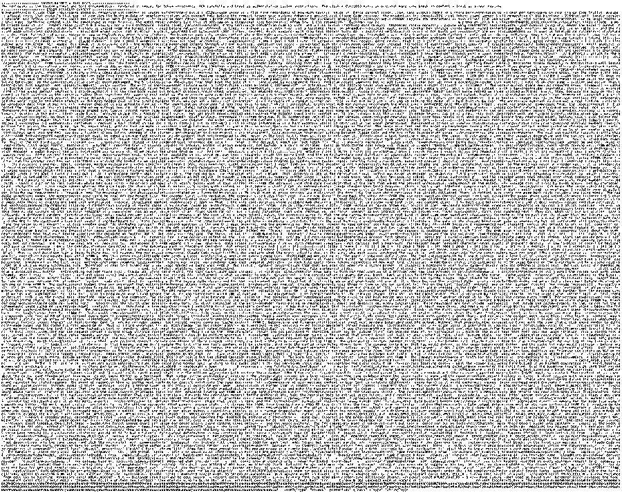
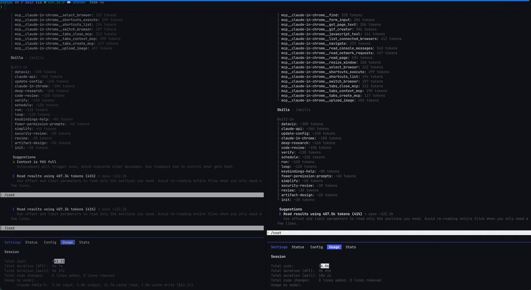

<strong style="font-size:16px;color:#1a6ba0;">要点速览</strong>

- <strong>省钱原理</strong>：图片按像素面积收固定视觉token，与装了多少文字无关。一页密集工具输出装1.5万字符也只付一张图的钱，而文本按字符计费。  
- <strong>实测省账</strong>：1.3万次生产请求快照端到端账单降59%（约100美元→41美元），更密集的trace接近70%。  
- <strong>致命弱点</strong>：模型按"大意"读图，决策、路径、名字能保住，但精确字符串（哈希、ID、随机hex）会静默出错，且下游无人报错。  
- <strong>安全边界</strong>：代理只把静态提示块和较早的折叠历史转成图片，最近的对话轮次和精确内容一律留作文本。

---

## 一个本地代理，把账单砍了六成

pxpipe是一个本地代理，在请求到达模型之前，把请求里臃肿的部分（系统提示、工具文档、较早的历史记录）渲染成PNG图片，从而削减Claude Code的输入token。在一个13,709次请求的生产快照中，它把端到端的账单砍掉了59%，从大约100美元降到41美元。后来一份更密集的trace测出的数字更接近70%。它运行在Claude背后，只需两行命令，并且能正常流式返回响应，因为它只压缩请求，不压缩输出。

## 省钱的来源是一个定价怪癖

一张图片按像素面积收取固定数量的视觉token，所以一页装150个字符和一页装15,000个字符收费相同；而文本是按字符计费的。这意味着你可以把一整面密集的工具输出塞到一页上，付一个固定的图片费率，而不是按字符付费。

图1：模型拿到的东西替代了文本。大约48k字符的系统提示和工具文档，原本大约要跑25k文本token，被渲染成单页，只需按约2.7k图片token计费。

图1：系统提示与工具文档渲染成单页，计费从约25k文本token降到约2.7k图片token

## 两行命令装上，一道门槛决定转不转图

安装只需两条命令：先启动代理，再把Claude Code指向它。

代理会拦截 `/v1/messages`，并在决定是否把某个臃肿块转成图片之前，先让它过一道"盈利能力门槛"。这道门槛很关键，因为只有当内容密集时这笔交易才划算。Claude Code的流量大约是每token 1.9个字符，而pxpipe的密集渲染大约每图片token装3.1个字符，所以图片以大约3倍的优势胜出。英文散文接近每token 3.5个字符，在这种情形下用图片反而亏钱，所以散文保持为文本。最近的对话轮次也保持为文本。只有静态提示块和较早的折叠历史会被转成图片。

## 为什么"大意"能保住，精确字符串却不行

视觉编码器不是逐字逐句读页面的。它会对图片里装的内容建立一个粗略的摘要：这里有个代码块，那里有一些看起来像hex的token，模型就照着这个摘要工作。决策、数值、路径、名字这些足够有特征的东西能在这次处理中存活下来，但一个随机的12字符hex字符串不行，所以它会被丢掉。

维护者用一个A/B测试框架测量了这条线的两边：在合成会话里埋入事实，然后用精确字符串匹配来打分，不用模型当裁判。

| | 保留为文本 | 转成图片 |
|------|------|------|
| 大意：决策、数值、文件路径、名字、改了什么（98 次尝试） | 98 / 98 | 98 / 98 |
| 逐字的 12 字符 hex 字符串（15 次尝试） | 15 / 15 | 13 / 15 |
| 同一个 hex 字符串，在 Opus 4.8 上（15 次尝试） | 15 / 15 | 0 / 15 |

表1：即使你往里丢干扰项，大意也能存活。精确字符串才是它滑倒的地方，而这也是可怕之处，因为它不会报错，只是递给你一个看起来对的错误hex。

表1：召回测试（Fable 5），精确字符串在转图后静默出错

那些漏掉的案例值得警惕。你很容易发现一个空白，但你没法发现一个自信的错误hex，而且下游没有任何东西会替你标记它。在数周的真实使用中发生过一次：模型从被转成图片的历史里提取一个人的名字，并说出了错误的那个，没有任何迹象表明它不确信。编码会话大多能吸收这种错误，因为Agent在编辑之前会重新读取文件并抓住自己的失误，而单纯的回忆没有这种兜底。这就是为什么门槛会把大量历史保留为图片，而把所有精确的东西（如ID、哈希、数字）保留为文本。

## bug还会被修好吗

通过召回测试并不意味着实际工作仍然能被完成，所以两个SWE-bench试点专门检查了这一点。在SWE-bench Lite上，两个版本都解决了10个中的10个，而转成图片的那个跑在缩小65% 的请求上；在更难的SWE-bench Pro上，成像版本得分19个中的14个，对照不成像的19个中的15个，两者在19个结果中有18个一致。它们唯一分歧的那一个，在重新跑时3个中有3个重新解决，这说明是普通的运行间方差而不是压缩惩罚，尽管样本很小。

Opus 4.7和4.8大约误读了7% 的渲染图，所以默认的允许列表只有Fable 5和GPT 5.6，其他一切都以纯文本通过。PNG编码还会在大数据离开之前给请求增加延迟，而能让逐字节精确块自身安全的守卫机制还不存在，维护者把这列为缺失的主要一环。

图2：在同一个会话里，左边是普通Claude Code，右边是pxpipe。左边把上下文跑到了96% 满，计量表显示 $42.21。右边用 $6.06完成了完全相同的工作，还留有富余。

图2：相同任务，pxpipe（$6.06）对比普通Claude Code（$42.21）

## 这到底改变了什么

这些数字描述的是一种思考模型记忆的方式。一张图片装着旧上下文的"意思"，却丢掉了"拼写"。所以把可略读的东西放像素里：到目前为止的任务、决策、已经打开的文件；而把精确的东西（如ID和哈希）留在文本里。

大多数上下文裁剪工具让你去猜什么被丢掉了。在这里你事先就知道损失的形状。它最终在你的工作负载上是否划算，取决于你的流量有多密集，以及你的Agent在行动前重新读取的频率有多高。事件日志让你对照自己的账单去核查，而不是盲目相信那个60%。

## 在一个真实会话里试一下

要把它跑在你自己的数字上，只需三步：把Claude Code指向代理，跑一个密集的编码会话；打开 `~/.pxpipe/events.jsonl`，对比免费的count_tokens反事实计数与你实际的账单；如果你的流量是密集的，这笔账已经算明白了，如果主要是散文，门槛会把它留作文本，你除了那两行尝试之外什么都没损失。

<strong style="font-size:15px;color:#8b6f4c;">结语</strong>

这个工具揭示了一个被忽视的事实：模型的"记忆"和"文本"不是一回事，图片能存意思却存不住拼写。  
静默出错比报错更危险。60% 的省钱数字只在密集流量上成立，散文流量下反而亏，盲目套用等于拿正确性换账单。  
它不是"免费午餐"，而是一道需要你亲自用事件日志核账的取舍。真正的价值在于你知道损失长什么样，而不是损失本身消失了。

---

【传送门】 
<a class="normal_text_link mp_article_text_link" href="https://mp.weixin.qq.com/s/OoHu1yeuh1gzgCfEiPvDuQ" target="_blank" data-linktype="2">RL的下一个大突破：不是优化可...</a> 
<a class="normal_text_link mp_article_text_link" href="https://mp.weixin.qq.com/s/2eWh5jZJPHsv0wi9km2nVg" target="_blank" data-linktype="2">NVIDIA TriAttention解读: KV Cache压缩...</a> 
<a class="normal_text_link mp_article_text_link" href="https://mp.weixin.qq.com/s/s0Ovn3_tnbbl9jxfAC3WLg" target="_blank" data-linktype="2">阿里Sparse Attention on CXL替代RDMA做K...</a> 
<a class="normal_text_link mp_article_text_link" href="https://mp.weixin.qq.com/s/3btXHAVd8_x5CM5CWETc2g" target="_blank" data-linktype="2">Agent卷向AI Infra: SGLang团队用硬核A...</a> 
<a class="normal_text_link mp_article_text_link" href="https://mp.weixin.qq.com/s/nVqW9acA7NN1zeALDwRAsw" target="_blank" data-linktype="2">Google新论文RubricEM: 评分标准引导...</a> 
<a class="normal_text_link mp_article_text_link" href="https://mp.weixin.qq.com/s/OqtF6ZaWQNu3o-VAWLfqbg" target="_blank" data-linktype="2">榨干GPU性能：流水线解码消除GPU...</a> 
<a class="normal_text_link mp_article_text_link" href="https://mp.weixin.qq.com/s/HnGKVp45C-GApBJ-LleP6g" target="_blank" data-linktype="2">小米MiMo罗福莉:8卡GPU让1T参数模...</a> 
<a class="normal_text_link mp_article_text_link" href="https://mp.weixin.qq.com/s/FTsibdpbEjvoPWtxGqgxkQ" target="_blank" data-linktype="2">小米MiMo罗福莉后训练新范式MOPD: ...</a> 
<a class="normal_text_link mp_article_text_link" href="https://mp.weixin.qq.com/s/mjBLO4O4fHUFNk4DfR9Y-g" target="_blank" data-linktype="2">Anthropic/Claude多Agent协同五种模式...</a> 
<a class="normal_text_link mp_article_text_link" href="https://mp.weixin.qq.com/s/aiJs5CC8Gb6qa_xDRNEjTA" target="_blank" data-linktype="2">Dynamic Subagents：用代码编排Agents...</a> 
<a class="normal_text_link mp_article_text_link" href="https://mp.weixin.qq.com/s/6uimwhjj_HlWTOB4m2FNrQ" target="_blank" data-linktype="2">Hermes Agent大师之路</a> 

---

参考：https://x.com/AlphaSignalAI/status/2074496013675696300
