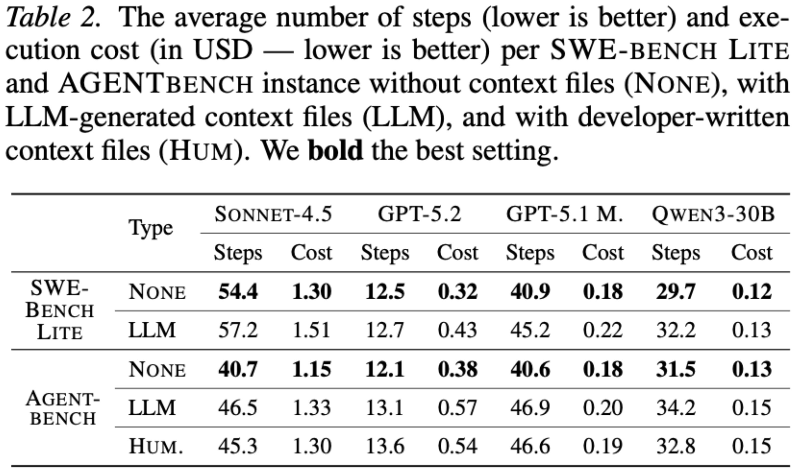

AGENTS.md 文件真的有用吗？这篇论文的结论可能会让你意外

最近一篇题为 "Evaluating AGENTS.md: Are Repository-Level Context Files Helpful for Coding Agents?" 的论文，系统评估了仓库级上下文文件对编码 Agent 的实际影响。

论文在两个设定下做了评估。首先在 SWE-bench Lite 上，作者生成上下文文件（因为原始仓库没有开发者写的）。其次，他们引入了一个新基准 **AGENTBENCH**，包含来自 12 个仓库的 138 个 Python 任务——这些仓库已经有开发者提供的上下文文件。Agent 在三种条件下被评估：无上下文文件、LLM 生成的上下文文件、以及开发者编写的上下文文件。

Figure 1：论文主实验结果

从上图结果来看，相比不用上下文文件，LLM 生成的上下文文件要么略微降低了任务成功率，要么平均没什么差别。这可能有点意外但也不完全意外——猜测 LLM/Agent Harness 在执行时已经即时生成了所需的上下文信息。上下文文件更多是提升独立会话之间的效率。

另一方面，开发者编写的上下文文件明显优于 LLM 生成的——这或许在意料之中，因为领域知识就在其中。

但真正让人惊讶的是：**在基准测试中，不使用上下文文件反而更便宜、更高效！**

Figure 2：效率对比结果

不使用上下文文件反而效率更高，这个结果乍看令人费解。起初猜测是 Harness 在处理冗余信息（即它们读了上下文文件，但不管怎样还是会像没读一样从代码仓库里解析额外信息）。

研究人员做了 trace 分析，结果显示 Agent 确实遵循了上下文文件中的指令，但它们在提到这些工具和步骤时会运行更多测试、搜索更多文件、读取更多文件、使用更多仓库特定工具。所以负面或微弱的性能影响似乎并非来自 Agent 忽略这些文件。更可能的解释是：上下文文件常常增加了额外的需求和探索步骤，让任务变得更难或更全面——但如 Figure 11 所示，这并不一定会带来更好的成功率。

个人观点是：仓库级上下文文件应该保持更短、更具体，理想情况下应该是分层的（例如"如果你要做 x，先检查这个其他上下文文件 y.md，否则忽略它"）。

当然，这里的问题是论文使用的 LLM 和 Harness 现在来看已经有点过时了，用最新的 Harness 和 LLM 重做这项研究会很有意思。

---

**一点观察**

这篇论文揭示了一个被很多人忽略的直觉陷阱：给 Agent 越多指令，它的探索行为就越发散——不是因为它不听话，恰恰是因为它太听话了。上下文文件里的 every 额外步骤、every 提及的工具都被 Agent 认真执行，结果就是做了大量"正确但无用"的工作。

这个现象在软件工程中其实有对应——规范的边际收益递减。当 AGENTS.md 从 10 行增长到 200 行，每增加一句指导，Agent 消耗的 tokens 和步骤数都在增长，但对最终结果的改善越来越弱。论文真正的价值可能不是"AGENTS.md 有没有用"，而是帮我们画出了上下文文件复杂度的上限。

---
参考：Do AGENTS.md Files Actually Help Coding Agents? arxiv.org/abs/2602.11988
