<div style="background:#e8f4fd;padding:14px 16px 10px 16px;border-radius:6px;margin-bottom:18px;">
<div style="text-align:center;margin-bottom:10px;">
<strong style="font-size:16px;color:#1a6ba0;">要点速览</strong>
</div>
<div style="font-size:14px;color:#3f3f3f;line-height:1.75;">
- <strong>规模与效率</strong>：prime-rl 0.6.0 在仅 28 个 H200 节点上，以最高 131k 序列长度、低于 5 分钟的步长时间、256 个 rollout 的批大小，在 SWE 任务上训练 GLM-5 这类万亿参数 MoE 模型。<br><br>
- <strong>异步 RL 是核心</strong>：训练器与推理分离，推理策略在优化器步一完成就更新，避免长尾 rollout 拖垮 GPU 利用率。<br><br>
- <strong>推理侧三大杠杆</strong>：Wide EP（宽专家并行）、P/D 分离（预填充与解码解耦）、Router Replay（R3 把训练器与推理的 KL 失配降一个数量级）。<br><br>
- <strong>训练侧三维并行</strong>：FSDP + EP + CP 组合，配合自定义 DSA 上下文并行和块缩放 FP8，把 trainer↔inference 的精度失配压到最低。
</div>
</div>

---

prime-rl 0.6.0 发布，目标只有一个：用最高的效率在万亿参数模型上跑繁重的智能体 RL 后训练。Prime Intellect 团队把整套 RL 基础设施从推理到训练重做了一遍，核心成果是：**仅 28 个 H200 节点，就能在 SWE 任务上以最高 131k 序列长度、低于 5 分钟的步长时间、256 个 rollout 的批大小训练 GLM-5**。

这篇博客把带来这个结果的每一项优化拆开讲：从低精度推理和训练，到 prefill 与 decode 分离的推理部署。下文以 zai-org/GLM-5.1 为示例模型，但所有优化都适用于任何大型 MoE 模型，比如 moonshotai/Kimi-K2.7-Code、nvidia/NVIDIA-Nemotron-3-Ultra-550B-A55B-BF16 等。

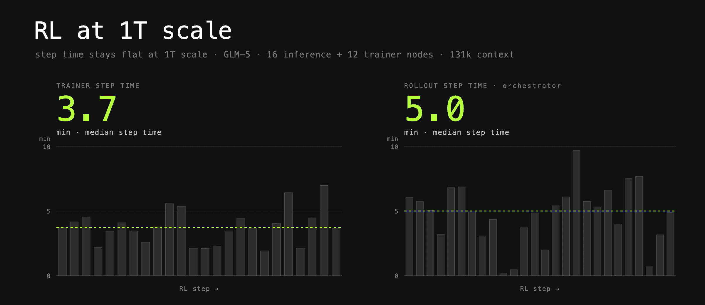
<span style="font-size:12px;color:rgb(153,153,153);">GLM-5 在 SWE 任务上的训练表现：131k 序列长度、低于 5 分钟步时间、256 rollout 批大小，仅用 28 个 H200 节点</span>

在 Slurm 集群上，整条训练只需一条命令：

```
uv run rl @ examples/glm5_llmd/rl.toml --output-dir /shared/outputs/glm5-llmd
```

## 从第一性原理出发的智能体 RL

prime-rl 从底层构建，专为高效的智能体后训练而生，并彻底拥抱异步 RL。智能体任务常有长尾离群值，某些 rollout 会拖上几个小时，尤其是长程编码任务。**如果在等这些 rollout 跑完才更新策略，GPU 利用率会坍塌，训练性能直接受损。**

异步 RL 的做法是：训练器上的优化器步一完成，就立刻更新推理策略。训练器和推理彼此分离，可以独立优化。

两者之间有一个绕不开的同步点：策略更新。每次优化器步进后，rollout 策略都用新权重刷新。prime-rl 的策略是权重一可用就更新。为了不拖慢推理，已经分发出去的 rollout 不会重置它的活跃前缀缓存：这些 rollout 的 token 由多个版本的策略生成，KV 缓存也混着多个版本。新 rollout 即使和旧的前缀相同，也会重新填充自己的 KV 缓存，这靠一个 KV 缓存 salt 强制实现。最后，**如果某个请求是由太旧的策略生成的，直接丢弃**，阈值由 `max_off_policy_steps` 控制。

这带来一个系统级的难题：怎么在保持训练器和推理兼容的前提下，把两个系统都优化到极致。下面分别解剖推理和训练两侧。

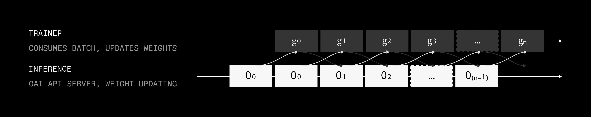
<span style="font-size:12px;color:rgb(153,153,153);">异步 RL 架构：训练器与推理分离，权重在优化器步完成后即时推送</span>

## 推理

推理是 RL 训练生命周期的关键环节，模型在这里与环境交互、产出 rollout、再被评分赋奖励。部分能力推理框架已经有了，其余的 Prime Intellect 与 vLLM、Dynamo 等框架深度合作，目标只有一个：**给社区交付经过验证、开箱即用的高性能推理配方。**

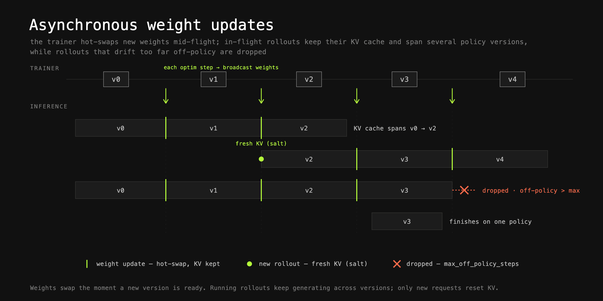
<span style="font-size:12px;color:rgb(153,153,153);">推理侧权重即时更新示意</span>

## FP8 推理

推理吞吐通常是整个 RL 系统的瓶颈，而 prefill 和 decode 两侧都能从更低精度显著受益。prime-rl 大量使用 FP8 推理，配合 DeepEP 和 DeepGEMM 的优化内核，换来更低的延迟和更高的吞吐。

## Wide Expert Parallelism（宽专家并行）

很多推理性能文章把焦点放在压低延迟、提升用户交互感上，但 RL 不一样：**主要目标是最大化吞吐，同时把延迟框在一个有界的范围内。**

最佳配置之一是 Wide EP：大规模专家并行，常常跨 ≥32 个 GPU。为了把吞吐拉满，再叠一个大的数据并行 rank（比如 32），组成一大片 GPU，每个持有一份独立专家、各自作为一个独立端点服务。同步按层发生，分别在 dispatch 和 combine 操作中完成。

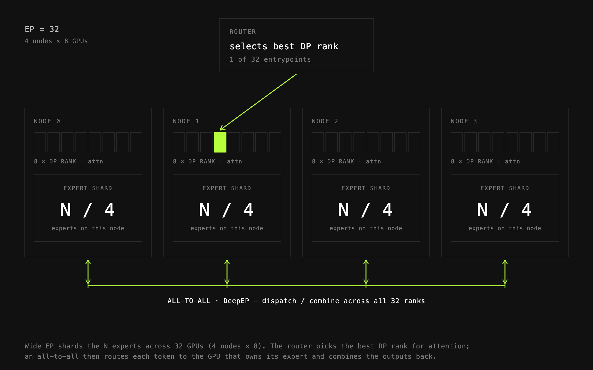
<span style="font-size:12px;color:rgb(153,153,153);">Wide EP 配置示意：大规模专家并行叠加大数据并行 rank</span>

## Prefill 和 Decode 分离

Prefill 吞吐是智能体 rollout 的一大瓶颈：某些模型↔环境组合下，prefill:decode 的 token 比高达 4:1。让同一批推理 worker 同时服务 prefill 和 decode，会抬高端到端延迟，直接削弱 PipelineRL 的收益。

**RL 的优先级是吞吐而非延迟。** 但如果批次被 prefill 请求主导、延迟被打爆，就会观察到已完成的 rollout「成团聚集」，训练器和推理步骤重叠度骤降。

prime-rl 让你无缝启用 P/D 分离。prefill 和 decode worker 拆开之后，冗长的 prefill 请求（比如超长的工具输出）不会再去节流 decode worker，后者得以在可预测的延迟下推进。模型轮次更快结束，工具调用更快进沙箱执行，循环往复，有时能跨数百个轮次。

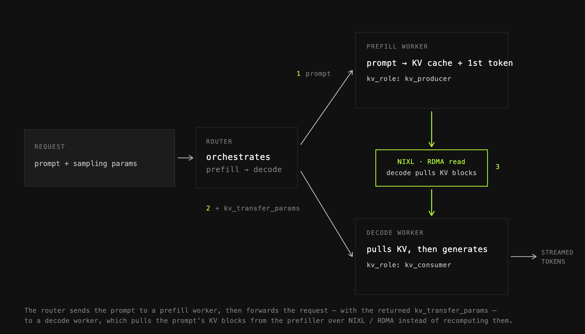
<span style="font-size:12px;color:rgb(153,153,153);">Prefill/Decode 分离部署：长 prefill 不再阻塞 decode worker</span>

## KV 缓存管理

最大化吞吐需要高并发，高并发又需要大量 KV 缓存空间。空间不够就会 KV 缓存抖动、前缀缓存命中率掉，吞吐跟着垮。prime-rl 紧跟推理框架的新特性，端到端支持 KV 缓存卸载。

它支持把 KV 缓存分层卸载到 CPU 和磁盘，同时兼容 vLLM 原生卸载和 Mooncake。缓存空间越大，并发度越高，训练器的成本就被摊得越薄。两者的主要差异：

- **vLLM 原生卸载**：简单，每个 worker（DP rank）建一个独立的 CPU/磁盘池，只有这个 worker 能读。
- **Mooncake Store**：集中式存储，把所有客户端（节点）的 RAM/磁盘聚成一个大池，任何节点的任何推理 worker 都能访问，在复杂路由策略下优势明显。

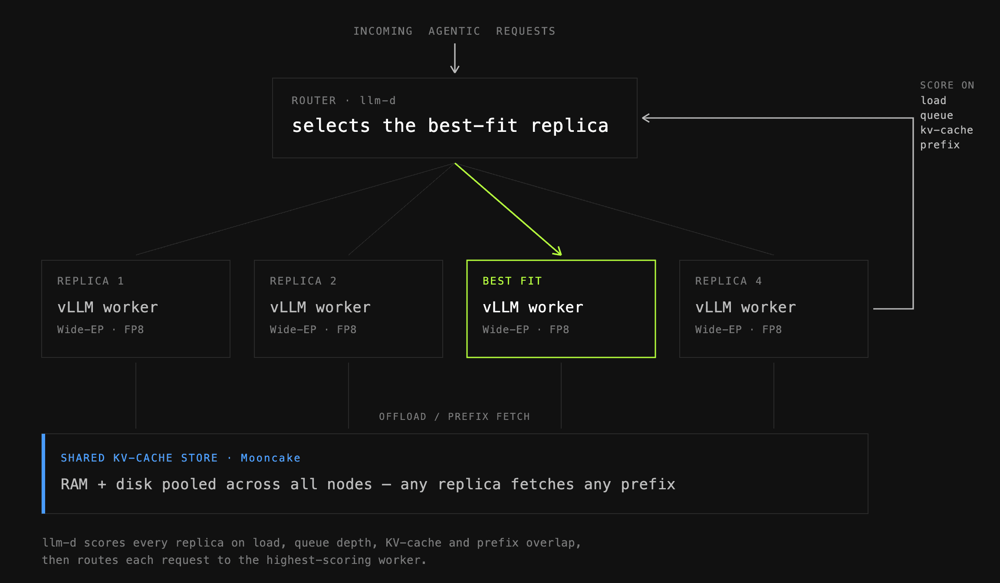
<span style="font-size:12px;color:rgb(153,153,153);">请求路由与 KV 缓存卸载协同示意</span>

## 请求路由

把整套推理串起来，需要高效的请求路由，才能实现前缀复用、负载感知路由等。

prime-rl 默认路由是我们 fork 的 vllm-router：极简、轻量，配置开销极小却性能强劲。你也可以按需求自选路由策略，针对负载均衡、KV 缓存复用或其他目标优化。

同时支持把 NVIDIA Dynamo router 作为即插即用的替代，用于更大规模、更复杂的路由策略。这些策略综合 KV 缓存复用、队列深度、KV 缓存利用率、当前负载等实时指标，给每个 worker 算一个分数再按策略挑人。配合 Mooncake Store 这个集中式卸载层，就能跨副本命中前缀缓存，同时公平分流、对实时指标做出反应。

## Router Replay（R3）

**训练器与推理的失配，会悄悄毁掉你的 RL 训练。** R3 的做法是：捕获推理时做出的路由决策，然后直接在训练器上重放。这把训练器与推理之间的 KL 失配降低了一个数量级，训练稳得多。

代价不小：大规模部署下，被路由专家的数据能冲到每秒数十 Gbps，处理压力巨大。路由专家是一个形状为 [num_layers, top_k, seq_len] 的大载荷，很快膨胀到数百 GB，连把响应转成 Python 字典这种「简单操作」都会酿成事件循环延迟和 CPU 瓶颈。prime-rl 把这个载荷当成不透明数据，只让高度优化的 PyTorch 操作去处理，CPU 压力随之卸掉。R3 与其他推理优化（包括 P/D 分离）完全兼容。

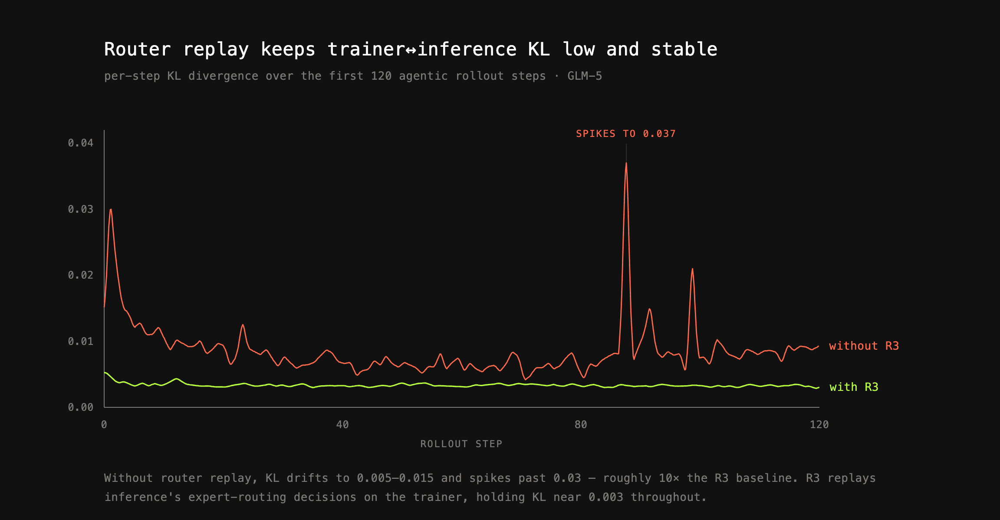
<span style="font-size:12px;color:rgb(153,153,153);">Router Replay（R3）将 trainer 与 inference 的 KL 失配降低一个数量级</span>

## 训练

训练器基于 torchtitan：一个 PyTorch 原生的、高性能大规模训练代码库。prime-rl 从 torchtitan 搬了大量代码，覆盖 FSDP、EP 等抽象，再叠加自己的调整与改进。

## 三维并行

prime-rl 主要依赖三维并行：FSDP、CP、EP。各有用例、利弊，大规模跑顺需要把它们按不同比例组合。GLM-5 这个案例里三者全用上了。

**FSDP（全分片数据并行）** 是基线分布策略。参数、梯度、优化器状态在数据并行 rank 间分片，前向反向时按需聚合。对 1T+ 参数的模型，这是摊销完整优化器状态内存占用的必需手段。prime-rl 用 PyTorch 的 fully_shard（FSDP2），方便与其他策略组合。

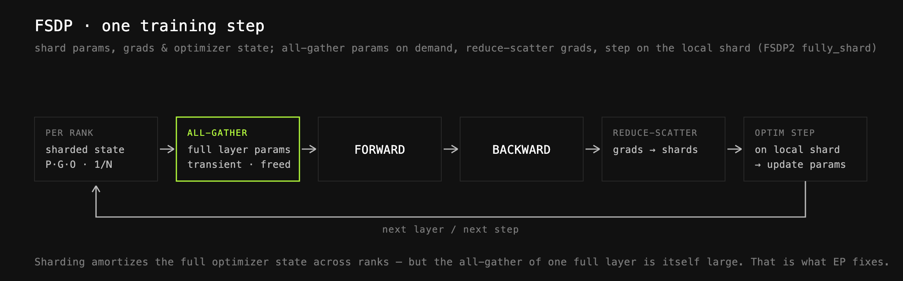
<span style="font-size:12px;color:rgb(153,153,153);">FSDP 全分片数据并行：参数/梯度/优化器状态跨 rank 分片</span>

**专家并行（EP）** 解决的是 FSDP 之后层仍装不进单卡 HBM 的问题。GLM-5 有 78 层、800B 参数、float32 主权重，单层 all-gather 大约要 (800B × 4) / 78 ≈ 40GB 缓冲，叠一层 FSDP 活动权重就要约 80GB。EP 的做法是不去 all-gather 整层，而是设一个内部 EP 度（比如 EP=8），专家不在此范围内聚合，token 改用 all2all 原语分发合并。专家是层内存的主要贡献者，所以活动内存被显著压下来。

prime-rl 支持两套 EP 配置：torch-native all2all 和 DeepEP。观察结论是，torch-native 在单节点 EP 范围（EP=8）吞吐略好，但跨节点扩展后急剧下跌，那时 DeepEP 反而快一大截。

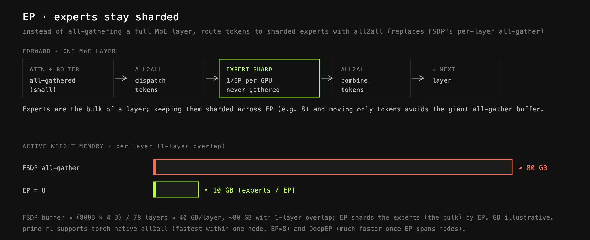
<span style="font-size:12px;color:rgb(153,153,153);">专家并行（EP）：all2all 分发/合并替代整层 all-gather</span>

**上下文并行（CP）** 针对的是 131k+ 序列长度下中间激活成为内存主权的局面。CP 在 rank 间对序列维度分片，压低每卡激活内存。prime-rl 支持两种主流用法：

- **Ring Attention**：批次在整模型前向按序列分片，到核心注意力时每个 rank 持有 Q/K/V 分片，并以环形模式处理其他 rank 的 K/V。
- **Ulysses**：同样序列分片，到注意力时 all2all 把布局从序列分片翻成头分片，在头维度算完再翻回来。对线性注意力、Mamba 等非标准注意力配合良好，是默认方式。

GLM-5 用的 DSA 两类都并行不了，于是 prime-rl 写了自定义上下文并行：保持序列分片算投影，再把 K/V 聚合（便宜，因为已投影到潜在空间），让索引器看到完整序列、算出全局稀疏索引，核心注意力只在这些索引上算。由于 DSA 的 top_k 固定，成本也可控。**整层只需一次 all-gather 集合通信，成本压到最低。**

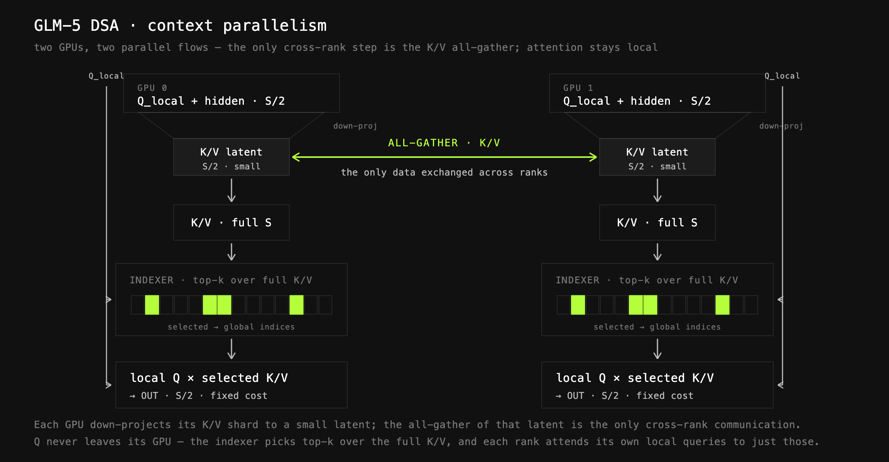
<span style="font-size:12px;color:rgb(153,153,153);">上下文并行与 GLM-5 DSA 自定义实现</span>

## GLM-5 DSA

为了高效算 DSA，prime-rl 用自定义内核（大量基于参考实现并适配需求），提供快速的前向和反向。

## FP8 训练

前面说过，trainer↔inference 失配会伤训练。这里用 DeepGEMM 内核做块缩放 FP8（即 DeepSeek V3 提出的方案）。**和流行观点相反，它其实没怎么提升吞吐（量化开销抵消了收益，特定配置除外），但显著降低了 trainer 与 inference 的 KL 失配**，因为两边现在用同一精度、有时甚至是同一内核，训练因此更稳。

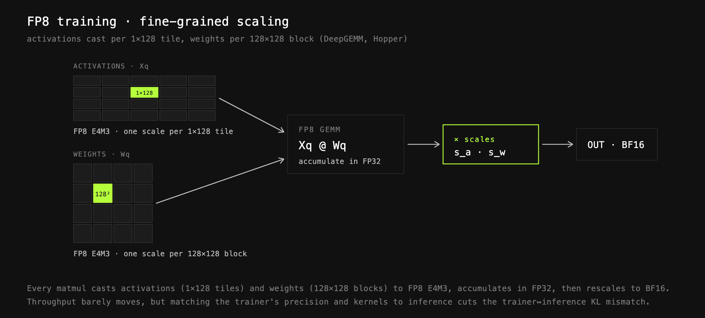
<span style="font-size:12px;color:rgb(153,153,153);">块缩放 FP8 训练：精度对齐推理，稳定训练</span>

## 未来工作

Prime Intellect 还在继续抠 RL 引擎的性能，和 vLLM、Dynamo、llm-d 合作加速推理端，和 PyTorch 合作做极速训练器，探索推测解码、NVFP4 训练与推理、容错、弹性扩展，以及巨型模型 trainer↔inference 权重传输低于 1 秒等方向。

<div style="background:#f5f0eb;padding:14px 16px 10px 16px;border-radius:6px;margin-bottom:16px;">
<div style="text-align:center;margin-bottom:8px;">
<strong style="font-size:15px;color:#8b6f4c;">结语</strong>
</div>
<div style="font-size:14px;color:#3f3f3f;line-height:1.75;">
万亿参数智能体 RL 的战场，已经从「能不能训」转向「每个 GPU 小时能榨出多少有效 rollout」。prime-rl 这版最有价值的不是某个单点黑科技，而是把异步 RL、P/D 分离、Wide EP、R3、三维并行和 FP8 精度对齐串成了一条连贯的工程链。<br><br>
把 trainer 和 inference 的精度对齐（FP8 块缩放）放在「提速」之前，是这次设计里反直觉但关键的一笔：吞吐没涨，训练稳定性却上一个台阶，说明在超大 MoE 上，失配带来的隐性代价被严重低估了。<br><br>
R3（Router Replay）把 KL 失配降一个数量级的思路值得整个 RL 社区借鉴：与其在算法层硬扛 off-policy 偏差，不如在系统层把推理时的路由决策原样重放到训练器。
</div>
</div>

---

<span style="font-size:12px;color:#888888;font-family:'Courier New',monospace;">参考：https://www.primeintellect.ai/blog/rl-at-1t-scale</span>
