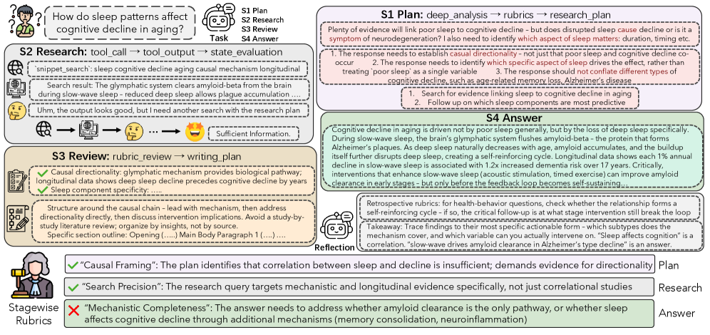
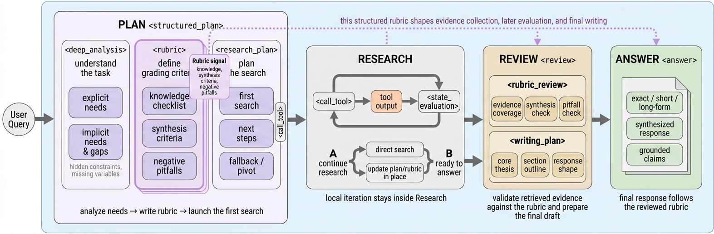
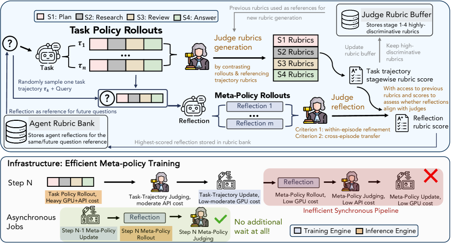
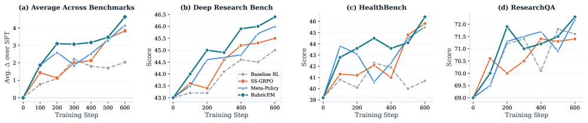
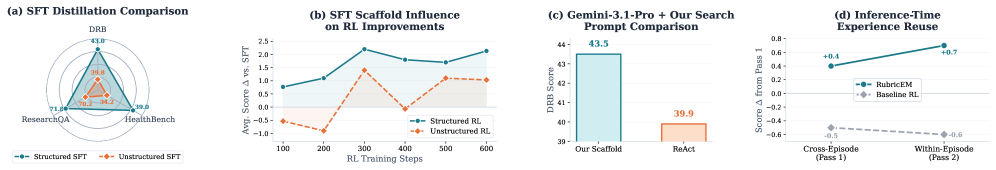

<strong style="font-size:16px;color:#1a6ba0;">要点速览</strong>

- <strong>评分标准（Rubric）不是评判工具，而是全过程共享接口</strong>：Google Cloud AI Research与UIUC联合提出RubricEM，将评分标准从"最终答案打分器"提升为贯穿规划、搜索、审查、综合四阶段的共享接口，让Agent的每一步都知道"什么做对了"  

- <strong>三管齐下的训练方案</strong>：结构化推理框架（Plan→Research→Review→Answer四阶段）+ SS-GRPO（阶段级信用分配）+ 反思元策略（将每次试错的判断结果蒸馏为可复用记忆），三者互补，无需任何可验证奖励  

- <strong>8B模型1400步RL逼近专有系统</strong>：RubricEM-8B在四个长篇研究基准上平均分55.5，超越DR Tulu-8B（1900步RL达到53.6），接近OpenAI Deep Research（59.9）和Gemini 3.1 Pro + Search（53.9）

---

## 问题：如何训练深度研究Agent

深度研究Agent：能够自主规划、搜索、评估证据并撰写长篇报告的AI系统：正在成为AI能力的关键前沿。Gemini和OpenAI的Deep Research展示了令人印象深刻的能力，但它们的训练方法几乎完全不公开。

为什么训练这样的系统如此困难？三个核心瓶颈：

首先，**输出缺乏标准答案**。一篇研究性报告的"质量"是主观的、多维度的：它在多大程度上回答了用户的问题？引用的来源是否权威？推理是否严谨？这些问题无法用"答案正确"或"答案错误"来评判。

其次，**轨迹太长**。深度研究Agent的rollout可能涉及数十甚至上百次工具调用和推理步骤，终端奖励信号穿过多层决策后已经极度稀释：Agent很难知道到底是哪一步搜索、哪一步推理导致了最终的好坏结果。

第三，**经验无法复用**。传统的RL后训练只是将评判过的尝试转换为参数更新，不会产生明确的、可复用的文本指导。同一个错误的搜索策略下一条query还会再犯。

Google Cloud AI Research与UIUC合作的这篇论文RubricEM，提出了一套完整的解决方案。

RubricEM的训练流程概览：评分标准引导的轨迹分解、阶段结构化GRPO的信用分配、以及反思元策略的异步训练。三种机制共用评分标准作为核心接口。

## 核心洞察：评分标准不应只是打分工具

论文的核心视角清晰：评分标准（rubric）不应只是裁判在最终答案上打分的工具，而应成为**贯穿强化学习全过程的共享接口**。

具体来说，同一个评分标准框架同时扮演三个角色：规划时告诉Agent "应该找什么样的证据"、裁判评判时作为打分基准、反思时作为经验总结的结构化模板。

这个思想的灵感来源于期望最大化（EM）算法：任务的结构（什么重要、信用在哪里、应该记住什么）通过评分标准来"估计"，策略则在评分标准约束下"最大化"。

> 如果说标准RL是"做完了再评判行不行"，RubricEM的做法是"先定好标准再做事、边做边对照标准、做完后把标准升级"：评分标准贯穿流程并持续演化。

## 组件一：结构化推理框架

RubricEM为Agent的推理过程施加了明确的阶段结构，将扁平的长程rollout划分为四个语义阶段：

**Plan阶段：** Agent分析用户显性和隐性需求，生成任务特定的评分标准（信息收集清单、分析性标准、负面约束），然后提出具体的研究计划。

**Research阶段：** 迭代搜索。每次工具调用后执行状态评估：对比累积证据与评分标准和计划，决定是否需要继续搜索，必要时原地修订计划。

**Review阶段：** 将收集的证据逐个映射回评分标准的知识清单，确认覆盖全面性，然后产出撰写大纲。

**Answer阶段：** 按照大纲和评分标准综合最终报告，带引文支撑。

论文给出了一个严谨的理论证明（定理1）：当同一局部上下文在不同阶段需要不同的最优行动时，阶段感知策略的价值严格高于扁平策略。这对应了深度研究中的实际情况："这是一篇学术论文中的关键数据，应该纳入搜索"vs"搜索已经够了，现在应该写报告了"：同样的搜索片段在不同阶段意味着完全不同的下一步行动。

RubricEM的阶段化推理框架。评分标准在Plan阶段生成，贯穿Research、Review和Answer全流程，形成稳定的高层决策结构。

### 阶段蒸馏

如何让8B模型学会这种结构化推理？论文采用了教师蒸馏（教师为Gemini-3.1-Pro），拒绝采样剔除不符合阶段边界、工具语法、引文规范和事实约束的低质量输出。SFT语料教会Qwen3-8B的不只是工具使用和引文格式，更重要的是"阶段纪律"和"评分标准约束"。

## 组件二：阶段结构GRPO（SS-GRPO）

这是RubricEM信用分配的核心机制。

传统GRPO（Group Relative Policy Optimization）对所有令牌广播相同的终端奖励。SS-GRPO改变这一点：将每个rollout按阶段切分，裁判为每个阶段分别打分，然后通过**因果阶段依赖矩阵**组合各阶段得分。

具体来说，阶段k的累积回报 = 阶段k自身得分 + λ×阶段 (k+1) 得分 + ...，其中 λ 控制下游阶段对上游阶段的信用传导。这确保了早期阶段（如Plan）不仅获得规划质量的评分，还能分享到好规划带来的下游红利。

裁判侧同样采用了"阶段演化评分标准"：每个阶段维护独立的评分标准缓冲区，复用此前高区分度的标准，移除不再能区分轨迹质量的条目。这实际上是**裁判侧的持续学习**，与策略的共同演化。

SS-GRPO的信用分配示意。与传统GRPO的单一终端奖励不同，SS-GRPO为Plan、Research、Review、Answer四个阶段分别提供密集的语义反馈。

## 组件三：反思元策略

这是RubricEM最独特的贡献：不是仅在参数空间里学习，而是在**文本空间**里学习。

每次Task rollout被评判后，共享骨干网络基于query和原始轨迹采样多个"反思"候选，然后用一个特权LLM裁判对这些候选打分（是否对同轮次优化和跨轮次迁移有用）。最高分的反思被写入Agent评分标准库，作为自然语言记忆。

这带来了两个好处：

1. **参数更新 + 文本更新**：同一个rollout既通过SS-GRPO更新策略参数（改"肌肉记忆"），又通过反思更新评分标准库（改"知识储备"）

2. **异步非阻塞**：反思分支滞后一步执行，不阻塞任务rollout。先跑任务rollout，再异步生成反思和评判。论文特别指出这是对以往Meta-RL工作中"rollout-反思-更新"同步瓶颈的重要改进

在推理阶段，评分标准库以两种模式工作：同轮次优化（同一query多次尝试时引用自己之前的反思）和跨轮次迁移（引用类似问题过去的反思）。

训练中采用"两次遭遇"课程：每个query先靠跨轮次检索求解，后期再用自己的反思重放。

## 实验结果

RubricEM-8B在四个长篇研究基准上的表现：

600步RL预算下的消融结果。SS-GRPO和Meta-Policy各自提供独立增益，全量方案最优。

| 模型 | HealthBench | ResearchQA | DRB | ResearchRubrics | 平均 |

|------|:-:|:-:|:-:|:-:|:-:|

| OpenAI Deep Research | 53.8 | 79.2 | 50.7 | 59.7 | 59.9 |

| Gemini 3.1 Pro + Search | 47.5 | 74.5 | 44.4 | 49.1 | 53.9 |

| **RubricEM-8B (RL, 1400 steps)** | **49.3** | **74.5** | **47.8** | **50.3** | **55.5** |

| DR Tulu-8B (RL, 1900 steps) | 50.2 | 74.3 | 43.4 | 46.4 | 53.6 |

| Tongyi DeepResearch-30B-A3B | 46.2 | 66.7 | 40.6 | 49.5 | 50.8 |

几个关键洞察：

**SS-GRPO与Meta-Policy提供互补增益**。在600步RL消融中，SS-GRPO单独提升约2-3分，Meta-Policy单独提升约2-3分，两者结合得5+ 分：不是叠加而是互补。**结构化框架是RL有效的先决条件**。去掉结构化框架的SFT检查点，600步RL后增益极小且不稳定。框架本身也提升了蒸馏质量和推理性能。

**知识迁移到短格式任务**。虽然只训练长格式数据，RubricEM在四个短格式搜索基准上的迁移表现远超基线（SFT平均67.8 vs DR Tulu-SFT的44.8，RL后进一步到73.5）。这说明RL教会了可迁移的工具使用和证据归因技能。

## 局限与启示

论文坦诚讨论了几个局限：目前只在Gemini-flash搜索后端上验证（未用真实网页搜索）、教师模型受限、以及反思质量的反馈信号本身由LLM裁判产生：如果裁判产生误导性打分，反思训练可能朝着错误方向演化。Agent-裁判共同演化中的共识漂移是一个需要进一步研究的问题。

但RubricEM提供了一个重要的方法论方向：**为开放性长程任务设计RL算法，关键在于显式暴露任务的结构、向该结构分配信用、并将评判经验转化为可复用的文本知识。**

结构化框架和推理时经验复用的消融实验。结构化框架同时提升蒸馏质量和RL效果，反思元策略在推理时提供额外增益。

<strong style="font-size:15px;color:#8b6f4c;">结语</strong>

---

【传送门】 
<a class="normal_text_link mp_article_text_link" href="https://mp.weixin.qq.com/s/6GuYxpX2yGov3IdtZuDTKg" target="_blank" data-linktype="2">多模型编排超过Claude Opus 4.8、GPT 5.5，媲美Fable 5: Sakana ...</a> 
<a class="normal_text_link mp_article_text_link" href="https://mp.weixin.qq.com/s/aiJs5CC8Gb6qa_xDRNEjTA" target="_blank" data-linktype="2">Dynamic Subagents：用代码编排Agents，告别逐轮工具调用</a> 
<a class="normal_text_link mp_article_text_link" href="https://mp.weixin.qq.com/s/zXF5pNopJ1s9QNFg98QIWg" target="_blank" data-linktype="2">【Agent for AI Infra二】Stanford合成数据+多Agent进化+RL生成A...</a> 
<a class="normal_text_link mp_article_text_link" href="https://mp.weixin.qq.com/s/qcIFzXsBalSGpca5fzJKxg" target="_blank" data-linktype="2">Claude Code动态Workflow Vs. SubAgent Vs. Skill</a> 
<a class="normal_text_link mp_article_text_link" href="https://mp.weixin.qq.com/s/4Iz5SjE4D240EL4MmKrWZQ" target="_blank" data-linktype="2">OpenAI Dreaming记忆系统：从记住你到理解你</a> 
<a class="normal_text_link mp_article_text_link" href="https://mp.weixin.qq.com/s/0zKdjRmWg3TbL5Y3HGO3fA" target="_blank" data-linktype="2">从P/D分离到A/F分离：从学术原型变成行业标准</a> 
<a class="normal_text_link mp_article_text_link" href="https://mp.weixin.qq.com/s/0dQ7pBJ0NmFt-bOwUCQ5ew" target="_blank" data-linktype="2">Torch解析系列二：Dynamo字节码级的计算图捕获</a> 
<a class="normal_text_link mp_article_text_link" href="https://mp.weixin.qq.com/s/oDZJbvskv_ocNgPUH1DHVA" target="_blank" data-linktype="2">AI暗输出：为何AI价值在GDP统计中失效了</a> 

---

参考：https://arxiv.org/html/2605.10899v1