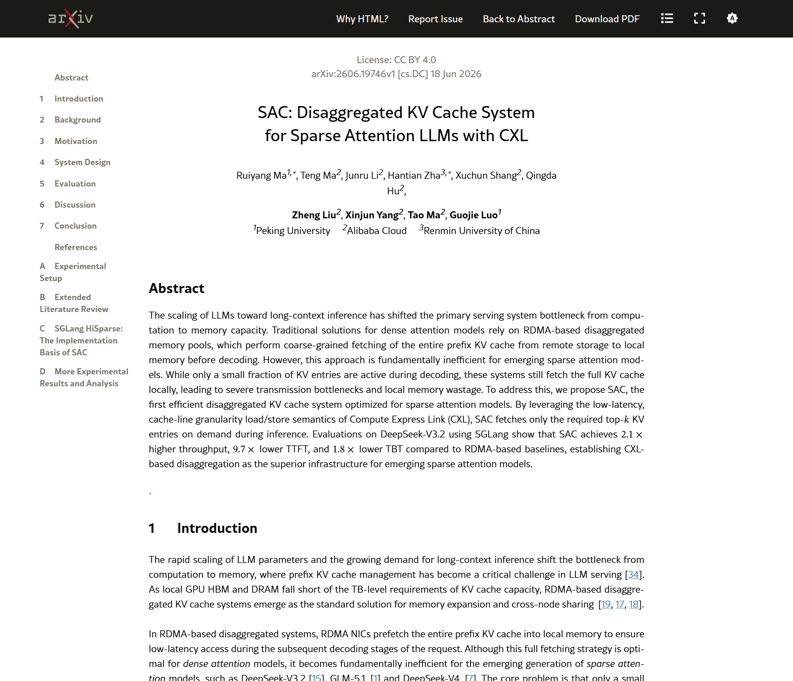
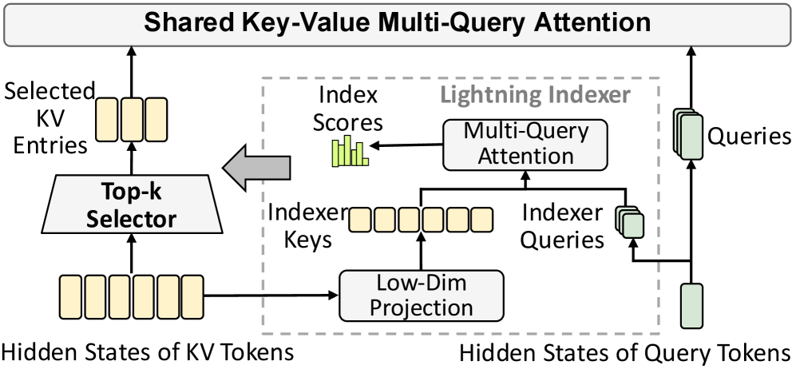
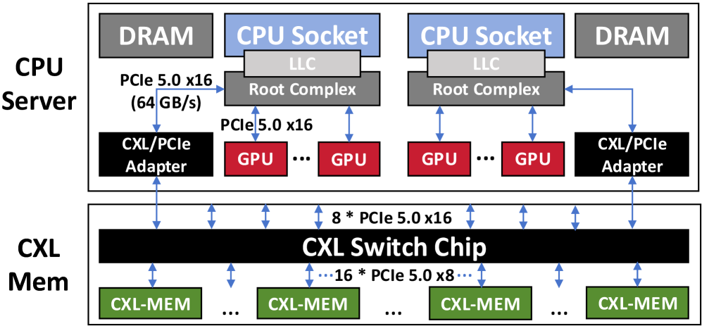
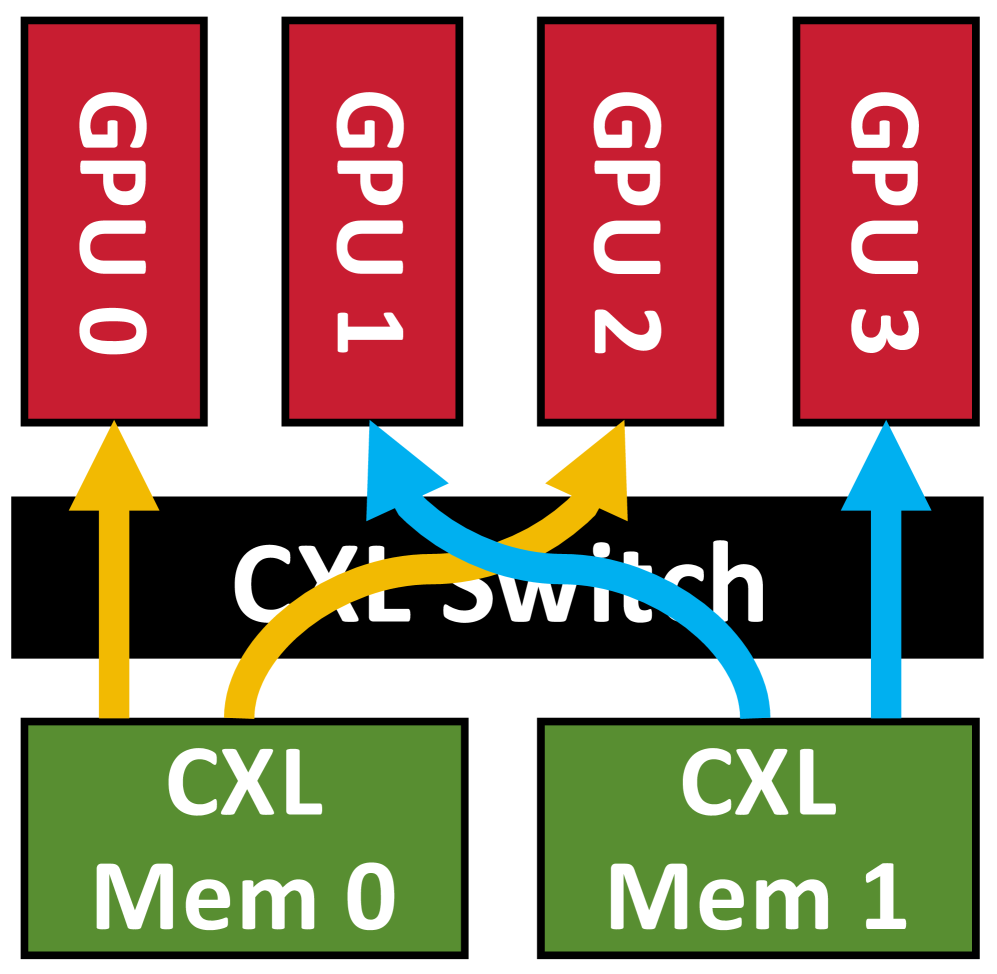
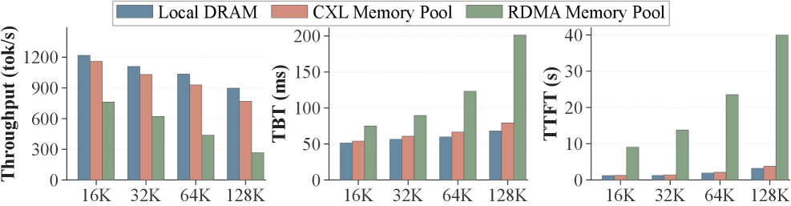
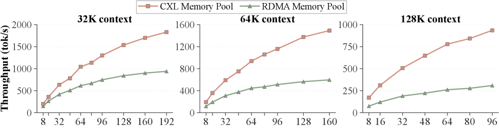

<strong style="font-size:16px;color:#1a6ba0;">要点速览</strong>

- <strong>CXL替代RDMA做KV cache解耦</strong>：稀疏注意力模型（如DeepSeek-V3.2）解码时只活跃少数KV条目，但RDMA仍全量预取全部KV cache，浪费带宽和内存  
- <strong>CXL的独特优势</strong>：近DRAM延迟（1.04-1.64× DRAM）+ cache-line粒度load/store语义，天然适合按需取top-k KV条目  
- <strong>性能数据</strong>：相比RDMA解耦池，SAC实现2.1× 更高吞吐、9.7× 更低TTFT、1.8× 更低TBT，接近本地DRAM上限的91%

---

**LLM长上下文推理的瓶颈正在从计算转向内存。当GPU HBM和本地DRAM面对TB级的KV cache需求时，RDMA解耦内存池是当前标准方案。但对于已进入稀疏注意力时代的模型（DeepSeek-V3.2、GLM-5.1、DeepSeek-V4），这个标准方案本身反而成了巨大的效率漏洞。**

论文标题、作者列表与arXiv元数据。本文来自北京大学与阿里云团队，共10位作者。

---

### 一、核心问题：RDMA全量取KV cache，稀疏注意力只用了21%

DeepSeek-V3.2等模型使用的稀疏注意力（DeepSeek Sparse Attention，DSA）通过一个轻量级Lightning Indexer动态计算相关性分数，每层只取top-k（2048）个KV latent vectors做注意力计算。计算复杂度从O(L²) 降到O(kL)。这是效率上的胜利。

但RDMA解耦系统依然采用"全量预取"策略：在解码开始前，把完整的prefix KV cache从远程存储拉到本地内存。这造成了两个根本性问题：

**传输瓶颈**：稀疏注意力的吞吐受batch size限制而非计算能力。长上下文下KV cache可达数十GB，高并发时RDMA传输队列延迟飙到数十秒，直接拖垮首Token延迟（TTFT）。

**本地内存浪费**：论文实测128K上下文中只有 **21%** 的KV cache被实际访问。但完整的prefix KV cache（DeepSeek-V3.2在128K下需要9.2GB/请求）必须驻留本地。维持高并发意味着TB级本地内存，成本爆炸。

直观的解决方案是"按需只取top-k"。但RDMA做不到：top-k索引是运行时动态确定的，RDMA微秒级延迟无法满足实时要求；且top-k KV条目是离散小块数据，用RDMA取需要数十次独立请求或复杂的gather/scatter操作，协议栈开销巨大。

图1：DeepSeek Sparse Attention（DSA）工作流。Lightning Indexer动态计算相关性分数，只取top-k KV latent vectors做注意力计算。

---

### 二、SAC方案：用CXL的cache-line粒度load/store，按需取top-k

CXL（Compute Express Link）基于PCIe物理层，但协议栈远比RDMA精简。它的核心区别：

- **延迟逼近DRAM**：实测CXL解耦内存的延迟仅为本地DRAM的 **1.04-1.64×**（RDMA是4-19.7×，过毫秒级）
- **cache-line粒度**：支持64字节粒度的load/store操作，天然适配稀疏、细粒度的数据读取
- **零协议开销**：硬件的load/store语义，无需RDMA的内存pinning、queue pair同步、上下文切换等协议栈

论文提出的SAC（Sparse Attention on CXL）系统正是基于这些特性：

**架构三组件**：
1. **Prefill Instance**：计算预填充阶段，全量KV cache在GPU本地计算完成后写入CXL内存池
2. **Decode Instance**：基于SGLang的HiSparse框架，每层解码时直接从CXL内存池取top-k KV到GPU
3. **CXL解耦KV cache系统**：管理KV cache和元数据，全部映射到全局CXL地址空间

图6：SAC系统架构概览和工作流，展示计算实例与解耦CXL内存池之间的交互。

硬件拓扑上，系统基于 **XConn XC50256 CXL交换机芯片**（256 PCIe 5.0 lanes），512 GB/s总带宽，连接最多8台服务器。每台服务器通过PCIe 5.0 x16适配器接入CXL交换机。

图7：SAC系统硬件拓扑。每个NUMA节点通过PCIe 5.0 x16适配器连接CXL交换机，CXL内存池通过交换机共享给多台服务器。

**关键设计决策**：

CXL的近DRAM延迟使得KV cache可以采用**与本地GPU完全相同的layer-first内存布局**，GPU访问CXL内存和访问本地内存使用相同的逻辑。这彻底消除了RDMA解耦系统中的"局部性感知调度"复杂度。

元数据管理也从传统的集中式RPC/网络交互转型：SAC把元数据也放在CXL全局共享内存中，用原生load/store做跨服务器同步，替代了沉重的远程过程调用（RPC）。

**带宽优化**方面，SAC通过 **CXL device interleaving**（设备交错）策略：轮询分配请求到不同CXL设备，避免多GPU同时访问同一设备的竞争：将解码吞吐提升 **9.2%**（峰值14.2%）。

图8：CXL设备交错（interleaving）示例。轮询分配GPU rank到不同CXL设备，避免链路竞争。

---

### 三、性能数据：2.1× 吞吐、9.7× TTFT、1.8× TBT

论文在8×H20 GPU + 2TB CXL内存池的硬件上，用DeepSeek-V3.2（AWQ 4-bit量化）跑端到端评估。对比基线为RDMA解耦池和本地DRAM（上限）。

**端到端对比**：

SAC在Round-2（Cache Hit，即KV cache已经预存在池中）表现尤其突出：

| 指标 | SAC vs RDMA | SAC vs DRAM 上限 |
|------|------------|-----------------|
| 吞吐（Throughput） | **2.1× 更高** | 91%（仅差 9%） |
| TTFT（首 Token 延迟） | **9.7× 更低** | 接近 |
| TBT（Token 间隔时间） | **1.8× 更低** | 接近 |

**为什么RDMA不行？** 高并发下RDMA的KV cache全量传输打满带宽，TTFT急剧恶化（因为请求必须等完整KV cache到齐才能开始解码）。PCIe总线也要同时处理KV cache流入和HiSparse swap-in过程，进一步拉高TBT。

图10：Round-2（解码阶段）性能对比。SAC吞吐2.1× 高于RDMA，TTFT低9.7×，TBT低1.8×。

**吞吐可扩展性**：这是SAC最亮眼的数据：

| 上下文长度 | SAC vs RDMA 吞吐提升 |
|-----------|-------------------|
| 32K | **2.0×** |
| 64K | **2.5×** |
| 128K | **3.1×** |

RDMA的吞吐增长在低并发下就达到平台：全量取KV cache把传输带宽吃光了。SAC通过按需只取top-k，每请求带宽占用大幅下降，吞吐与并发保持线性增长。

图11：解码吞吐可扩展性对比。SAC保持线性增长，RDMA快速达到平台。

**与GPU HBM对比**：低并发下GPU HBM吞吐更高，但高并发时HBM容量成为瓶颈（最大batch无法继续增长）。这正是CXL解耦内存的价值：用低层级内存提供必要的扩展容量。

---

### 四、关键讨论：CXL不只是"更快存储"，是GPU内存层次的自然延伸

论文在讨论部分明确区分了SAC与之前工作（Beluga、TraCT）的定位：

- 之前工作把CXL当作 **faster storage tier**（更快的存储层）：用于大块KV block的传输
- SAC把CXL视为 **direct extension of GPU's memory hierarchy**（GPU内存层次的直接扩展）：针对非连续访问模式做细粒度、实时的top-k取数

"从Transfer到On-Demand Fetching"是SAC的核心范式转换。在密集注意力模型中，CXL是性能优化器；对稀疏注意力模型，CXL是必需品：因为没有其他方案能做到实时按需取top-k。

这个思路也延续到DeepSeek-V4（支持1M上下文，混合使用压缩稀疏注意力和重度压缩注意力），和SAC共享相同的top-k访问模式，可以直接受益。

---

<strong style="font-size:15px;color:#8b6f4c;">结语</strong>

本文最值得关注的地方不是"CXL比RDMA快"：这几乎是共识。真正的贡献在于它精准定位了RDMA在稀疏注意力时代的结构性缺陷：<strong>RDMA的协议模型天然与稀疏、细粒度的数据访问模式不匹配，这不是带宽或延迟的问题，是语义的错位</strong>。CXL的cache-line粒度load/store恰好弥合了这个错位，使得"解耦内存"从存储扩展变为内存层次的自然延伸。  

但SAC的当前实验也存在局限：只在DeepSeek-V3.2上做了端到端评估，且硬件规模有限（8 GPU + 2TB CXL）。对于更大规模集群（数百GPU、数十TB内存），CXL交换机拓扑的竞争和可扩展性还需要更多验证。  

从产业角度看，这个方向的意义可能更深远：<strong>随着模型稀疏化成为趋势，推理系统的架构正在从"网络中心"走向"内存中心"</strong>：CXL交换机取代RDMA NIC，load/store取代message passing。这可能是未来几年AI基础设施最底层的架构变化之一。

---

参考：https://arxiv.org/html/2606.19746v1
