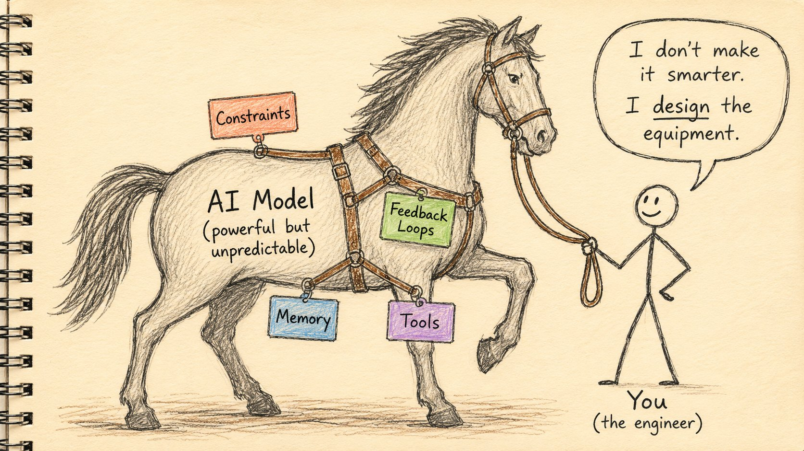
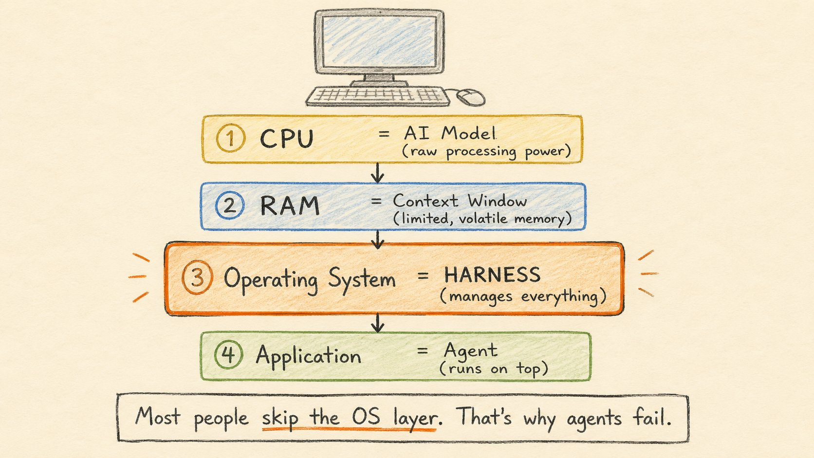
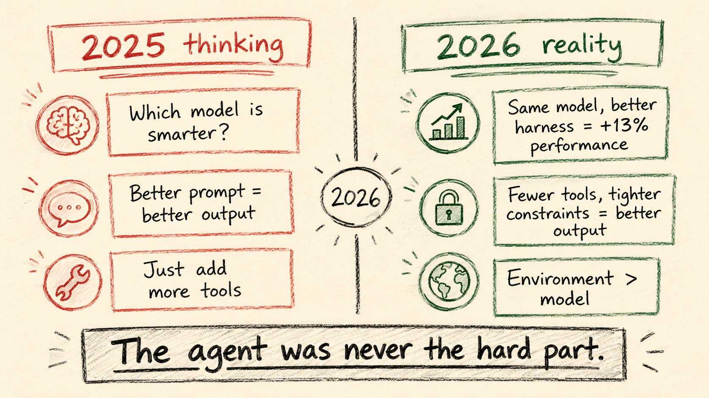
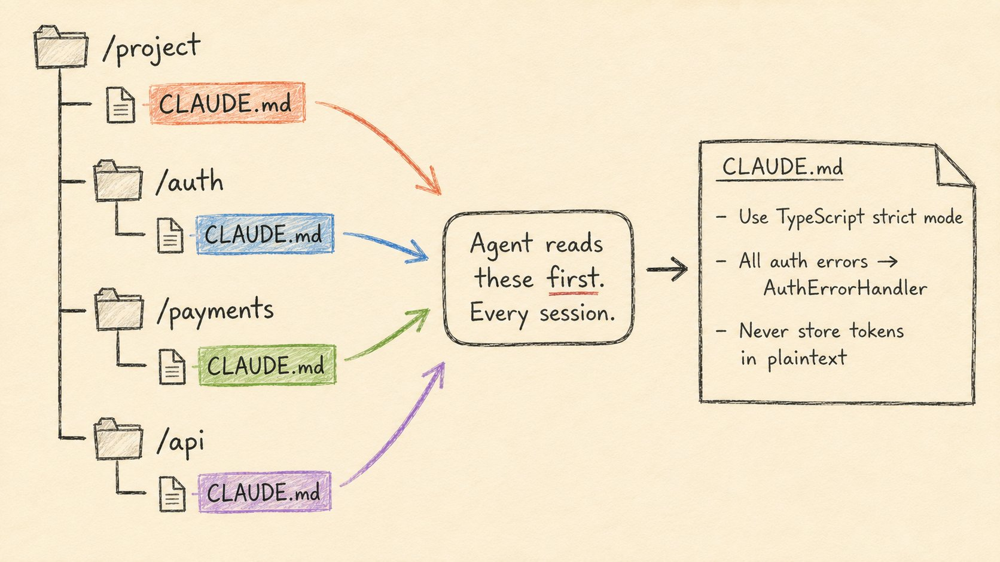
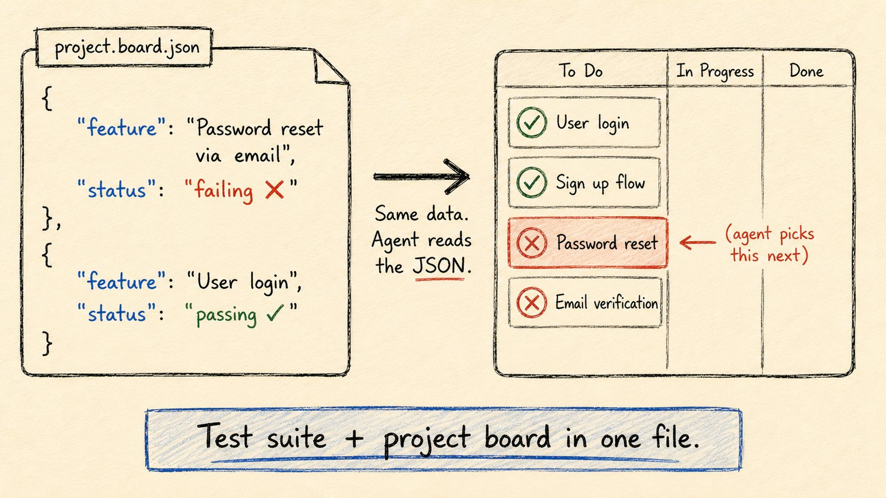
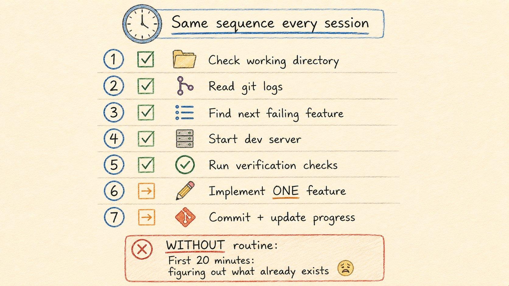
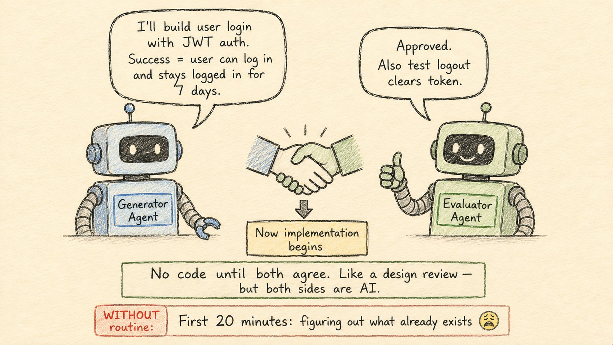
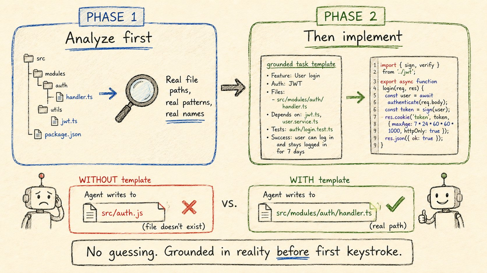

2026 年 2 月，一支小型 OpenAI 团队交付了 100 万行生产代码——没有手写一行。AI Agent 写的。人类设计了让 Agent 变得可靠的系统。

这个系统现在有了名字：**Harness Engineering**。

几周内，Anthropic 发表了 3 篇相关论文。ThoughtWorks 形式化了一个框架。Hugging Face 的 Philipp Schmid 称其为「2026 年最重要的工程学科」。一门新工程学科在 90 天内诞生了。

本文来自 Rahul（@sairahul1），把 Harness Engineering 的核心概念、五大工件、三个流派、五条通用原则全部拆开。

---

## 什么是 Harness

ThoughtWorks 给出了最简单的定义：

> Agent = 模型 + Harness

Harness 是一切不属于模型的东西——约束 Agent 在轨道上的限制、捕捉错误的反馈回路、告诉 Agent 所处位置的文档、它有权限使用的工具。

去掉 Harness → 原始语言模型在代码库里瞎猜。加上对的 Harness → 能交付生产代码的系统。

名字来自马具。Harness 是缰绳、马鞍和嚼子——把强大但不可预测的动物导向有用方向。你不需要让马更聪明，你需要设计让它的力量变得有用的装备。

---

## OS 类比

Philipp Schmid 给出了最佳技术框架：

- 模型 = CPU（原始算力）
- 上下文窗口 = RAM（有限易失性工作「记忆」）
- Harness = 操作系统（管理 CPU 看到什么、什么时候看到）
- Agent = 运行在上的应用

没有 OS 管理「记忆」、调度任务、执行规则——只是硅片。大多数人在没有操作系统的情况下运行应用，这就是他们的 Agent 在生产环境失败的原因。

---

## 2026 年的关键信号

LangChain 在 Terminal Bench 2.0 上两次运行同一个模型：

- 旧 Harness：52.8%
- 新 Harness：66.5%

Vercel 走了相反方向——删掉了 Agent 80% 的工具。结果？性能更好了。

2026 年令人不安的事实：Agent 从来不是难点，Harness 才是。如果 2025 年是 AI Agent 证明了它们能写代码，2026 年就是我们发现环境比模型更重要。

---

## 五个 Harness 工件

### AGENT.md / CLAUDE.md 文件

代码库各处的 markdown 文件，Agent 每次会话开始时阅读——就像新工程师加入团队的 onboarding 文档。OpenAI 叫 AGENT.md，Anthropic 叫 CLAUDE.md，Cursor 用 .cursorrules。没有它们，Agent 每次会话从零开始。

### JSON 特性列表

Agent 多会话构建整个应用时，每次开始是空白上下文。JSON 文件定义每个特性、如何验证它、通过/失败状态。Agent 读取后挑最高优先级的失败特性实现它。为什么是 JSON 不是 markdown？Anthropic 发现 Agent 意外覆盖 JSON 的可能性比 markdown 小。

### 会话初始化例程

Anthropic 的 7 步启动序列：确认工作目录 → 读取 git 日志和进度文件 → 检查特性列表找最高优先级未完成项 → 启动开发服务器 → 运行端到端验证 → 实现一个特性 → 提交并更新进度。

### Sprint 合约

在 Agent 写一行代码之前——两个 Agent 谈判。Generator 提议构建什么、如何验证成功。Evaluator 审查：方案是否完整？成功标准是否清晰？两者同意后才开始实施。

### 结构化任务模板

编码之前，Harness 分析真实代码库，生成 grounded impact map：真实文件路径、真实符号名、现有模式、具体验收标准。

---

## 三个流派

**OpenAI：环境优先。** 设计环境，然后放开 Agent。100 万行生产代码不手写一行，因为环境设计得足够彻底。Codex 每周处理 70% 的内部 PR。

**Anthropic：分离执行者和评判者。** 三个专业 Agent——Planner（把两句话转成完整产品规格）、Generator（一次一个 sprint 实现特性）、Evaluator（用浏览器自动化测试运行中的应用）。自评估不管用——Agent 既是学生又是老师，给自己打全 A。

**ThoughtWorks：2×2 框架。** 两条轴——运行时机（前馈 / 反馈）和工作方式（计算型 / 推理型）——形成四象限：类型系统和 linter（计算型前馈）、测试套件（计算型反馈）、规格文档（推理型前馈）、LLM 代码审查（推理型反馈）。

---

## 五条通用原则

**原则 1：上下文优于指令。** 展示 Agent 当前世界状态始终优于抽象告诉它该做什么。

**原则 2：计划和执行必须分离。** 让 Agent 在同一次 pass 中计划和执行产生不可靠的输出。计划不一定要人做，但必须是独立步骤，输出在执行前被审查。

**原则 3：反馈回路不可协商。** 没有反馈的 Harness 只是多了步骤的提示词。

**原则 4：一次只做一件事。** 试图同时做太多事的 Agent 会耗尽上下文、失去连贯性、默默丢掉需求。

**原则 5：代码库就是文档。** 没有一个团队为 Agent 维护独立知识库。如果惯例、约束或架构决策不在代码库中——Agent 不会知道。

---

## Harness 衰减

Anthropic 从 Opus 4.5 升级到 4.6 后，sprint 分解——之前必不可少的——变成了死重。模型改进的计划能力让它变得多余。Opus 4.7 后模型开始自我验证，Evaluator Agent 的工作描述开始缩小。

这就是 **Harness 衰减**：Harness 的每个组件都编码了一个关于模型不能做什么的假设。随着模型改进，这些假设过期，组件变成开销。

Opus 4.5：sprint 分解 + 逐 sprint 评估。Opus 4.6：无 sprint 分解 + 单次评估（省 38% 成本）。Opus 4.7：模型开始自我验证。

Philipp Schmid 的建议：**构建以便删除。** 设计每个 Harness 组件为可移除的。定期关掉它，测量输出质量是否变化。如果没变，删除它。

---

## 成本现实

Anthropic 的 A/B 测试真实数据：

- 独立 Agent（无 Harness）：$9，20 分钟 → 能用但核心功能有 bug
- 完整 Harness（Opus 4.5）：$200，6 小时 → 完整软件，精良 UI

22 倍成本差距。但没人说的是：$200 的 Harness 在一次模型升级后就变成了 $124。

趋势线：更好的模型 = 更简单的 Harness = 更便宜的单次运行 = 更快的输出。

2026 年胜出的工程师不是在写最好的代码。他们在设计最好的约束。并在这些约束不再值回票价时，愿意扔掉它们。

---

## 把 Harness 做好到底有多贵

Anthropic 的完整数据：

> 每件产品一个套件，构建和维护成本大约 $1,200/月，对于一家 14 人的初创公司。

OpenAI 内部分析：

> 对于 Codex 规模的系统，专用的 Harness 工程团队每人每年超过 $50 万（包括计算），但节省的工程时间超过 $1,000 万。

Anthropic 发现，当 Agent 处理 50+ 个并发 PR 时，Harness 的 ROI 最高。低于这个数，人工代码审查更便宜。

---

## 什么让 Harness 好或坏

Goodhart 定律在 Harness 设计中完整呈现。

坏 Harness 的三个特征：
1. **死提示词。** 每个工程团队都有那条没人记得为什么写、但都不敢删的 prompt。模型更新把它从有用变成了噪声。
2. **工具膨胀。** Agent 面对太多工具时，花在「思考该用哪个工具」上的 token 比「思考问题本身」还多。Vercel 删掉 80% 工具后性能提升——这正是原因。
3. **隐藏状态。** 给 Agent 一个文档叫它自己「记住」，比让它每次都重新读取更糟糕。Agent 的隐藏状态会漂移、矛盾、默默毒害输出。

好 Harness 的三个特征：
1. **可审计。** 每个 Harness 决策可以被追溯。当 Agent 做了奇怪的事，Harness 让你知道为什么。
2. **可测试。** 对 harness 本身运行测试。如果修改 prompt，必须有方法衡量它变好还是变坏。
3. **可丢弃。** 下一个模型版本可能让当前组件过时。你不想抱着它不放。

---

## 上下文管理是最被低估的 Harness 技能

Agent 的上下文窗口就像人类的工作「记忆」——有限且脆弱。

Anthropic 的数据：
- Agent 的「记忆」从会话开始到结束衰减约 40%
- 每次工具调用增加约 2% 的衰减速度
- 第 50 次工具调用后，上下文开头的内容几乎不可用

解决方案不是扩大窗口——Claude 有 200K 窗口，问题依然存在。

真正的方法：
- **分页上下文。** 不是把所有东西都塞进一次提示。分阶段加载。
- **结构化遗忘。** 有意识地决定 Agent 可以忽略什么。给 Agent 一个「垃圾桶」。
- **外部「记忆」。** 用文件、数据库、git 历史作为持久层。Agent 的上下文只是缓存。

---

## Agent 之间的通信：被忽视的关键

单个 Agent 够用，但真正的工作流需要多个 Agent 协作。

在多 Agent 系统中，最脆弱的环节不是单个 Agent 的能力——是它们之间的接口。

Anthropic 的经典失败模式：
- Agent A 生成一份详细计划
- Agent B 读取计划，只理解了 60%
- Agent B 的执行偏离轨道
- Agent A 看到偏离，生成修正
- 修正基于错误假设
- 循环直到上下文爆炸

解决方法：
- **结构化协议。** Agent 之间传递的不是自由文本而是结构化数据。
- **契约测试。** Agent A 输出被 Agent B 消费前需要满足的断言。
- **人类在回路中。** 关键交接点有人类批准步骤。

---

## 工具调用是 Harness 的致命弱点

工具调用是目前 Agent 系统中最常出错的环节。丢失参数、错误格式、幻觉响应类型、顺序错乱——种类繁多。

LangChain 的研究：
- 工具调用错误占 Agent 生产故障的 37%
- 最常见的错误：参数类型不匹配、缺失必填字段、返回格式无效
- 在复杂工具链中，错误率随工具数量线性增长

ThoughtWorks 的建议：
- 每个工具都应有一个测试套件，就像 API 端点一样
- Agent 调工具前，Harness 应验证参数结构
- 工具返回后，Harness 应验证返回模式
- 幂等设计——Agent 重复调同一个工具不应产生副作用

---

## 评估是 Harness 的试金石

Anthropic 的观点：你在 Harness 上投入的每一分钱都应该体现在评估质量上。如果无法衡量变化，你无法知道是变好还是变坏。

三个层级的评估：
1. **单元评估。** 每个 Harness 组件的独立测试。这个 prompt 比那个好吗？减少一个工具会怎样？
2. **集成评估。** Agent 在端到端场景上的表现。完整 sprint、完整应用构建。
3. **生产评估。** 上线后的真实用户交互。Shadow 模式——新 Harness 与旧 Harness 并行运行，比较输出。

ThoughtWorks 推的评估框架是一个构建-测量-学习的循环：
- 构建一个假设
- 在基准集上测量
- 学习并调整
- 重复

---

## Harness 不仅仅是一个系统——它是一门学科

Harness Engineering 的本质不是在搭工具链。

它是学会**停止优化模型，开始优化环境。**

OpenAI 的 Rajeev Nair 在内部 Codex 回顾中说得最清楚：

> 「我们花了 2024 年让模型更好。2025 年我们意识到，提供正确的输入比更好的模型重要得多。2026 年我们正在把这一洞察工程化。」

这意味着：
- Agent 之间的结构化协议
- 可运行的规范而非文档
- 每次干预都可以被测试、回滚和删除

这让人想起敏捷在 2000 年代初的诞生：不是一套工具，而是一种系统化集体学习的思维方式。

---

## 2026 年的 Harness 工具栈

没有标准栈——领域太新。但一些模式正在形成：

**配置文件：** CLAUDE.md / AGENT.md / .cursorrules
**规则格式：** JSON 特性列表、YAML 规则集
**验证层：** 类型系统、linter、测试套件、CI 集成
**评估层：** 基准集、A/B 框架、生产 shadow 模式
**编排层：** 多 Agent 协调、会话管理、状态持久化

---

## Harness 作为竞争壁垒

真正的竞争优势不在于你有最好的模型——模型很快就会商品化。

真正的竞争优势在于你设计了最好的 Harness。

Anthropic 和 OpenAI 正在争夺模型霸权，但每个工程师实际上在争夺的是 Harness 质量。更好的 Harness → 更好的 Agent 输出 → 更快的迭代 → 更好的产品。

而 Harness 比模型更难复制。模型是一个 API 调用。Harness 是你代码库的全部知识和约束、团队惯例、工具生态系统的编码化表达。

---

## 给管理者的行动指南

如果你是工程管理者，正在考虑投入 Harness Engineering，这里是从各公司实践中提炼的路线图：

**第一阶段——基础（2 周）：**
在代码库中放置 AGENT.md / CLAUDE.md。定义 Agent 可以访问哪些工具，删除它不需要的。

**第二阶段——结构（1 个月）：**
添加上下文压缩。分离计划和执行。设置基本的反馈回路。

**第三阶段——评估（2 个月）：**
建立基准测试。能测量 Harness 变更的影响。开始 A/B 测试不同的 Harness 配置。

**第四阶段——多 Agent（3 个月+）：**
引入专门化的 Agent。设置 Agent 间通信协议。人类在关键点的监督。

贯穿所有阶段的一条规则：**构建以便删除。** 你添加的每个组件都应该是暂时性的——下一个模型版本可能让它过时。

---

## 结尾

Harness Engineering 是 2026 年 AI 工程的核心学科。

2026 年胜出的工程师不是在写最好的代码。他们在设计最好的约束。并在这些约束不再值回票价时，愿意扔掉它们。

---

## 一点观察

**这篇文章本身就是 Harness Engineering 的产物。** Rahul 花了大量篇幅讲概念、框架和原则，而不是推荐某个特定产品——因为 Harness 不是一个工具，是一种设计思想。19 个章节的密度在 X 长文中罕见，说明这个领域正处于知识快速成型的阶段。

**Harness 衰减可能是最重要的概念。** 大多数人在设计 Agent 系统时假设模型能力不变。实际上模型每几个月就显著提升一次，针对旧模型做的约束编排很快变成无用功。「构建以便删除」不是谨慎，是在快速变化的底层上求生存的基本策略。

**三大流派从不同起点汇合到了同几条原则。** OpenAI（1M 行 Codex）、Anthropic（三 Agent 分离）、ThoughtWorks（咨询 50+ 团队）各自独立发现了上下文 > 指令、计划 / 执行分离、反馈回路必要。当一个领域的三方独立玩家同时得出同一结论时，这个结论的正确概率很高。

**ThoughtWorks 的 2×2 框架让 Harness 设计从手艺变成了工程。** 在那之前，「加什么工具、加什么文档」靠直觉。80% 的工具被删掉反而更好——Vercel 的案例说明 Harness 设计的优化方向不是「越多越好」，而是「越精确越好」。

---

参考：Harness Engineering: What Every AI Engineer Needs to Know in 2026
