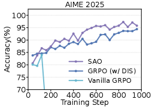
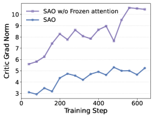
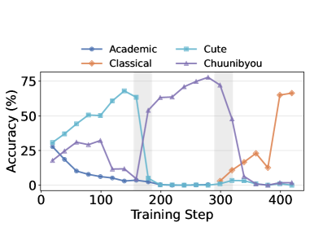

<strong style="font-size:16px;color:#1a6ba0;">要点速览</strong>

- <strong>核心矛盾</strong>：同步 RL 必须等整批 rollout 收齐才训练，长程智能体任务里慢轨迹拖垮整批 GPU，吞吐被最慢样本卡死。  
- <strong>SAO 做法</strong>：每个 prompt 只采一条轨迹，生成完立刻送训练（单轨迹异步），砍掉 GRPO 组采样强制等待最慢样本的同步屏障。  
- <strong>代价与解法</strong>：单轨迹方差大、易离策略，靠三类设计稳压：更直接的重要性采样裁剪、比策略更快更新的价值模型、跳过环境观测的 GAE。  
- <strong>结果</strong>：稳定训练约 1000 步（vanilla GRPO 约 160 步就崩），Qwen3-30B 上 AIME2025 97.3、SWE-Bench 29.8，已落地训练 GLM-5.2（750B-A40B）。

---

## 为什么同步 RL 在智能体任务上浪费算力

LLM 后训练大多还走同步流水线：策略先生成一整批 rollout，等全部收齐才开始优化。对数学推理这类短输出没问题，但对智能体编程、工具调用这类长程任务，rollout 长度高度不均——短的几秒结束，长的跑几百轮交互，成为掉队者（straggler）。结果就是**大量 GPU 在等最慢的那条轨迹**，墙钟效率被拖死。

异步 RL 的思路是：rollout 一边生成一边喂给训练，不用等整批。但异步带来两个老问题：一是每条轨迹可能由多个版本的旧策略生成，离策略（off-policy）更严重；二是 GRPO 这类组采样天然与异步冲突——它要对每个 prompt 采一组响应、用组内平均算优势，整组必须等最慢样本完成才能进训练，等于在异步里又造了一道同步屏障。

SAO（Single-rollout Asynchronous Optimization）的出发点很直接：**把组采样换成单轨迹采样，样本一生成就立刻训练**，从根上消除这道时延屏障。

SAO 论文 teaser 图（Figure 1）

## 单轨迹怎么稳住

异步下不能简单地"来一条训一条"就完事，离策略和方差会冲垮训练。SAO 用四块设计兜底。

**直接双侧重要性采样（DIS）。** 异步里 rollout 引擎在一条轨迹生成期间可能已被更新多次，精确追踪旧策略概率需要存一堆历史检查点，不现实。SAO 的做法粗暴而有效：直接用 rollout 阶段留下的 log 概率当行为策略，跟当前策略算比值，丢掉那个不准确的旧策略。信任域收紧到 [1-ε_ℓ, 1+ε_h]，落在区间外的 token 直接从梯度里掩码掉。这等于用受控的离策略偏差，换来不用维护历史模型集合的巨大计算节省，还能做更激进的裁剪。

**比策略更快更新的价值模型（TTUR）。** 单轨迹梯度方差高（类似 REINFORCE），必须有个够好的价值模型压方差。SAO 解耦策略和价值的学习频率：每对策略做 1 次更新，就对价值网络做 K=2 次更新，让价值估计先跟上策略再算优势。

**冻结注意力的价值模型训练。** 实验发现价值模型梯度范数远大于策略，且不稳定主要来自全注意力层（MoE 层反而稳）。于是 RL 训练中冻结价值模型的注意力参数，只优化 MoE 投影——预训练注意力已够用，限制优化范围就顺带正则化了 critic。

**跳过观测的 token 级 GAE。** 智能体轨迹是 [动作, 观测, 动作, 观测...]，模型不生成观测。标准 GAE 跨"动作末尾→观测开头"算价值差会把环境噪声带进来。SAO 改 Bellman 目标，绕过环境反馈 token，把当前动作价值直接连到下一动作价值，优势估计只依赖模型自身输出。

SAO 整体设计（Figure 2）：rollout 到达即训练，单轨迹 + DIS + 强价值模型

## 稳定性能拉到多少步

这是时延叙事里最关键的一组证据。vanilla GRPO 在约 **160 步**就性能崩塌；加上 DIS 能稳住；SAO 与 GRPO+DIS 初期相当，约 400 步后明显拉开，最终稳定跑满约 **1000 步**。

训练步数上的评测表现：GRPO 早期崩，SAO 持续稳定上升（Figure 3）

训练动态进一步解释为什么稳：SAO 的 Explained Variance（价值预测与真实回报的对齐度）在约 400 步后显著高于只更新 1 次 critic 的基线，价值收敛更快；冻结注意力的 critic 梯度范数更低更平滑；而 VAPO 几乎不裁剪离策略 token，约 90 步就崩。

训练动态：解释方差、critic 梯度范数、裁剪 token 占比（Figure 4）

## 跑分：不只是稳，还更强

在 Qwen3-30B-A3B 上（batch 128、group size 1、max-length 128k、token 裁剪 ε_low=0.3/ε_high=5.0）：

| 方法 | AIME2025 | BeyondAIME | HMMT | IMOAnswer |
| --- | --- | --- | --- | --- |
| GRPO (w/ python) | 84.2 | 54.8 | 76.0 | 55.8 |
| SAO (ours) | 97.3 | 74.8 | 88.3 | 74.0 |

SWE-Bench Verified（编程智能体）准确率：GRPO+DIS 为 27.0%，SAO 为 **29.8%**。消融显示每块都必要——去掉冻结注意力掉到 90.6（AIME2025），只更新 1 次 critic 掉到 95.0，用 running-mean 基线只剩 79.8。

## 在线学习里单轨迹的额外红利

真实在线环境往往每个 prompt 只给一条轨迹反馈，GRPO 的组相对优势天生用不了。SAO 用基于价值模型 critic 的优势估计，能从单条轨迹有效更新。模拟在线写作任务里奖励偏好在 cute→中二→古典间切换，SAO 每次切换后迅速重新对齐策略，而 running-mean 基线因滑动窗口惯性适应滞后。

在线学习模拟：风格偏好切换后 SAO 快速恢复（Figure 5）

## 落地

SAO 已用于训练开源 GLM-5.2（750B-A40B）的智能体 RL 流水线，证明这套异步单轨迹方案在大规模真实训练里站得住。

<strong style="font-size:15px;color:#8b6f4c;">结语</strong>

异步 RL 的瓶颈从来不是"不够快"，而是"快了就崩"。SAO 的价值在于证明：只要把组采样的同步屏障拆掉、并用更狠的裁剪和更强的价值模型兜底，单轨迹异步既能吃掉长程任务里的掉队者空闲，又能比 GRPO 训得更稳更准。  
它和 AReaL、ROLL Flash 这些异步系统的分工很清楚：那些工作主攻系统解耦（rollout 与训练并行），SAO 主攻算法层稳定（单轨迹下的离策略与方差），两者是正交的可叠加项。  
真正的工程代价在基础设施：SAO 依赖可靠保留 token 级行为概率的异步生成链路，这对部署提出了比同步 RL 更高的要求。

参考：https://arxiv.org/html/2607.07508v1
