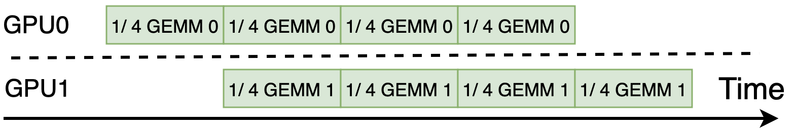
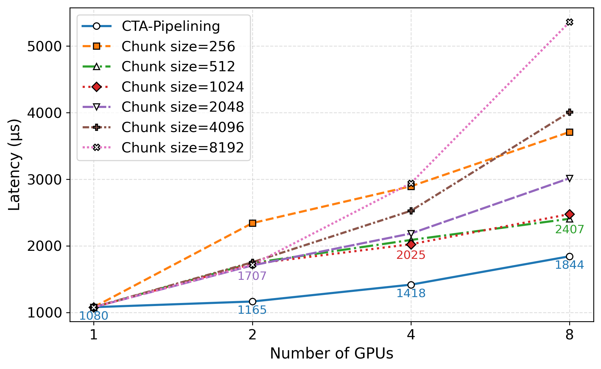
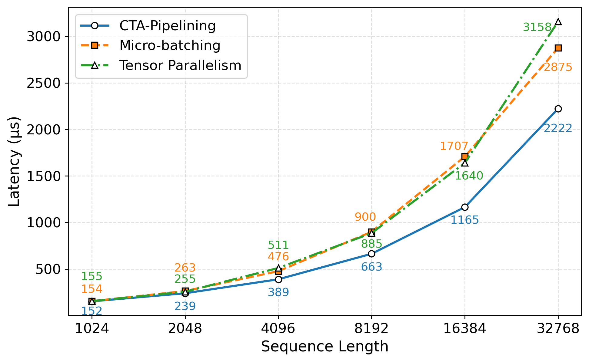
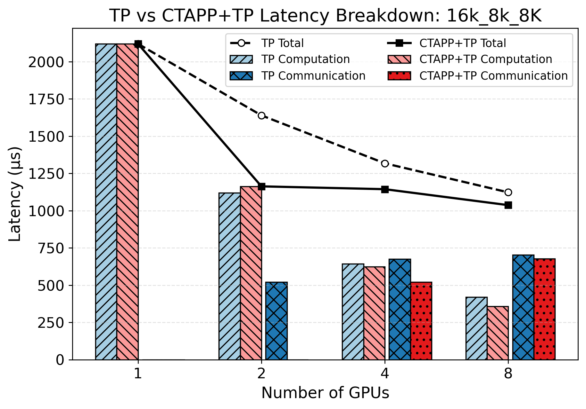
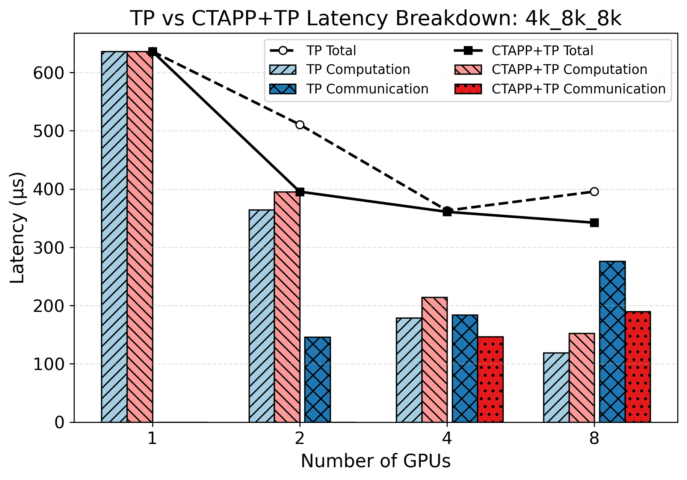

<strong style="font-size:16px;color:#1a6ba0;">要点速览</strong>

- <strong>核心做法</strong>：CTA-pipelining把跨GPU的数据依赖kernel拆到CTA粒度做空间流水线，消费者CTA一拿到生产者产出的数据块就立刻启动，无需等整层算完。  
- <strong>关键收益</strong>：相比micro-batching延迟最高降31.8%，相比张量并行（TP）最高降29.6%，且能作为正交维度与TP组合进一步压低延迟。  
- <strong>侵入极小</strong>：只在kernel首尾注入prologue/epilogue代码片段，不改核心实现，可对接CUTLASS等现有库直接在8卡H200/B200上跑。

---

## 问题：TP给延迟优化设了天花板

多GPU部署LLM推理，通用基线就是流水线并行（PP）和张量并行（TP）。PP在层间切分只为提吞吐，TP在算子层面空间切分能同时降延迟。但TP每两层就要一次All-Reduce集合通信来消解数据依赖，这给单batch延迟优化画了一道硬天花板。

这些都不是为"降低单batch延迟"设计的。CTA-pipelining瞄准的正是这块空白：用细粒度空间流水线，把跨GPU的依赖kernel并发跑起来。

## CTA-pipelining：在CTA粒度上跨GPU流水线依赖kernel

CTA（协作线程阵列）是GPU最细的执行粒度。传统做法是等生产者kernel完全结束、再启动消费者kernel；CTA-pipelining改为：生产者每产出一个输出块，消费者对应的CTA立刻启动去消费它。依赖的kernel在空间上分布到多GPU，几乎同时启动、几乎同时完成（仅消费者尾部最后一轮略晚）。

图1：双GPU下CTA-pipelining的整体执行架构（含依赖数组、记分牌、跨设备工作队列三类组件）

## 协议核心：依赖数组、记分牌、跨设备队列

支撑这套控制流的是三个数据结构，统称依赖结构：

- **依赖数组**：以生产者CTA ID为索引，标明它影响哪些消费者CTA，存在生产者设备内存。
- **记分牌**：原子计数器数组，每个消费者CTA一个条目，初始化为前置生产者数；归零即表示"我就绪了"，也存生产者侧。
- **跨设备工作队列**：环形缓冲区作就绪信号。放在消费者设备内存以压低关键路径延迟，生产者用CUDA异步写"发射后不管"，消费者单线程忙轮询。

注入的逻辑极轻：生产者CTA把输出经NVLink直写消费者输入内存后，发系统级内存屏障，再原子递减记分牌；计数器归零就把就绪的消费者CTA ID推入队列。消费者侧prologue单线程轮询队列、广播取值，CTA把自己重映射成该ID，跑标准未改动的kernel负载。核心kernel一字不动，只加了首尾片段。

图3给出多层GEMM的流水线示意，第一层输出被第二层直接消费。

图3：多层GEMM的CTA-pipelining执行流程（每层即一个流水线阶段）

## 开销实测：warp特化kernel里几乎为零

开销评测在8卡H200（经典SM90 kernel）和8卡B200（SM100 warp特化持久kernel）上进行，GEMM尺寸16384×8192。

- 经典kernel：每CTA epilogue约6μs，跨设备可见需120μs，消费者prologue取队列约1.5μs，且逐轮累积。
- warp特化持久kernel：利用微流水线中其他warp的等待空闲，把协议操作塞进去。跨设备写可见仅5μs，prologue 1.5μs、广播0.5μs均被隐藏。开销只在流水线初始爬升时可见一次。

实测两个连续GEMM基线各1080μs；用CTA-pipelining后生产者1090μs、消费者1165μs（含可见开销与末轮流水线延迟）。对原kernel无寄存器/共享内存干扰，不引发溢出。

## 对比micro-batching：最高降31.8%

负载为多层GEMM（模拟MLP层，省去激活），权重固定8192×8192，每GPU一层、GPU数即层数；基线用cuBLAS+CUDA Graph，并扫描最优chunk尺寸保证公平。

图4：不同GPU数与chunk尺寸下，CTA-pipelining相对micro-batching的延迟降低（R-MB）

结果：对比扫描中最优chunk，CTA-pipelining在2/4/8 GPU下分别降31.8%/30.0%/23.4%。**micro-batching的本质矛盾是chunk尺寸两难**：chunk太大会拉长流水线头尾、降低并行度；太小则单kernel效率崩、启动气泡多。CTA-pipelining在CTA级重叠，又不显式切chunk，保住原生kernel效率，直接化解这个两难。极小输入（序列长1024、kernel仅百微秒级）时协议开销会凸显，但此时micro-batching也到极限。

## 对比TP：最高降29.6%，且能与TP正交组合

图5：不同输入序列长度下，CTA-pipelining相对TP的延迟降低（R-TP）

纯CTA-pipelining在2/4/8 GPU上相对TP降29.0%/46.2%/59.0%，主要因为**完全绕开了All-Reduce**。但有的负载kernel不够多、凑不出足够流水线阶段，这时把它和TP组合：硬件切成2-GPU组，组内用CTA-pipelining跑本地两层GEMM，最终All-Reduce的world size减半。

图7(a)：CTA-pipelining+TP组合的总延迟（线）与计算/通信拆分（柱）

图7(c)：高TP度下纯TP因通信主导反而变慢，组合方案继续降延迟

组合方案的直接收益是All-Reduce world size减小、通信时间下降；同时降低了所需TP度、保留了更大矩阵维度，计算效率也受益（部分尺寸被流水线爬升延迟抵消）。两者正交、可无缝叠加。

## 讨论：中心化NVLink拓扑限制重叠

CTA-pipelining依赖NVLink营造的"共享内存错觉"。但8卡B200经NVSwitch中心化交换，每GPU并发进出带宽被这颗星型交换机瓶颈。生产者直写消费者内存会长期占住同一物理链路，导致消费者想和第三方通信做计算-通信重叠时被迫与它争用。论文指出更分散的NVLink拓扑（如GB200 NVL72多Switch）可化解：把一栈CTA-pipelining kernel局部化在单一Switch下，二次通信走另一Switch，重叠才真正可行。

<strong style="font-size:15px;color:#8b6f4c;">结语</strong>

这套工作的价值不在某个新kernel，而在把"跨GPU依赖kernel的细粒度空间流水线"做成了一个对现有库几乎零侵入的软件协议：只加prologue/epilogue就能让CUTLASS kernel跨设备并发跑。  
它和TP不是替代关系而是正交维度，给部署多GPU LLM推理多了一根延迟杠杆，尤其适合能端到端纯CTA-pipelining执行的负载。  
真正的瓶颈已经不在软件而在互连拓扑：中心化NVLink让"共享内存错觉"在物理上撑不住，后续收益要看更分散的交换机拓扑和硬件级kernel间信令支持。

---

参考：https://arxiv.org/html/2607.07862v1
