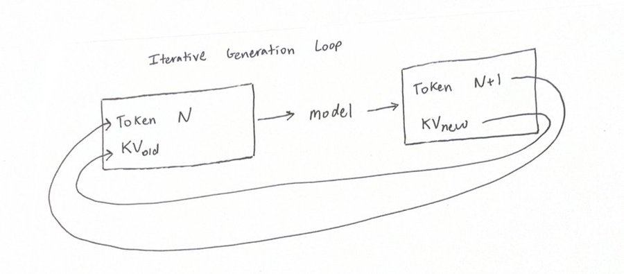
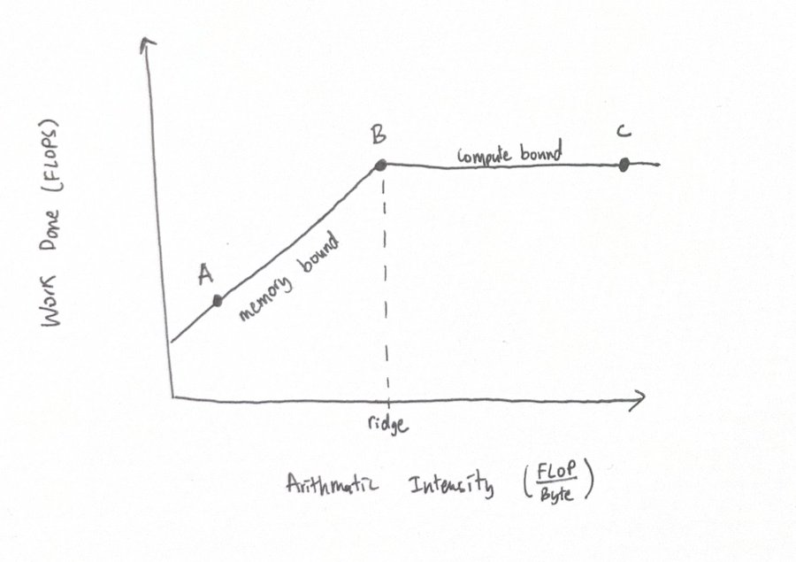
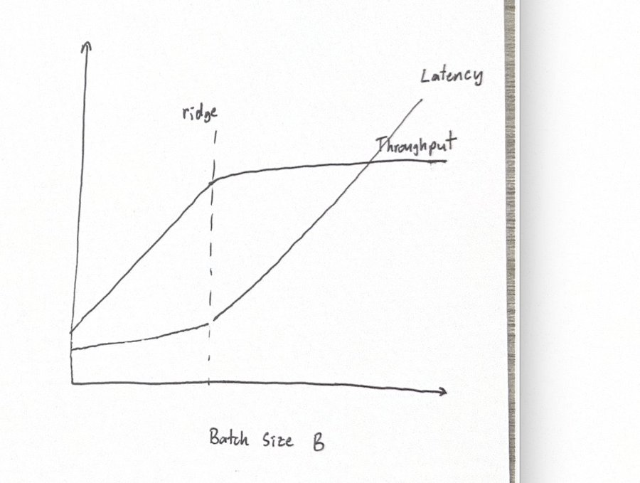
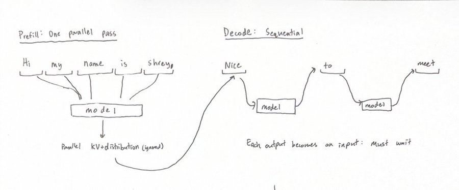
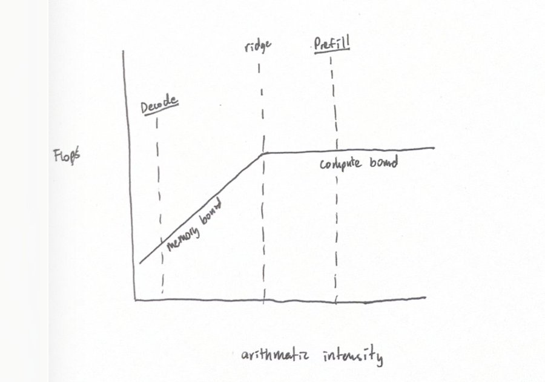
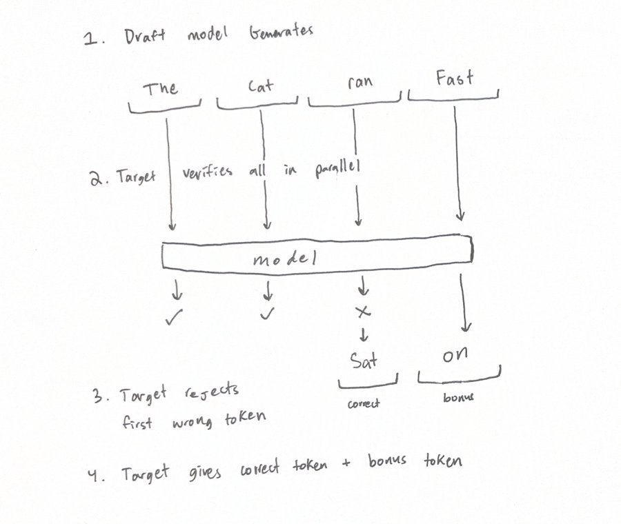
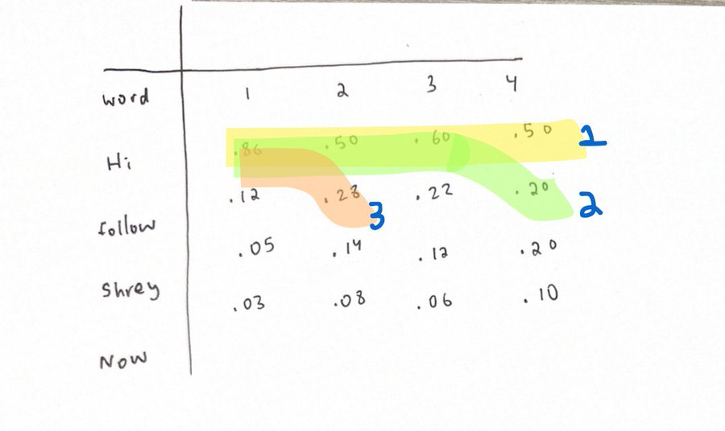

<strong style="font-size:16px;color:#1a6ba0;">要点速览</strong>

- <strong>核心结论</strong>：推测解码（speculative decoding）能让LLM推理最高获得8倍加速，且完全无损、分布与原模型完全一致，几乎是推理领域的一顿免费午餐  
- <strong>底层动机</strong>：decode阶段是顺序生成、算术强度极低、GPU处于内存受限状态，大量算力被闲置，推测解码的本质是用一个小草稿模型并行猜出多个token，把decode拉向计算受限的屋脊点  
- <strong>无损保证</strong>：通过拒绝采样（rejection sampling）数学证明，被接受的草稿与原始目标输出有完全相同的分布，加速不以质量为代价  
- <strong>演进主线</strong>：从独立草稿模型（Leviathan）到多头并行（Medusa）、借用隐藏状态（Eagle）、块扩散（DFlash）、树状验证（SpecInfer/Eagle 2/DDTree），加速从3.5倍一路推到7-8倍

---

## 前置知识：自回归模型与GPU硬件

大语言模型的工作方式可以一句话概括：旧token加上KV一起送入模型，预测出新的token和新的KV，这个循环反复迭代，不断生成下一个token。即使在读取用户输入时这个循环也得跑，只是被预测的下一个token会被丢弃。

token是模型吐出的词，KV是句子逐步累积起来的知识。**你应该注意到一件关键的事：生成是顺序性的。**第50个token依赖第49个，第49个又依赖第48个，以此类推。这就是为什么ChatGPT是一个token一个token流式输出，而不是一大块一大块地吐字。

大语言模型的迭代生成循环：旧token与KV送入模型，预测新token与新KV

当我们优化LLM在GPU上的运行时，GPU只有两种最基础的操作值得关注。其一是计算（compute），即GPU每秒能做的浮点运算量（FLOP/s）；其二是内存带宽（memory bandwidth），即GPU能把多少字节从HBM显存加载进SRAM / SM（真正的计算核心）。

直觉上任务耗时是内存时间加计算时间之和。但现实中GPU是大规模并行处理器，加载和计算交错进行，借助流水线，墙上时钟时间其实近似为较慢那项操作的时间。所以我们要专注减少瓶颈，确保加载权重的耗时永远不超过计算的耗时，即**永远不要处于内存受限状态**。

关键指标叫算术强度（arithmetic intensity）：每加载1字节所做计算的量，大致衡量计算受限与内存受限的比例。Roofline分析模型让这一点一目了然：随着算术强度增加，完成的工作量也增加，直到到达屋脊点（ridgepoint），从内存受限翻转为计算受限。

Roofline分析模型：横轴为算术强度，纵轴为可用工作量，A点为内存受限、B点为屋脊点、C点为过度计算受限

在A点，模型需要加载整个文本知识和全部权重，只为生成1个新token，算术强度极低。我们的目标是通过提升并行度，把传统LLM处理从A点推向B点，最优地用满所有算力。

## 并行方法一：批并行

理解并行，先要分清两个术语。延迟（latency）是每用户token之间的时间间隔，越低越好，因为用户更快看到输出；吞吐（throughput）是每秒产出的token总数，越高越好，因为能服务更多用户。两者不总是一同扩展，提升吞吐往往意味着每用户的延迟变差。

通过增大批大小（batch size），我们可以并行化并提高算术强度，因为token数乘了B倍，而共享权重这个除数保持不变。批大小有助于摊薄把权重从HBM加载到SRAM/SM的成本。

在屋脊点左侧，延迟随批大小温和上升；到了右侧，已经是计算受限，增大批大小只是线性增加工作量。这也解释了为什么不想去C点：C点和B点吞吐相同，但每用户的延迟会显著变差。

批大小与吞吐、延迟的关系：屋脊点左侧延迟温和上升，右侧转为计算受限

还有个硬约束：GPU的HBM内存容量有限，增大批大小需要更多空间存KV，最终会耗尽。所以批并行虽好，却不摊薄KV加载成本、会抬高单用户延迟、且无法无限扩展。

## 并行方法二：序列并行

顺序生成的思维模型在大语言模型中一直成立。即使下一个token已知（比如解析输入提示时），你仍要做那部分工作，不是为了预测token，而是让模型建立内部表征来理解输入，也就是KV。

**Prefill是并行的，decode是顺序的。**如果你知道接下来是什么，可以一次性算出接下来几个token的概率。LLM推理的第一部分（读取输入提示）叫prefill阶段，它完全可并行化。而生成新token的decode才是顺序的：我们不知道下一个token，每轮输入是上轮输出，每次前向只能出1个token，算术强度低、内存受限，浪费了闲置的GPU资源。

Prefill阶段完全并行，decode阶段逐token顺序生成

序列并行不仅摊薄了权重，也摊薄了KV（每个请求独有的KV在整个序列间共享），而批并行只能摊薄权重。结论很清楚：decode是内存受限，prefill是计算受限。

Decode阶段内存受限、Prefill阶段计算受限（序列并行与注意力所致）

## 在decode阶段借用序列并行：推测解码

Leviathan在2023年的原创论文提出了推测解码（speculative decoding）。问题来了：我们知道prefill可以并行化、提高算术强度，但decode阶段我们根本不知道接下来是什么，怎么复用prefill的验证技巧？

Leviathan的解法是引入一个草稿模型（draft model），借用了CPU推测分支的思路：在目标（主）模型生成之前，先跑一个微小、快速的草稿模型，自回归地输出token。因为它极小，生成5个token也几乎是免费且即时的。把这些当作猜测的「接下来几个token」，目标模型就能并行验证。

目标模型沿用prefill的验证技巧验证所有草稿token。在第一次出现分歧的地方，目标模型拒绝草稿的答案、保留自己的。验证通过的最后一次输出是对n+1位置token的预测，这叫 +1奖励token（bonus token），因为这次前向总能给出1到n+1个正确token。

草稿器/验证器流程：验证器纠正错误并给出奖励token

生成的token数量增加了，带宽压力却保持不变，算术强度随之上升，把decode推得离计算受限更近。

推测通过提高算术强度，把decode从内存受限推向屋脊点

**一个前提必须记牢**：如果批大小已经够大，推测前就已是计算受限，那么推测带来的额外成本就是直接的负收益。验证成本随生成token数线性增加，推测器本身的算力开销纯粹叠加到总延迟上。所以推测器只在你内存受限、而非计算受限时才该跑，并且要平衡它的占用、接受率和延迟。

## 草稿模型如何保持与目标相同的分布

验证的精妙之处在于拒绝采样（rejection sampling）：它数学上保证最终输出与目标模型有完全相同的分布。所有自回归模型都把概率分布作为对下一个token的预测输出。设p(x) 是目标对token X的概率，q(x) 是草稿器的概率，接受规则是：

以min(1, p(x)/q(x)) 的概率接受token x。当p(x) 大于q(x) 时总是接受；当p(x) 小于q(x) 时只在p/q比例接受，其余从残差分布采样。

直觉上，如果草稿器选了一个比真实值概率更低的token，即使只有目标模型大概率也会采样到同一个，没有过度代表的风险；如果草稿器过度自信，我们只在p/q比例接受，拒绝部分从残差分布补回，恰好把目标想要但草稿器低估的概率质量还回去。

通过把「提出并接受」与「拒绝并从残差采样」两条路径的概率相加，可以严格证明选中token x的总概率恒等于p(x)。**用这套拒绝采样数学，我们保证了被接受的草稿与原始目标输出之间有损无损、完全相同的分布。**

## 推测器的演进：更好的草稿模型

Leviathan的原创工作验证了推测器这个概念，但后续论文训练了不同架构，带来了高得多的加速。

Medusa（Cai '24）发现，独立的草稿模型会偏离目标模型的策略（off-policy）。它改为在目标模型最后一层接上几个额外的解码头，分别预测N+1、N+2、N+3等未来token，在编码工作负载上最高3.5倍加速。弱点在于每个头互相独立，预测N+2的头不知道N+1的预测，伤害了最大接受长度。

Eagle 1（Li '24）的关键洞察是「目标模型最懂」：目标模型的隐藏状态已包含接下来几个token的丰富上下文，应把这些特征传进草稿器，接受率相比Medusa跳升约5-10%。

DFlash（Chen '26）则把草稿器架构从自回归换成块扩散（block diffusion）模型。扩散模型在一次前向中给整块被遮蔽的token去噪，更长的文本块几乎不增加延迟，带来6倍无损加速，代价是token彼此略独立，Medusa/MTP的老问题重现。

## 推测器的演进：树状验证

SpecInfer（Miao '23）指出，Leviathan的草稿模型一旦在某个token上猜错，该点之后的整条样本都要被拒绝。SpecInfer改为猜一棵树、分出多个续写全部验证，创造了「树注意力」，并行检查树的所有分支。

Eagle 2（Li '24）在Eagle 1之上加树状验证，并生成动态树：自信的分支走得更深，不自信时更宽更浅。DDTree（Ringel '26）把树状验证应用到DFlash的扩散块草稿器，通过沿图累积概率，先取最长概率最高的分支，一旦更短分支的联合概率更高就停止深入。

树状验证：用累积概率产生不同长度的分支，捕获更浅路径

这把某些工作负载的加速推到7-8倍，即便总token数与DFlash相同，也能因捕获后者可能错过的浅路径而获得更高加速。

## 未来的一些方向

推测解码仍在快速演进。几个值得关注的方向：在长上下文、大批量也会翻转为内存受限的场景下，用推测提高吞吐而非延迟（Together Compute借此把吞吐提高2倍）；把推测器彻底解耦，用专用边车芯片跑微小模型；MoE架构下的路由感知草稿器；以及按工作负载路由到不同专用草稿器。Baseten和Modal还展示了在服务客户的同时在线训练推测器、数据不离开内存的方案。

最新的DSpark（DeepSeek '26）在DDTree之上进一步改进，是这一领域最值得跟进的新工作。

<strong style="font-size:15px;color:#8b6f4c;">结语</strong>

推测解码的真正价值不在某篇论文，而在它把「decode是顺序瓶颈」这个看似无解的约束，转化成了「用并行度换算术强度」的可优化问题，且数学上零代价。  
无损保证是它能被放心部署的底线：拒绝采样让加速与分布保真不再二选一，这正是它区别于各种近似加速方案的根本。  
演进主线清晰指向两个方向：草稿器越来越深地借用目标模型的内部状态（Eagle系），验证越来越结构化（树状），而扩散与MoE的加入说明这场效率革命远未到头。

---

【传送门】 
<a class="normal_text_link mp_article_text_link" href="https://mp.weixin.qq.com/s/nVqW9acA7NN1zeALDwRAsw" target="_blank" data-linktype="2">Google新论文RubricEM: 评分标准引导的深度研究Agent训练框架</a> 
<a class="normal_text_link mp_article_text_link" href="https://mp.weixin.qq.com/s/FTsibdpbEjvoPWtxGqgxkQ" target="_blank" data-linktype="2">小米MiMo罗福莉后训练新范式MOPD: 多教师同策略蒸馏，多领域无损</a> 
<a class="normal_text_link mp_article_text_link" href="https://mp.weixin.qq.com/s/s0Ovn3_tnbbl9jxfAC3WLg" target="_blank" data-linktype="2">阿里Sparse Attention on CXL替代RDMA做KV Cache解耦 推理2.1×吞吐, 9.7×TTFT</a> 
<a class="normal_text_link mp_article_text_link" href="https://mp.weixin.qq.com/s/3btXHAVd8_x5CM5CWETc2g" target="_blank" data-linktype="2">Agent卷向AI Infra: SGLang团队用硬核Agent优化框架和CUDA Kernal性能</a> 
<a class="normal_text_link mp_article_text_link" href="https://mp.weixin.qq.com/s/OoHu1yeuh1gzgCfEiPvDuQ" target="_blank" data-linktype="2">RL的下一个大突破：不是优化可验证问题而是把'不可验证'领域变</a> 
<a class="normal_text_link mp_article_text_link" href="https://mp.weixin.qq.com/s/OqtF6ZaWQNu3o-VAWLfqbg" target="_blank" data-linktype="2">榨干GPU性能：流水线解码消除GPU气泡，推理吞吐提升35%</a> 
<a class="normal_text_link mp_article_text_link" href="https://mp.weixin.qq.com/s/HnGKVp45C-GApBJ-LleP6g" target="_blank" data-linktype="2">小米MiMo罗福莉:8卡GPU让1T参数模型跑出1000 TPS , FP4+DFlash+TileRT全解</a> 
<a class="normal_text_link mp_article_text_link" href="https://mp.weixin.qq.com/s/2eWh5jZJPHsv0wi9km2nVg" target="_blank" data-linktype="2">NVIDIA TriAttention解读: KV Cache压缩最大的问题不是算法而是两个Infra</a> 
<a class="normal_text_link mp_article_text_link" href="https://mp.weixin.qq.com/s/jUby-3eouB39b6LkzI1fCA" target="_blank" data-linktype="2">DeepSeek的10万亿美元棋局：7大杀手锏技术催生中国AI硬件生态</a> 
<a class="normal_text_link mp_article_text_link" href="https://mp.weixin.qq.com/s/lcs_gT9vfs0eaW001g2dfg" target="_blank" data-linktype="2">SGLang用Waterfill+LPLB解决DeepEP MoE负载不均，吞吐提升7.3%</a> 
<a class="normal_text_link mp_article_text_link" href="https://mp.weixin.qq.com/s/i6aZ8u3HSCNv7o1G8Lr6wQ" target="_blank" data-linktype="2">Miles：PyTorch原生的大规模 RL后训练框架</a> 

---

参考：https://x.com/shreybirmiwal/status/2074666256402448732
