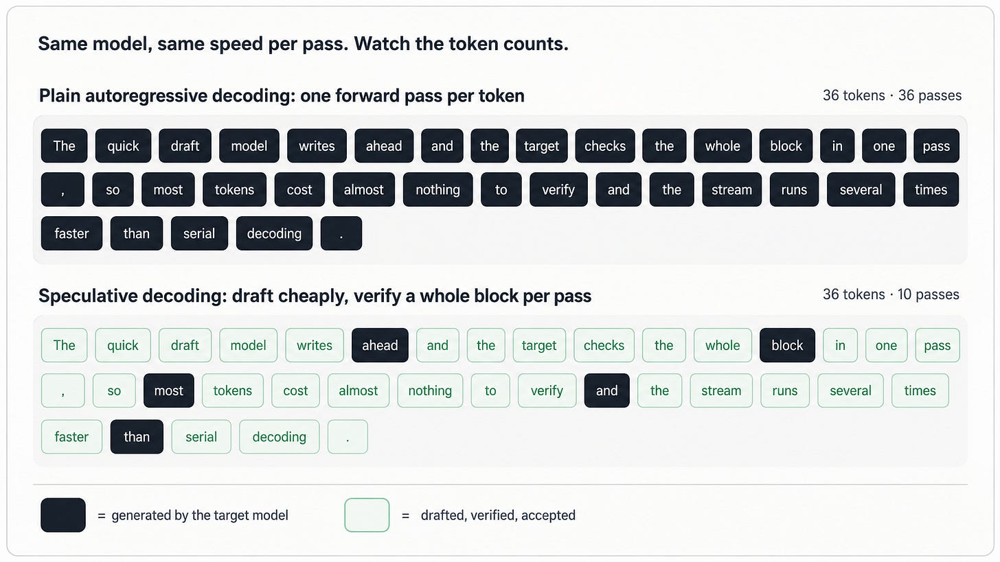
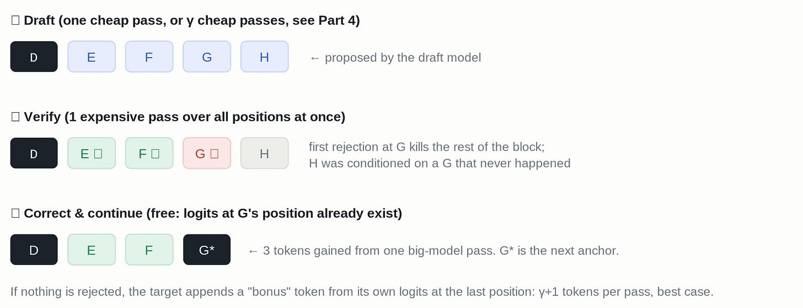
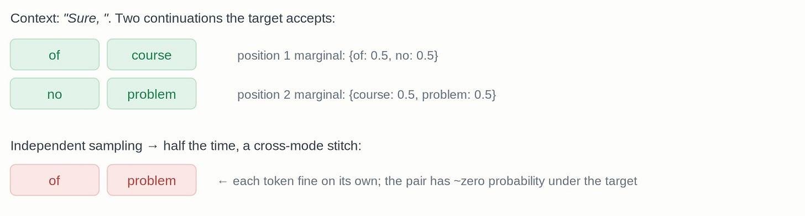
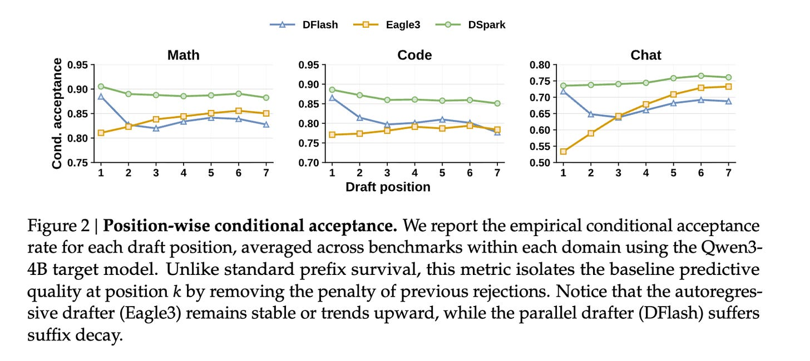
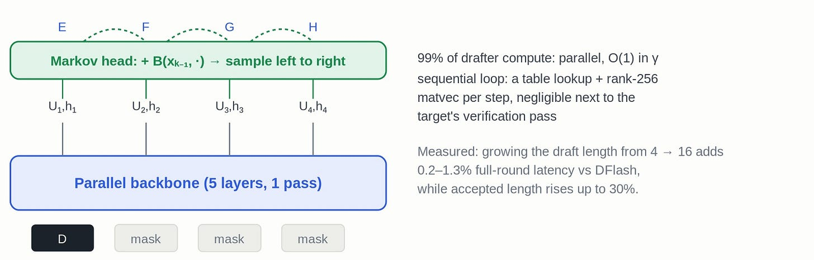
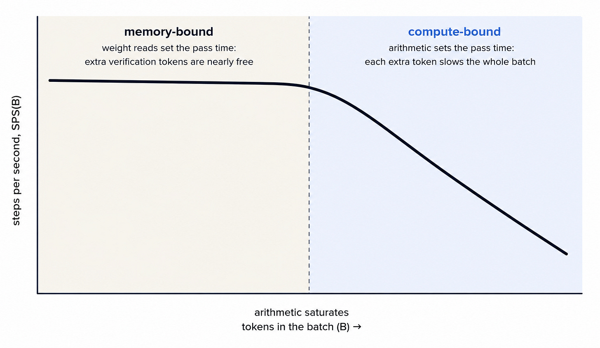
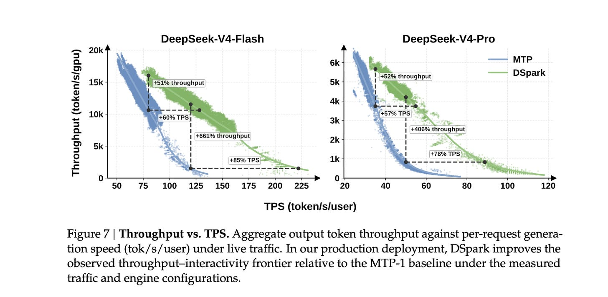
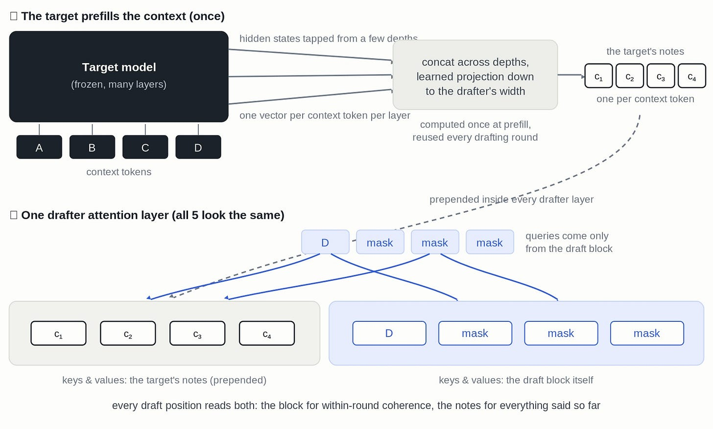

<strong style="font-size:16px;color:#1a6ba0;">要点速览</strong>

- <strong>投机解码的本质</strong>：大模型解码是内存受限的，每生成一个token都要把全部权重从HBM读一遍；权重读取按前向传播付费，所以一次性验证多个token几乎不增加时间成本。  
- <strong>平行草稿器的死穴</strong>：并行预测每个位置、互相看不到采样结果，导致「多峰碰撞」：把两个有效续写缝成无效片段，接受率随块内位置快速衰减（后缀衰减）。  
- <strong>DSpark点子一</strong>：在并行主干后加一个极便宜的sequential Markov头（学到bigram），补上「相邻token是否连贯」这一信息，Qwen3上接受长度比Eagle3高27–31%。  
- <strong>DSpark点子二</strong>：在生产serving系统里逐请求、逐步决定验证多少个草稿token，用置信度头预测每个token的存活概率，按期望吞吐贪心分配批槽，绕开无损性陷阱后已部署到DeepSeek-V4。

## 1. 每个token都要一次完整前向

自回归语言模型一次只产出一个token。要生成第t+1个token，它需要以到第t个token为止的所有内容为条件做一次前向传播。

要判断这到底是不是瓶颈，我们跟着一次解码步骤走过GPU，看看时间花在哪。要生成一个新token，模型必须算出它的logits（词表上的softmax前分数）。拿到它们意味着模型里的每个权重矩阵都要从GPU主存搬进计算单元。这块主存叫 **HBM（High Bandwidth Memory，高带宽内存）**，它存着模型权重和KV cache。对一个70B模型、16-bit精度，生成一个token的logits大约要读140GB权重。

相比之下做的算术少得可怜：每个权重对每个token大约只参与一次乘加。一块H100每秒能做约一千兆次乘加，但从HBM里读数据只约3 TB/s。所以这个解码步骤是**内存受限（memory-bound）**的：它的墙钟时间由权重读取耗时决定，而不是由计算决定。另一极：算术本身成为瓶颈：叫**计算受限（compute-bound）**。解码远远没到那一步，而这个落差正是整个机会所在。在内存受限区间，算术单元大部分时间是闲着的：乘法器瞬间干完活，然后干等下一批权重流入。

图：内存受限区间下，权重读取占满时间，算术单元大部分空闲

漏洞在于：**权重读取是按前向传播付费，不是按token付费。** 把8个token位置塞进同一次传播，权重从HBM只读一次，然后乘以8个向量而不是1个。内存流量几乎不变。你做了8倍的算术，但算术本来就是闲置资源，所以一次过8个位置比过1个只慢一点点。

你早就认识这个效应，它叫 **prefill/decode落差**。Prefill是模型读入你的prompt，所有prompt token事先已知，一起过模型，权重读取成本被分摊到所有token上。解码每次传播只生成一个新token，每次都付全价。

解码不能像prefill那样批处理，因为位置t+1的输入是位置t采样出的token，在上一次传播结束前它不存在。但假设有人递给你接下来8个token的猜测。现在你就暂时有了全部8个输入，大模型可以prefill风格地一次过完，同一次传播还给模型在每个位置上的next-token分布：这些分布正是它逐位置检查这个猜测哪里开始不对的东西。**验证是prefill形状的，生成是decode形状的。**

谁来写这个猜测？一个更小更便宜的模型。这就是投机解码：本文里所有东西都是在把慢生成转成快验证加一个廉价猜测。

## 2. 廉价起草，并行验证

投机解码跑成一个循环：起草几个token，验证它们，保留好的前缀，重复。大家用的版本来自Leviathan等和Chen等。一个轻量的草稿模型提出一个含 γ 个候选token的块。目标模型对整个块跑一次前向，在每个位置得到自己的next-token分布，然后从左到右逐位置决定是否与草稿一致。

设最后一个确认的token是D，叫它**锚点（anchor）**：这一轮草稿挂着的那个已确认token。草稿提出E F G H。目标可能接受E和F、拒绝G。拒绝不是白干：目标已经在G的位置算出了分布，所以它从一个修正版里采样出替代G*，叫**修正token（correction token）**。第一个拒绝之后的所有东西（H）都被扔掉，因为它们是以一个从未发生的token为条件的。

如果每个草稿token都被接受，这一轮就白赚一个额外token：这次传播还在最后一个草稿token之后的位置算出了目标的分布，目标从那里采样并追加这个**奖励token（bonus token）**。

图：一轮投机解码：起草若干token，目标一次验证，保留接受前缀，抛弃首个拒绝之后的部分

### 接受规则，以及为什么输出是无损的

投机解码的大主张是它**无损（lossless）**：输出token的分布和目标模型单独生成时完全一样，连温度都包括。这是个真保证，不是近似，它来自一条拒绝采样规则。在位置k，草稿分布pᵈ 和目标分布pᵗ，草稿token xₖ 以如下概率被接受：

当目标给这个草稿token的概率至少和草稿一样大（pᵗ(xₖ) ≥ pᵈ(xₖ)）时永远保留它；当草稿对它过采样时，只在比例pᵗ/pᵈ下保留它。被拒绝时，替代token从残差分布norm(max(0, pᵗ − pᵈ))里采样。

一个漂亮的推论是，逐位置接受概率等于 **1 − ½‖pᵈ − pᵗ‖₁**，这说明草稿模型的全部工作就是和目标保持分布上的接近。DSpark后面复用这个确切量作为一个免费的训练标签。

## 3. 延迟方程

生成一个token要多少时间？投机解码按轮付费，一次起草加一次验证，拿回数量不定的token，所以成本是**每轮时间除以每轮token数**。设 τ 是每轮平均拿到的token数（接受的草稿token加奖励/修正token），Tdraft是写草稿的时间，Tverify是目标验证传播的时间。那么每个生成token的延迟是 τ 越大、Tdraft和Tverify越小越快。

这留下三条提速的路：起草更快（缩小Tdraft）、起草更好（抬高 τ）、验证更聪明（不再把Tverify花在注定活不下来的草稿token上）。大部分文献只选其中一条。

**DSpark不寻常地同时打两项**：用架构改动打 τ，用调度器打Tverify。第二击只有当你不再想单个用户、开始想一个有几百个并发请求的服务系统时才有意义。但首先，是标准的草稿器设计菜单。

## 4. 两种造草稿器的方法

**自回归草稿器**（EAGLE、DeepSeek的MTP多头预测）是小语言模型，一次一个token地生成草稿，每个都以最后一个为条件。它们产出连贯的草稿，但起草成本随块大小线性增长（Tdraft ∝ γ）。为了让起草便宜，它们必须保持浅（EAGLE式草稿器通常只有一层transformer）并让 γ 小，这同时限制了块长度和草稿器能知道多少。

**并行草稿器**（Medusa，以及最近的DFlash）在单次前向里填完所有 γ 个位置：喂入锚点token加一排mask token，一次性读出所有位置的logits，diffusion风格。现在Tdraft几乎与 γ 无关，所以你用得起深得多的草稿器（DFlash用5层，EAGLE用1层）和长得多的块（γ = 16的成本约等于 γ = 4）。

DFlash是DSpark所基于的并行草稿器，值得细说，因为DSpark重用了它的整个骨架。草稿器是个5层小transformer，输入是锚点token的embedding后接mask-token占位符，所有位置双向互相attention，一次前向给块里每个位置产出logits。它甚至不拥有自己的embedding表或输出头，借目标模型的、冻结的。

它的核心技巧叫 **KV injection（KV注入）**：目标处理上下文时，几层的隐藏状态被存下来，投影降维到草稿器的宽度，预置到每个草稿器层的keys和values之前，于是每个草稿位置都能attend到目标自己对所有已说内容的内部表示。这一切在prefill时算一次，之后每轮复用。草稿器不是用自己的5层去理解对话，而是读大模型的笔记：这正是它能模仿比自己大几千倍模型的重要原因。

所以并行草稿器既跑得更快，又可以免费更深。这听起来应该完胜，但并没有。

## 5. 并行草稿器在哪崩：多峰碰撞

并行草稿器一次性、一步预测每个位置。位置3看不到位置2实际采了什么，只能看到共享上下文。所以当上下文允许多个同样好的续写时，每个位置都在它们之间对冲。

拿上下文「Sure, 」来说。目标模型对of course或no problem都满意。一个并行草稿器从它的边际分布逐个位置采样，可以吐出of problem或no course：两个有效答案的碎片缝进了一个无效答案。这就是**多峰碰撞（multi-modal collision）**问题，自非自回归机器翻译时代（Gu等，2018）就为人所知。每个token单独看都合理，组合起来是垃圾，目标拒绝它。

损伤表现为**后缀衰减（suffix decay）**：接受率随块内位置迅速下滑。论文用一个漂亮指标衡量它，叫**逐位置条件接受率**：在位置k，只统计位置1…k−1都被接受的情况，再问k被接受的频率，剥掉复合存活惩罚，露出草稿器在每个深度的原始预测质量。

图：并行草稿器把不同有效续写的片段拼在一起，产出目标会拒绝的无效序列

### 为什么DFlash仍拿到更长的接受长度

曲线让Eagle3在位置3之后几乎处处显得是更好的草稿器。然而在接受的token长度上，DFlash在论文几乎每个benchmark上都打败它。这个错位由验证给块打分的方式解释：验证接受一个前缀、丢弃第一次拒绝之后的所有东西，所以每轮期望收获是**乘法复合**的。

写成条件接受率c₁, c₂, … 的期望接受数，每一项都含c₁，所以把c₁ 抬10% 就让整个和涨10%，而抬c₆ 只动最后几项。**位置1的拒绝抹掉整块，位置6的拒绝只抹掉一两个token。** 不管草稿器擅长什么，擅长位置1比在别处擅长值好几倍。

而位置1正是深度并行草稿器有优势的地方：第一个位置还没有任何草稿token，两类草稿器都以同样的东西为条件（已验证的上下文），依赖建模在那里买不到什么。决定位置1的是原始容量，而延迟预算是倾斜的：自回归草稿器每位置跑一次、必须保持浅（Eagle3是一层），并行草稿器每块跑一次、用得起5层加KV注入。

## 6. DSpark点子 #1：给并行草稿器拧上一个bigram

后缀衰减的显然修法是让草稿器重新自回归，但那样你又回到Tdraft ∝ γ。DSpark只在几乎零成本的地方加自回归。昂贵的部分：5层KV注入的DFlash主干：照旧完全并行：一次传播给每个位置产出隐藏状态h₁…hᵧ 和base logits U₁…Uᵧ。之后，一个小的**顺序头（sequential head）**从左到右扫过块，给每个位置的logits加一个修正，这个修正依赖于它之前已采样的token。其中Uₖ 是并行主干已给的base logits，Bₖ 是顺序头的修正，也是唯一允许看块历史的项。

默认的B是一个小 **Markov头**：它扔掉除紧邻前一个token之外的一切，修正变成B(xₖ−₁, ·) ∈ ℝᵛ：一个由刚来的token选定的完整logit修正向量。写成表就是个V×V矩阵，即一个**学到的bigram模型**，以秩256分解存储。每位置顺序循环的成本是一次表查找加一次小矩阵-向量乘，相对目标的验证传播可以忽略不计，且它和草稿器其余部分一起用梯度下降学，不是从语料数出来的。

回到碰撞。主干并行地给出位置1为 {of, no}、位置2为 {course, problem}。顺序循环先采样位置1得到of，移到位置2时，「of」的bigram偏置抬高course、压低problem，于是草稿器不再把「of problem」缝在一起。

作者也试了一个RNN头（携带整个块内前缀而非仅最后一个token），它只在长块上略有帮助。论文认为这个近乎为零的结果正是最有用的发现：**并行草稿器的后缀衰减主要是相邻token不连贯的问题，而不是缺长程信息。**

通过KV注入，每个草稿位置已经看到目标对整个对话的表示。缺的那块是相邻位置采了什么，而这在前向结束前不存在。只有采样时跑的东西能补上这个缺口，而bigram是最小的这种东西。

图：并行主干产出base logits，顺序Markov头按已采样token追加修正，消除相邻位置不连贯

在Qwen3-4B/8B/14B上，DSpark的macro平均接受长度比Eagle3高 **27–31%**、比DFlash高 **16–18%**，而且2层的DSpark已经打败5层的DFlash：增益来自依赖建模而非额外参数。在条件接受曲线上，DSpark在DFlash打开的地方打开、在Eagle3持平的地方持平。

图：DSpark把昂贵的并行草稿计算保持并行，再加一个便宜的顺序Markov头提升块内连贯性

## 7. Serving问题：草稿token争抢批空间

之前一切都是单用户故事。生产里目标模型是共享的，一份拷贝同时服务几百个用户，每次前向处理一个批。批由serving引擎（vLLM、SGLang、DeepSeek自己的引擎）完成：第1部分里摊销权重读取的技巧，从跨位置改成跨用户。

但批是共享的、有限的资源。小批让传播保持内存受限，额外的token免费搭车；一直加token，到某个批大小算术单元不再是闲着的那个，每多一个token都让传播对所有用户明显变慢。这给每个引擎一条特征曲线 **SPS(B)：每秒步数作为批持有token数的函数**：内存受限时持平，计算受限时下跌。

一个请求提交验证的每个草稿token占批里一个token槽，被拒绝的token浪费它的槽。**在曲线平的那段浪费无害，在陡的那段，同一个token贡献0.2个期望token、却拖慢共享传播的其他几百个，它不值这个槽。**

该验证多少也取决于内容。草稿器在结构化文本上表现好、开放式文本上差：Qwen3-4B上论文测到数学约5.6个接受token/轮、代码5.1、聊天3.5。所以一个固定长度两头都错。

在这篇论文之前，DeepSeek的生产系统每轮只起草一个token（MTP-1），尽管他们已经造了多头草稿器（MTP-3、MTP-5）。静态3-token起草下，每个请求给每个批加3个token，不管负载或内容是否配得上；在生产并发下其中很多是注定被拒的晚期聊天token。批变大、每次传播变慢，跨所有用户的减速超过多接受的token，总吞吐反而下降。生产因此停在从不翻车的「每轮一个token」：代价是 γ = 1时一轮最多产两个token，上限大约2x加速，第4部分为大并行块做的所有事都没用上。

出路是别再给所有人挑一个长度，而是**逐请求、逐步决定**：给定此刻的负载，这个请求多少个草稿token配得上一个批槽？草稿器已经产出了整块 γ-token，成本已沉没；唯一的选择是哪些token拿到槽，被砍掉的悄无声息地丢。

图：额外验证token在批内存受限时几乎免费，一旦进入计算受限区间就变昂贵

## 8. DSpark点子 #2：按期望吞吐挑验证长度

调度器是引擎的一部分，在目标模型每次前向之前决定这次传播里放什么：哪些请求参与，以及每个请求贡献多少个草稿token。对一次验证步骤，有R个活跃请求，每个都刚起草了 γ-token块，调度器给每个请求r挑一个验证长度 ℓᵣ ∈ {0, …, γ}：验证前 ℓᵣ 个草稿token，丢掉其余。一个长度选择由这一步整个系统的**期望token吞吐**来评判：SPS(B) 是成本曲线，τ 是跨请求求和的期望输出token数，每个被接纳的草稿token给 τ 加aᵣ,ⱼ（它在验证中存活并真正进输出的概率）。

### 置信度头（confidence head）

一个槽「回本」意味着什么？一个草稿token在从左到右的检查真的走到它（块里每个更早token都被接受）且也接受了它时才存活。为此他们用一个置信度头，每个位置输出一个标量cₖ：在检查走到位置k的前提下它被接受的概率，正是第5部分曲线测的条件接受率，现在逐token预测。头本身很小：读主干隐藏状态加前一个token的Markov embedding，过一次线性投影加sigmoid。它的训练标签是免费的：第2部分的精确接受概率在每步训练都可算，直接当软标签用。

因为cₖ 是条件的，链式法则免费把它们变成完整存活概率aₖ = c₁·c₂⋯cₖ。一个要求是分数必须**被校准**（打了0.8的token真的约80% 被接受）；原始头过于自信，逐位置温度缩放把预测-观测差距从3–8% 缩到约1%。

一次性挑所有R个长度听起来是组合问题，但存活概率有性质让这变简单：在一个请求内aᵣ,ⱼ 是0到1之间数的乘积，所以aᵣ,₁ ≥ aᵣ,₂ ≥ … ≥ aᵣ,ᵧ。这个递减顺序正是**贪心算法**能用的理由：把所有请求的候选扩展倒进一个池，按aᵣ,ⱼ 排序，从顶上接纳，每接纳一个重算 Θ（一次查表）。请求内约束（没位置1、2就不能验证位置3）自己就强制了，因为每个请求的存活概率已经递减。

当批几乎空时，SPS(B) 停在平的段，接纳另一个token几乎免费抬高 τ，调度器验证得长（每请求4–6个token）；随着批填满，只有存活概率胜过拖累的token才进得去，预算缩水。在一个批内，0.9置信度的代码请求保持长验证，置信度在位置2就崩的聊天请求在那被砍，**全程没有设任何阈值**。

### 一个破坏无损性的版本

无损性除了接受/拒绝规则还需要一个条件，落在调度器上：**token k是否被接纳验证不能依赖token k的值**（非预知性non-anticipation）。固定验证长度平凡满足它，但贪心搜出来的长度可能违反：置信度头读前一个token的Markov embedding，c₂ 因而a₂ 是抽了哪个x₁ 的函数，于是决定x₁ 是否被接纳的比较已经依赖抽了哪个x₁。论文用二元词表的例子说明这会导致输出分布偏向自信续写。

干净算法的解决方案是一个 **early-stopping断点**：走排序的接纳路径，在第一个降低 Θ 的接纳处停。于是关于位置k的决定在查任何由xₖ 算出的东西之前就定下了，证明才走得通。

图：调度器按存活概率把各请求的候选扩展排序，贪心分配批槽

## 9. 让它在真实引擎里跑起来

在DeepSeek的真实引擎里，第8部分的算法在两处崩。第一处是 **SPS曲线不平滑**：kernel为特定批形状调过，传播时间在tile大小和dispatch边界处跳变而非渐升，early-stopping断点在锯齿曲线上会把系统困在局部最优。第二处关于 **timing**：现代引擎用CUDA-graph replay，下一次批大小必须在当前传播结束前定好，而第8部分调度器需要当前步的置信度分数，那些在步做完前不存在，同步跑它GPU会在每对步之间停顿。

部署版通过**把批容量提前几步算好**绕过这两个问题：调度器用两步之前的置信度分数定下K（下一次传播能负担验证的token数），在传播启动前就准备好；真正填满K个槽的token仍在这一刻从当前步的真实分数里挑，保留前K个。

这个设计也了结了无损性问题：截断K从两步前的旧数据定下、在这一步任何token存在之前，而填槽的新鲜排序只查块里更早的token，从不是token k自己或它之后的任何东西：正是非预知性要求的，所以构造上成立，early-stopping断点可以去掉，搜索能全局跑到真最大值。**同一个设计选择既修了流水线停顿又恢复了精确性。**

### 真实流量数字

部署在DeepSeek-V4-Flash和V4-Pro下、真实用户流量中，对比在位者MTP-1。论文Figure 8显示中等并发下平均验证预算停在每请求4–6个token，随着并发上升调度器缩小它，在低价token占批槽前就丢掉低置信度token。

图：真实流量下验证预算随并发上升而收缩（论文Figure 8风格化重绘）

论文留开放的几件事：SPS表只按批大小索引，而真实每步成本还取决于上下文长度分布；置信度头在teacher-forced前缀下训练、却部署在采样出的前缀上（训练/推理不匹配）；校准在留出集上拟合、实时流量会漂移；草稿器仍在每个请求上烧一整块 γ 前向，调度器剪的是验证不是起草。

## 10. 真正要记住什么

DSpark重要的不只是它让投机解码更快。更早的工作大多问怎么造更好的草稿器：更便宜、更深、或更准。DSpark表明这只有一半故事。在真实serving系统里，问题不是「我能起草多少token？」而是「此刻哪些起草token值得花目标模型批容量？」论文的两个主要点子回答了这个问题的两面：一个半自回归的Markov头让长并行草稿连贯得多，一个吞吐感知的调度器决定在当前负载下验证草稿的多少。

<strong style="font-size:15px;color:#8b6f4c;">结语</strong>

DSpark的启发在于把投机解码从「怎么造更好的草稿器」重新框架成「怎么分配共享的批容量」：前半是架构补丁（Markov头），后半是系统调度（吞吐感知），两者合起来才把并行草稿器的长块真正用到了生产里。  
论文最有价值的负面结果，是RNN头几乎没帮助：它证明并行草稿器的后缀衰减主要是相邻token不连贯，而不是缺长程信息，所以一个最小的一阶bigram就够，不必为复杂递归买单。  
部署版提前两步定K的设计，同时解决了锯齿曲线上的局部最优和CUDA-graph的timing约束，还顺手恢复了无损性，是个把工程限制变成正确性的漂亮例子。  
仍待解的缺口是调度器只剪验证不剪起草：每个请求无论多没希望都先烧一整块 γ 前向，这部分的计算浪费DSpark还没碰。

---

【传送门】 
<a class="normal_text_link mp_article_text_link" href="https://mp.weixin.qq.com/s/00mkoR8kdo_G9Xt2PLUevg" target="_blank" data-linktype="2">RLM：MIT提出递归语言模型，处理超长上下文不再是难题</a> 
<a class="normal_text_link mp_article_text_link" href="https://mp.weixin.qq.com/s/LernqwWz_g6jUMSHDGiLZQ" target="_blank" data-linktype="2">Google发布Agent知识标准OKF - Open Knowledge Format：解决上下文碎片问题</a> 
<a class="normal_text_link mp_article_text_link" href="https://mp.weixin.qq.com/s/US2wSIxUd4GrtFm1Ion1BA" target="_blank" data-linktype="2">MiniMax-M2.7解读: 9.8B激活参数硬刚GPT5.4/Opus4.6;逆势Full Attention</a> 
<a class="normal_text_link mp_article_text_link" href="https://mp.weixin.qq.com/s/OqtF6ZaWQNu3o-VAWLfqbg" target="_blank" data-linktype="2">榨干GPU性能：流水线解码消除GPU气泡，推理吞吐提升35%</a> 
<a class="normal_text_link mp_article_text_link" href="https://mp.weixin.qq.com/s/o6pnSWW01pahFQelJSbSPA" target="_blank" data-linktype="2">华为「韬定律」全解析：从 τ 常数到4GHz麒麟，一张时间表看清未来十年芯片路线</a> 
<a class="normal_text_link mp_article_text_link" href="https://mp.weixin.qq.com/s/olxLm3almopaba6J2JeFrA" target="_blank" data-linktype="2">Anthropic：如何用Claude实现95%自动化数据化分析</a> 
<a class="normal_text_link mp_article_text_link" href="https://mp.weixin.qq.com/s/0dQ7pBJ0NmFt-bOwUCQ5ew" target="_blank" data-linktype="2">Torch解析系列二：Dynamo字节码级的计算图捕获</a> 
<a class="normal_text_link mp_article_text_link" href="https://mp.weixin.qq.com/s/MLFtBJrXFoHn6IPj1Z_36Q" target="_blank" data-linktype="2">苹果Apple感知压缩新突破PICO：图像画质不降低，体积只有1/3</a> 

---

参考：https://www.the-information-bottleneck.com/p/speculative-decoding-from-zero-to
