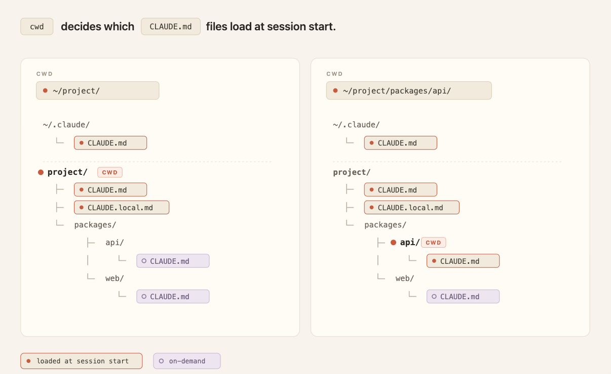
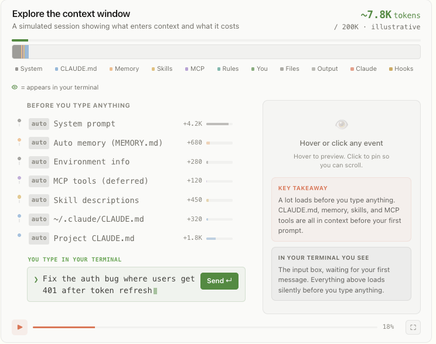
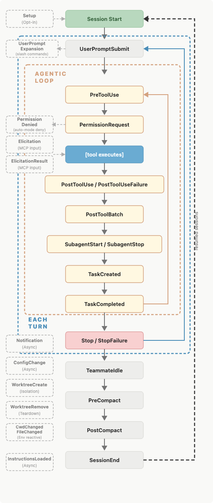

**Steering Claude Code：Skills、Hooks、Subagents 等更多定制方式**

Claude Code 提供了**七种方法**来定制 Claude 的行为。每种方法在加载时机、压缩处理方式、上下文成本和最佳使用场景上各有不同。

---

<div style="background:#e8f4fd;padding:14px 16px 10px 16px;border-radius:6px;margin-bottom:18px;">
<div style="text-align:center;margin-bottom:10px;">
<strong style="font-size:16px;color:#1a6ba0;">要点速览</strong>
</div>
<div style="font-size:14px;color:#3f3f3f;line-height:1.75;">
- <strong>七种定制方法</strong>：CLAUDE.md、Rules、Skills、Subagents、Hooks、Output Styles、追加系统提示，各有不同的上下文成本和适用场景<br><br>
- <strong>上下文成本是关键考量</strong>：CLAUDE.md 每行都消耗 token，Skills 和 Subagents 只在调用时加载，Hooks 完全绕过上下文窗口<br><br>
- <strong>路径限定是节省 token 的核心技巧</strong>：Path-scoped Rules 只在匹配文件被触碰时才加载，避免全局浪费<br><br>
- <strong>Hooks 用于确定性自动化</strong>：不是给 Claude 的指令，而是必须可靠执行的动作——运行 linter、发 Slack、阻止命令
</div>
</div>

---

**快速参考表**

| 方法 | 加载时机 | 压缩行为 | 上下文成本 | 最佳用途 |
|------|----------|----------|-----------|---------|
| **CLAUDE.md（根目录）** | 会话启动，全程驻留 | 记忆化，压缩后重新读取 | 高（每行都消耗 token） | 构建命令、目录布局、单体仓库结构、编码规范、团队约定 |
| **CLAUDE.md（子目录）** | 按需——Claude 读取该目录下的文件时 | 子目录不再触碰后丢失 | 低 | 子目录特有的约定 |
| **Rules** | 会话启动（用户级）或匹配文件被触碰时（路径限定） | 压缩后重新注入 | 中（非路径限定则始终开启） | 特定约束/约定（如"所有 API handler 必须用 Zod 验证"） |
| **Skills** | 名称/描述在会话启动时加载；完整正文在调用时加载 | 已调用的 Skills 按共享预算重新注入，最旧的优先丢弃 | 低（完整正文只在调用时加载） | 流程性工作（部署/发布清单） |
| **Subagents** | 名称/描述/工具列表在会话启动时加载；正文只在通过 Agent 工具调用时加载 | 只有最终消息（摘要+元数据）返回主会话 | 低（调用前主上下文中零成本） | 隔离运行的并行/侧线任务（深度搜索、日志分析、依赖审计） |
| **Hooks** | 在生命周期事件上触发 | 完全绕过压缩 | 低（配置在主上下文之外） | 确定性自动化（linter、Slack 通知、阻止命令） |
| **Output styles** | 会话启动时注入系统提示 | 永不压缩 | 高（占用上下文窗口，覆盖默认） | 重大角色变更（代码助手→通用助手） |
| **追加系统提示** | 会话启动，作为 CLI 标志传入 | 永不压缩，仅对该次调用生效 | 中（首次请求后缓存） | 语气、回复长度、格式偏好 |

---

**每种方法的详细拆解**

**1. CLAUDE.md 文件**

- **根目录 CLAUDE.md**——在会话启动时加载，全程驻留。最适合放：构建命令、目录布局、单体仓库结构、编码规范、团队约定。
- **子目录 CLAUDE.md**——只在 Claude 读取该目录下的文件时才加载。最适合放单体仓库中团队特有的约定。
- **建议：** 保持根目录 CLAUDE.md 在 **200 行以内**，指定负责人，像代码一样审阅变更。把它看作一个概览或索引。
- **警告：** 在共享仓库中，CLAUDE.md 会随着每个团队追加指令而膨胀。把团队特有的约定推进路径限定的 Rules，把流程性工作推进 Skills。
- **单体仓库建议：** 使用 `claudeMdExcludes` 设置跳过你从不触碰的团队的代码文件。
- **组织级标准：** 通过 MDM/配置管理部署集中管理的 CLAUDE.md（个人设置无法排除它）。



**2. Rules**

- 存放在 `.claude/rules/` 目录下——markdown 文件，可选 `paths` frontmatter。
- **无范围 Rules**——始终在会话启动时加载，压缩后重新注入。可能浪费 token。
- **路径限定 Rules**——只在 Claude 读取匹配 `paths` 模式的文件时才加载。示例：

```yaml
---
paths:
  - "src/api/**"
  - "**/*.handler.ts"
---
All API handlers must validate input with Zod before processing.
```

- **建议：** 当指令是横切关注点、适用于代码库多个（但不是全部）角落时，用路径限定 Rule。在这种情况下优先于嵌套的 CLAUDE.md。

**3. Skills**

- 存放在 `.claude/skills/` 目录下，每个是一个文件夹，内含 `SKILL.md` 文件（名称、描述、正文）。
- 只有名称和描述在会话启动时加载；完整正文在调用时加载（通过斜杠命令如 `/code-review` 或自动匹配）。
- 压缩时，已调用的 Skills 按共享预算重新注入，最旧的优先丢弃。
- **建议：** 流程性工作（部署、发布清单、审查流程）属于 Skill，不应放在 CLAUDE.md 中。
- 有内置 Skills；也可以编写自定义 Skills（参见[完整指南](https://claude.com/blog/complete-guide-to-building-skills-for-claude)）。


**4. Subagents**

- 存放在 `.claude/agents/` 目录下——YAML frontmatter（名称、描述、可选模型/工具访问权限）+ 正文（subagent 的系统提示）。
- 名称、描述和工具列表在会话启动时加载；正文从不进入父会话。
- Claude 通过 **Agent 工具**调用它们；subagent 在自己的独立上下文窗口中运行。
- 只有最终消息（摘要+元数据）返回主会话。
- 最多可嵌套 **5 层**；动态工作流可编排数十到数百个后台 Agent。
- **建议：** 当侧线任务（深度搜索、日志分析、依赖审计）需要隔离运行且只返回摘要时，用 Subagent。当你想在主线程中看到并引导每一步时，用 Skill。



**5. Hooks**

- Hooks 是用户定义的命令、HTTP 端点或 LLM 提示，在特定生命周期事件上触发。
- 在 `settings.json` 中注册，或在 Skill/Agent frontmatter 中注册。
- 类型分为：command、HTTP、mcp_tool（确定性）| prompt、agent（使用 Claude 的判断力）。
- 上下文成本低——配置在主上下文窗口之外。输出只在显式配置时保存。
- **建议：** Hooks 用于**必须**可靠执行的事情，不是给 Claude 的指令。



**6. Output Styles**

- 存放在 `.claude/output-styles/` 目录下——将指令注入系统提示。
- 永不压缩，每次会话都加载，首次请求后缓存。中等上下文成本。
- **警告：** 自定义样式会**替换**默认输出样式（除非设置 `keep-coding-instructions: true`）。这会移除关键默认行为（范围限定变更、代码注释、安全、验证习惯）。
- 内置样式：Proactive、Explanatory、Learning——覆盖了大多数需求，无需维护。
- **建议：** 在写自定义样式之前，先检查内置样式是否够用。

**7. 追加系统提示**

- 通过 `--append-system-prompt` 标志传入——仅追加不修改 Claude 的角色。
- 只对该次调用生效（不持久化）。
- 上下文成本较高（增加输入 token，但首次请求后提示缓存有帮助）。
- 指令越多→遵守越不严格，尤其当指令相互矛盾时。
- **建议：** 最适合特定编码标准、输出格式或领域知识。保持指令简洁。

---

**定制快速建议**

| 如果你发现自己在 CLAUDE.md 中写…… | 考虑改用…… |
|------|------|
| "每次 X 时，总是做 Y" | **Hook**（在 settings.json 中，确定性） |
| "永远不要做这个" | **Hook**（PreToolUse 配合 exit code 2）或 **托管设置**（管理员强制执行，不可覆盖） |
| 一个 30 行的流程 | **Skill**（只在调用时加载） |
| 一个没有路径的 API 特定规则 | **路径限定 Rule**（节省 token） |
| 个人偏好写在项目级 CLAUDE.md 中 | **用户级文件**（跨所有仓库生效） |

---

**开始使用**

- 更多模式：[Claude Code 最佳实践](https://code.claude.com/docs/en/best-practices#write-an-effective-claude-md)
- 将多个定制（Skills、Subagents、Hooks、Output Styles）打包为一个 **plugin**，可在团队成员/项目间共享。

---

<span style="font-size:12px;color:#888888;">参考：https://claude.com/blog/steering-claude-code-skills-hooks-rules-subagents-and-more</span>
