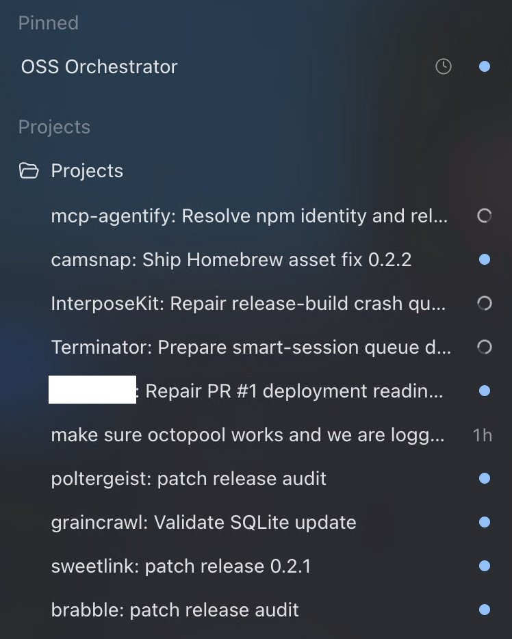

**OpenClaw 之父 Peter Steinberger** 发布了一个简单的循环：告诉 Codex 维护你的仓库，每 5 分钟醒来一次，把工作分配到线程中。并行化 + 按需引导，就这么简单。

他同时开源了背后的两个核心技能文件。

---

**一个真实的 Agent 维护循环**

Steinberger 的循环结构非常直白：一个编排技能（maintainer-orchestrator）作为大脑，每 5 分钟醒来一次，检查所有仓库的状态——未解决的问题、待审的 PR、CI 状态、最新发布。然后它调用分类技能（github-project-triage）对每个项目做 triage，把工作项分类：

- **可自主处理**：有清晰范围、可复现、有验证路径的，直接派 sub-agent 去修
- **需要决策**：涉及产品选择、安全/隐私决策、需要凭证或人工验证的，准备好决策材料后交给人类
- **被忽略的**：只有人类明确说"这个先不管"才算

每个可自主处理的任务，loop 开一个独立线程去执行，完成后另一个 sub-agent 做代码审查。Connectors 负责开 PR、更新 ticket。处理不了的事情落入 triage inbox 等人来处理。

**关键是：制造者和检查者必须分开。** 写代码的 Agent 不审查自己的代码。

---

**两个核心技能**

Steinberger 开源了两个 SKILL.md 文件，构成了整个循环的骨架：

**maintainer-orchestrator** — 编排层。它的职责是：协调跨仓库的维护工作，准备"决策就绪"的 PR，监控 worker 线程，清理队列，做发布。它使用 github-project-triage 对每个仓库做映射，然后分类每个队列项。对于可自主处理的任务，派独立 Codex 线程去执行（每个仓库一个线程，不混用）。编排线程保持轻量——把繁重工作派给仓库线程，然后每 5 分钟检查一次状态。

**github-project-triage** — 分类层。用户输入 `triage` 时触发。对仓库的 issues、PRs、CI 状态、阻塞项、风险做全面评估。输出三类结果：可自主处理的候选、需要 Peter 决策的、可以推迟/关闭的。每个评估项包含：匹配度（好/一般/差）、风险（低/中/高+理由）、证据状态（CI/复现/测试）、阻塞项、下一步操作。

这两个技能的组合，让 Steinberger 的 loop 可以处理数十个开源仓库的日常维护，而人类只需要做两件事：land 准备好的 PR，或决定关闭它。

---

**为什么这值得关注**

这不是一个 demo。这是**生产环境已经在跑的真实工作流**。Steinberger 维护着 OpenClaw 生态下的大量仓库，他的 loop 每天处理 issues、修 bug、审 PR、做发布——而他的工作从"写代码"变成了"设计 loop + 审结果"。

这和 Boris Cherny 说的完全一致：**"我不再写 prompt 了，我的工作是写 loops。"** 只不过 Steinberger 更进一步——他把整个 loop 的配置和技能文件都开源了。任何人可以 fork 他的 agent-scripts 仓库，改改就能用在自己的项目上。

---

**一点观察**

Steinberger 的 loop 和 Cherny 的 loop 有一个本质区别：Cherny 的 loop 是**产品内建的**（Claude Code 的 compaction + sub-agents），而 Steinberger 的 loop 是**手工搭建的**（Codex + 自定义 skills + 线程管理）。前者开箱即用但不可定制，后者需要自己组装但完全可控。Steinberger 选择开源他的配置，本质上是在说：loop engineering 不是某个产品的功能，而是一种可以独立于任何 Agent 平台存在的方法论。

另外值得注意的是，他的两个技能文件加起来超过 500 行——loop 的"简单"是表象，背后是大量工程细节（如何做 triage、如何判断信任度、如何写决策简报、如何避免 sub-agent 再创建 sub-agent）。**loop engineering 不是不写代码，而是写不同种类的代码。**

---

参考：OpenClaw 之父 Peter Steinberger 展示 Agent 维护循环
