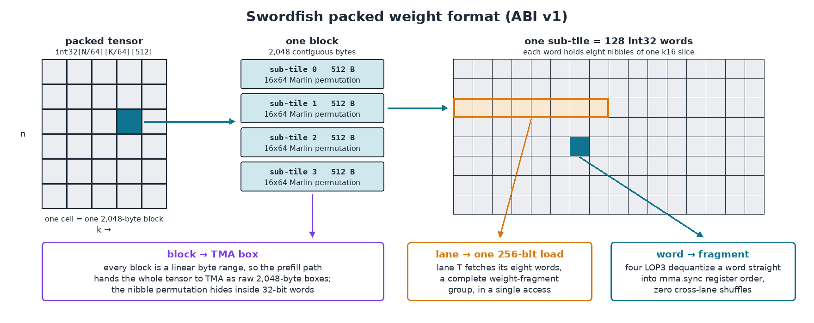
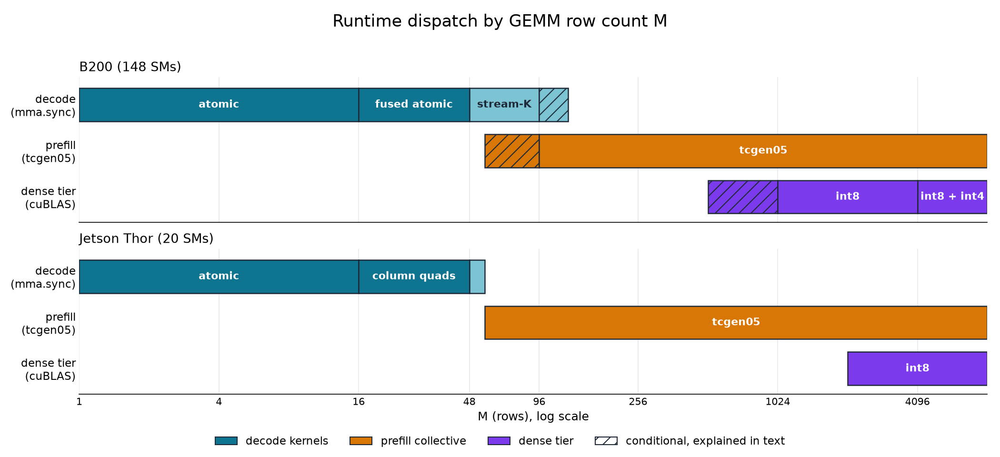
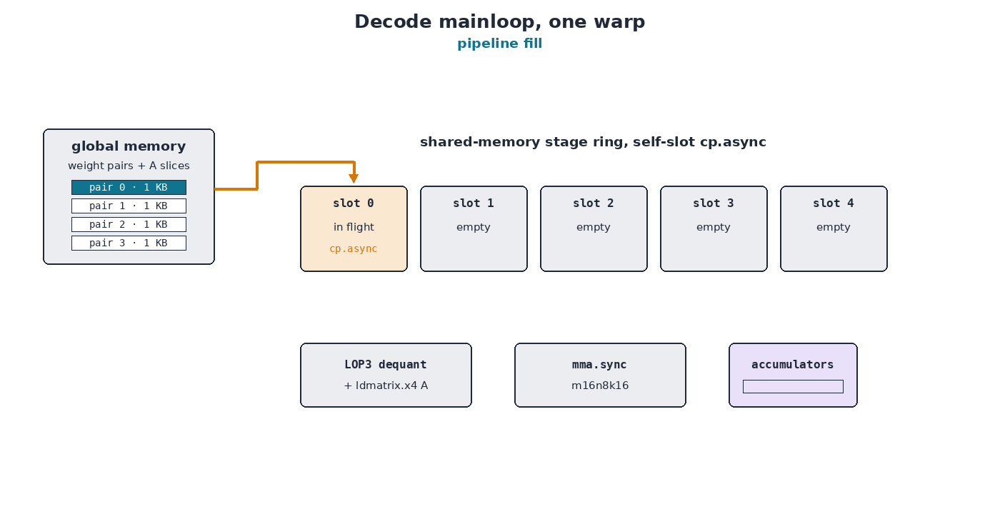
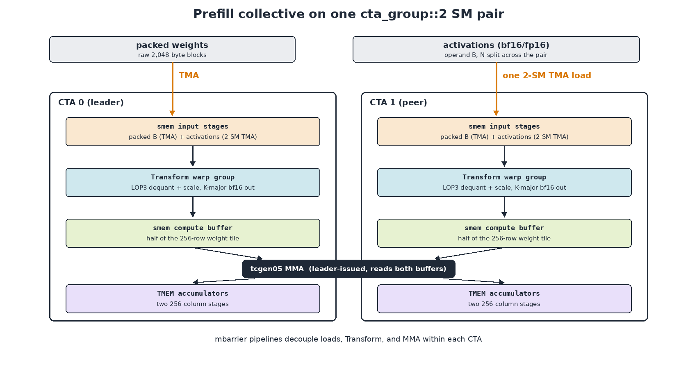
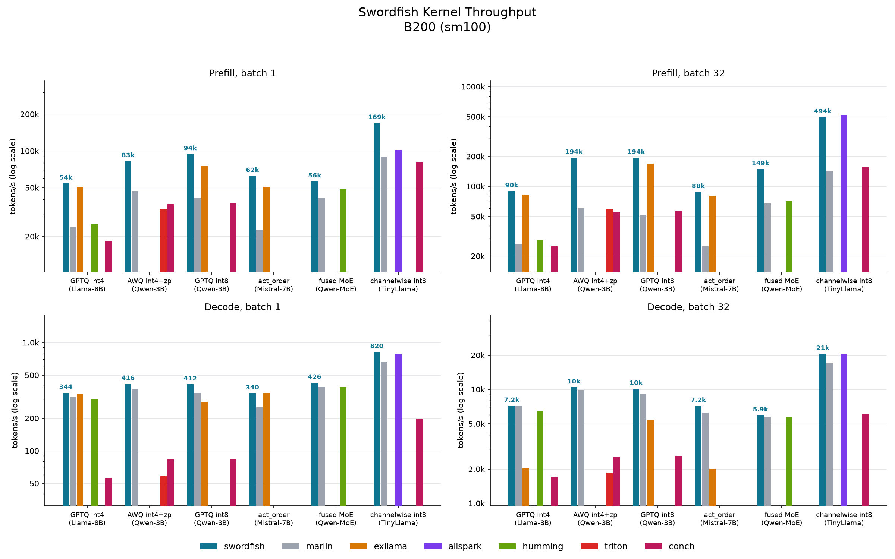
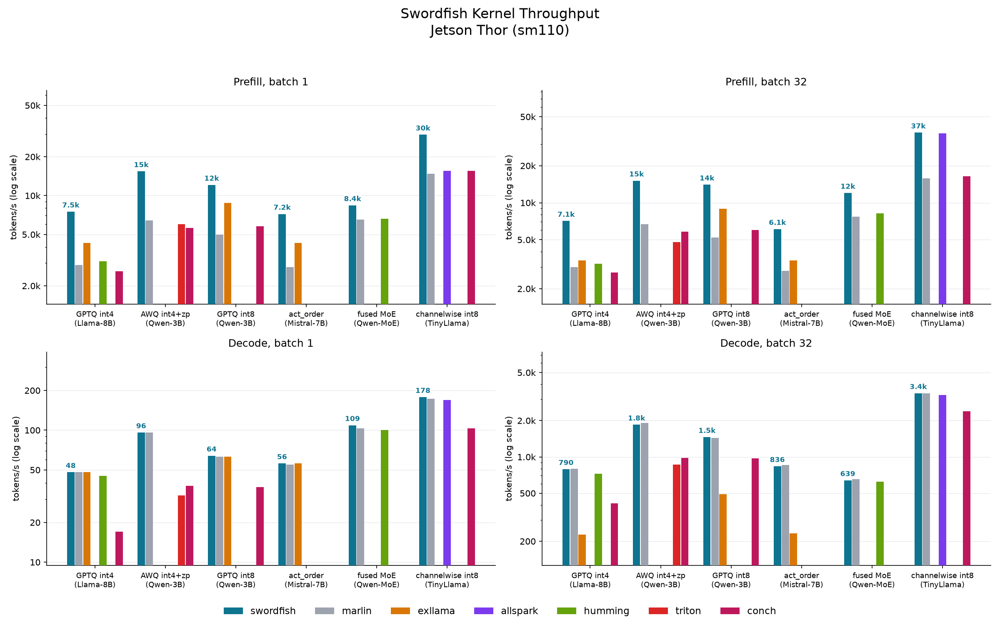

<strong style="font-size:16px;color:#1a6ba0;">要点速览</strong>

- <strong>Blackwell权重量化的新内核</strong>：Swordfish是继Marlin、Machete之后，面向NVIDIA Blackwell数据中心GPU（B200、Jetson Thor）的INT4/INT8权重量化GEMM内核家族，decode跑满DRAM屋顶线的90-97%  
- <strong>一套打包格式喂三条路径</strong>：同一个预打包张量同时服务decode内核（mma.sync）、prefill主循环（tcgen05）和稠密层（反量化后交cuBLAS），按运行时M维度自动调度  
- <strong>性能对标cuBLAS稠密BF16的90%</strong>：B200上带内联反量化的持续算力达1,444 TFLOPs，端到端prefill相对Marlin快1.4x到2.8x，decode在单请求下赢或平  
- <strong>已落地生产</strong>：集成进Sonar（原Aphrodite Engine），在支持的硬件上自动启用，也可强制指定 `--linear-backend swordfish`

## Blackwell上的变化

NVIDIA的Blackwell系列GPU为FP4数据类型（具体是NVFP4和MXFP4）引入了原生加速，块缩放在张量核心内部完成，速率最高可达BF16的四倍。自那以后NVFP4成了LLM里权重和激活值最流行的量化格式之一。在这之前，低精度跑模型的主流方式（GGUF之外）是GPTQ、AWQ这类权重量化，但它们通常仍把激活值保留在半精度。这些纯权重量化格式没有张量核心支持，想跑得快就必须写专门的内核。

Swordfish就是这条内核谱系里的Blackwell版本，只面向数据中心级GPU（B200、Jetson Thor，即sm100和sm110），不支持消费级的RTX 5090、RTX 6000 Pro Blackwell（sm120）。**在B200上，它的内核在带内联INT4反量化的前提下持续达到1,444 TFLOPs，是同形状cuBLAS稠密BF16的90%；在Jetson Thor上decode跑到了DRAM屋顶线的90-97%。**

数据中心级Blackwell带来第五代张量核心 `tcgen05`，这是Swordfish的关键。它需要三点特殊处理：

**没有混合输入MMA。** 该指令接受f16/bf16、tf32、int8、fp8/fp6/fp4这组格式以及块缩放的MX类型，但int4乘bf16的乘积无法表达，所以CUDA核心必须先反量化权重，MMA才能消费。那个反量化后的操作数放在哪里、由几条指令生成，成了最关键的架构选择。

**累加器搬进了张量内存（TMEM）。** 每个SM有256 KB TMEM（512列 × 128数据通路）。单个线程异步发出MMA，结果累加到TMEM，专门的加载指令在收尾阶段读回。warp寄存器累加器片段、以及Ampere上把MMA与收尾数学交错在同一批寄存器里的习惯，都消失了。

**一个MMA跨越两个SM。** 在 `cta_group::2` 下，单条指令跨SM对计算一个tile，操作数投送和同步都是配对模式特有的。

warp级的 `mma.sync` 路径在Blackwell上依旧可用且表现不错，所以下面的decode内核留在 `mma.sync`，而prefill改用 `tcgen05`，因为那里需要榨干所有算力。

## 一套布局服务三个消费者

decode极度受内存限制：活跃批次小，每个权重字节每步只被读一次。prefill把每个权重tile摊还到数千个token上，因此极度受计算限制。超大批次则受计算限制到这种程度：把整个权重反量化一次再调稠密库，直接就赢了。

**于是Swordfish针对一个预打包张量编译出三条路径，模型加载时只打包一次**：一组手写的decode内核（围绕 `mma.sync.m16n8k16` 的CUDA + PTX）负责到大约一百行为止的工作；一个prefill主循环（CUTLASS 4.4 sm100混合输入collective的分支）通过TMA喂料的warp专门化流水线驱动 `tcgen05`；一个稠密层用一次合并内核把权重反量化为临时fp16/bf16张量，再把GEMM交给cuBLAS。

### 打包格式

int4存储按 `(n_block, k_block, word)` 索引，范围是 `(N/64, K/64, 512)`，int8则是 `(N/64, K/32, 512)`。每个块是一段连续的2,048字节，保存一个64×64（int4）或32×64（int8）tile，由四个512字节子tile组成，原样保留Marlin的16×64片段排列。

布局围绕三个不变量构建：一个32位字用四个 `LOP3` 且零跨lane洗牌反量化进 `mma.sync` 片段寄存器；一条lane用一次256位访问取回它完整的权重片段组（八个打包字）；在此之上每个块占据一个线性字节范围，让prefill路径能把整个张量作为稠密字节数组交给TMA，而半字节排列被锁在32位字内部，任何字节级拷贝都观察不到它。

同一个张量的三种视角。decode路径读字和256位lane组，prefill路径读整个块。

反量化用magic-number惯用法：对bf16，`lop3.b32` 从字中恢复八个半字节里的四个为两个bf16x2对，第二组 `LOP3` 完成整个字，所以八个int4值只花四个逻辑操作加每对一次 `hmul2`。AWQ零点作为scale形状的行到达，保存预缩放值 `(8 − zp)·s`，于是scale乘法和零点加法融合成每对一个 `hfma2`。逐通道检查点把单个scale行复制到group 128；prefill和稠密层把它当普通group-128元数据消费，而decode保留 `group_size = -1`，只读一次scale行零，完全跳过group记账。

### 运行时调度

regime边界藏在C++ 算子内部，真正的运行时M在每次调用、每个捕获的CUDA图处决定。Python侧分支被 `torch.compile` 在一个代表性批次大小处追踪、烘焙进编译图，后续每次调用都路由到追踪所见的内核。

decode永远处理M ≤ 55；只要prefill网格的列数（每128个输出列一个CTA）会欠填SM，就保持M < 96；数据中心部件上对K重窄N形状（K ≥ 2N）保持到M = 127，因为一次欠填的 `tcgen05` 波次会输给Stream-K。prefill要求fp16/bf16激活、int8 group 128或int4 group 32/64/128、且K和N能被128整除，不合条件者任何M下都留在decode。稠密层抢占前两者：数据中心部件上int8在M ≥ 1024、int4在M ≥ 4096、激活重排权重在N ≤ 2K且M ≥ 512时介入；Thor上只服务int8，普通形状M ≥ 2048、K重形状M ≥ 8192。

沿M轴的kernel归属。阴影跨度是上面描述的那些条件区间。

## Decode，掰着指头算内存管道槽位

对早期修订在M = 1、K = N = 4096下相对Marlin做性能剖析，DRAM流量只差两个sector，Swordfish侧却多了41% 的LSU wavefront。wavefront是加载-存储流水线的一个发射槽，这条流水线服务每次共享内存访问、全局加载和原子操作，所以暂存、scale收集、收尾阶段全都和权重流抢同一个发射能力。**最终主循环被整个decode家族共享，就是把那些槽位当稀缺资源来用。**

共享主循环的优化项包括：每条lane只拷贝它稍后要消费的字节进自己的共享内存槽（最多五级深），全程无warp同步；`ldmatrix.x4` 用一条指令替换八次标量共享加载，把m16k16 tile落到张量核心寄存器顺序；协作式scale加载用每lane一次4字节访问覆盖64宽scale行，并提前一整组预取下一组；收尾用 `red.global.add` 把分块tile合并进清零输出，删掉跨warp的共享内存归约及其barrier；权重流标记 `evict_first`，把L2留给会被重读的激活和scale。

一个warp的主循环。阶段环填满后，每轮发一次拷贝、消费最老的就绪槽，累计tile最后通过red.global冲出，全程无barrier。

decode窗口分三个regime：**M ≤ 16** 用一个四warp CTA占一个n64列，warp连续切K使每个warp恰好看一遍所有scale组，必要时用 `blockIdx.z` 做split-K；**M 17到48** 数据中心部件用融合原子内核（每CTA两到三个m16 tile、共享一条权重流），少SM部件改用Stream-K（按n256列四元组领claim），两者在各自硬件上比对方形态快最多25%；**M ≥ 49到prefill交接点** 用持久Stream-K，一个warp领一段连续单元，累加器在claim边界通过原子收尾冲出，所以一个tile的K轴可由任意数量warp覆盖，无锁无修复。

在Thor的M = 1上，该家族在Llama层形状上持续231到249 GB/s的权重带宽，即平台实际DRAM上限的90% 到97%。

## 稠密层

从大约一千行起问题转为受计算限制，融合主循环把稠密库性能留在桌上。稠密层用一次内核启动把打包张量反量化为临时fp16/bf16权重并调用 `cublasGemmEx`。反量化内核给每个warp一个16×64子tile，通过同样的 `LOP3` 路径解包，暂存进每行从64补到72个元素的共享tile。不补边的128字节行步幅会让跨行同列存储都落在一个共享内存bank，4096×4096时每次启动160万次冲突；补边消除了它们，让内核落到DRAM屋顶线。激活重排检查点把排列折叠进反量化权重的写地址，于是激活以未排列形式被消费，单独的prep启动也消失了。

调度里的交接阈值来自两台机器上的实测：融合主循环读int4权重的流量是稠密层fp16权重的四分之一，而Thor上稠密层的cuBLAS速率始终补不上这个差距，所以int4在那里任何M都保持融合；int8时流量差减半，稠密层反超融合路径；激活重排权重最早越过，因为稠密层吸收掉了融合路径要花一次prep启动加gather密集scale处理的排序。

## 在tcgen05上做prefill

### 分叉collective

CUTLASS 4.4混合输入sm100 collective已经有我们想要的正确骨架：TMA warp加载操作数、Transform warp组反量化进共享内存计算缓冲、MMA warp喂 `tcgen05`、mbarrier流水线解耦三者。原版期望规范的列主序权重并在摄入时重排列，所以Swordfish在两个缝处分叉它：TMA把打包张量当作原始2,048字节块暂存，Transform阶段以Marlin tile顺序消费打包字、反量化、缩放，并用lane局部的32位存储把K主片段写进 `tcgen05` 合法的缓冲。流水线和MMA阶段基本没动。零点沿scale流水线作为第二个scale形状张量进入，在Transform阶段多一次FMA。这个分叉相对稠密参考GEMM看不出任何偏离，并在M ≥ 1024处比原版collective快11%，这就是跳过规范布局工作的直接回报。

一个SM对上的分叉collective。每个CTA变换自己那半权重tile，一次2-SM TMA投送两个激活半块，leader在两个计算缓冲上发出MMA。

UMMA描述符在字节域消费共享内存偏移，而评估计算缓冲的 `ComposedLayout` 在元素域应用swizzle，所以描述符寻址需要字节域形式：对此原子有闭式表达 `offset ^ ((n % 8) << 3)`。作者针对该布局静态断言这个表达式，并用它替换通用 `crd2idx` 寻址，使Transform阶段快了40%。

### 每个MMA两个SM

`cta_group::2` 跨SM对计算一个256行权重tile，每个CTA持有反量化权重的一半，leader发出指令。实现把权重当作操作数A、激活当作操作数B贯穿Transform阶段，有三处2-SM细节决定正确的构造、分区和操作数投送，每处只需改一行：`sm100_make_trivial_mixed_input_tiled_mma` 没有针对smem来源A的2-SM原子分支（但有完整trait的 `SM100_MMA_F16BF16_2x1SM_SS`，直接 `make_tiled_mma` 即可）；`partition_shape_A/B` 取2-SM原子的CTA局部形状（256行指令tile按每CTA 128行分区，传整个tile会因重载解析报错却从不提形状）；激活操作数按指令的B-layout `Shape<_2, Shape<N/2, K>>` 跨对拆分，leader的MMA读peer CTA的共享内存后半，这正是 `SM100_TMA_2SM_LOAD` 存在的意义，一条指令投送两半、leader barrier上的一次到达覆盖两个CTA的字节。普通每CTA TMA会要么挂起、要么非确定性地破坏后半输出，两个特征都指向这个拷贝原子。

### 指令宽度

配对正确后，B200吞吐从M = 2048往上在接近1,090 TFLOPS处饱和，并在Transform宽度、流水线深度、K-tile粒度扫描中保持平坦。把MMA从256×128加宽到256×256，一步就抬高了天花板：每条指令的发射开销限制了窄tile，把每指令工作量翻倍消除了这个限制。

| M（K=4096, N=28672） | 256×128 | 256×256 |
| --- | --- | --- |
| 512 | 879 | 1,139 |
| 1024 | 1,029 | 1,406 |
| 2048 | 1,056 | 1,395 |
| 4096 | 1,089 | 1,444 |
| 8192 | 1,093 | 1,442 |

B200上含内联反量化的有效TFLOPs。稠密bf16 cuBLAS在这些形状上测到1,604到1,629，量化路径约为稠密库的90%。

每个CTA分配两个256列累加器阶段，正好耗尽512列TMEM地址空间。int4为每个激活数据类型和group size实例化两种宽度并按时调度；int8只编译256×128，因为宽tile的输入暂存在8位下超出共享内存预算。Thor上大M启动一旦激活块超出32 MB L2就会抖动，在M = 2048、K = 14336处造成三分之二吞吐损失，所以启动器分块M以适配。256宽tile把大多数Thor形状抬到96到175 TFLOPs，相对127 TFLOPs的稠密bf16天花板。受带宽限制的形状超过稠密，因为int4权重以稠密成本的四分之一穿过内存总线，这让量化在这类硬件上本身就是一项吞吐特性。

## 融合MoE

专家层在token排序的工作上复用decode机制。`moe_align_block_size` 把（token, expert）对排成16行块，每专家平均token超阈值后加宽到32，一个持久Stream-K内核像稠密Stream-K一样领扁平（块, 列, k-slice）单元，只是多了三层间接：块行通过排序后的token id收集激活，`expert_ids` 选出权重张量的专家slab，路由权重作为每行乘法折进收尾。一个内核形状能覆盖batch 1下60专家top-4路由（多数块只含单行真实数据）直到完整prefill批次。每专家token很高时，该层按与稠密层同样的逻辑离开融合内核：少SM部件上跑每专家 `tcgen05` 启动，数据中心部件上跑稠密层反量化的转置变体，把专家权重物化为stock bf16融合-MoE内核消费的 [N, K] 顺序。

## 端到端结果

我们在六种模式上做基准，每模式一个公开检查点，针对能在这硬件上运行的每个混合精度后端，关闭前缀缓存、1,024 token提示、128输出token。表格是Swordfish在batch 32的每秒token数，括号内是相对最强基线Marlin的倍数。

| 模式, 模型 | B200 prefill | B200 decode | Thor prefill | Thor decode |
| --- | --- | --- | --- | --- |
| GPTQ int4, Llama-8B | 89.5k (3.4x) | 7,176 (1.00x) | 7.1k (2.4x) | 790 (0.99x) |
| AWQ int4+zp, Qwen-3B | 193.7k (3.2x) | 10,426 (1.06x) | 15.1k (2.3x) | 1,846 (0.97x) |
| GPTQ int8, Qwen-3B | 193.5k (3.8x) | 10,129 (1.10x) | 14.0k (2.7x) | 1,458 (1.01x) |
| act_order, Mistral-7B | 87.7k (3.5x) | 7,163 (1.14x) | 6.1k (2.2x) | 836 (0.98x) |
| Fused MoE, Qwen1.5-MoE | 148.9k (2.2x) | 5,928 (1.03x) | 12.0k (1.6x) | 639 (0.98x) |
| Channelwise int8, TinyLlama | 494.2k (3.5x) | 20,547 (1.21x) | 37.1k (2.3x) | 3,365 (1.00x) |

batch 1的同一扫描更偏向Swordfish：单请求decode在两种机器上赢或平每种模式（B200相对Marlin 1.10x到1.34x，Thor 1.00x到1.06x），单请求prefill跑1.4x到2.8x。

B200吞吐。

Thor吞吐。

面对更广的对手差距更大：Exllama重建fp16权重、在行阈值之上跑稠密GEMM，大批次prefill落在Swordfish的10% 以内，但decode只有其四分之一到三分之一；AllSpark（Ampere逐通道int8内核）在唯一支持的模式下与Swordfish差两百分点内，其余五种全不支持；Humming在prefill处落后2x到3x，Triton和Conch内核全程落后2x到5x。

Thor batch 32上四种decode模式落后Marlin最多三个百分点，因为该负载落在20-SM部件的M 17到48窗口，即Marlin的256线程tile调优区间；但完整请求在那些设置下于Swordfish上完成得更快，因为prefill领先1.6x到2.7x。随着上下文增长提速被压缩，因为注意力成本二次增长、GEMM成本线性增长，量化GEMM在墙钟里的占比缩小，131k token提示下B200 prefill优势为1.5x。

## 数值行为

每个配置都通过sm100和sm110上相对反量化参考的prepack测试和GEMM正确性测试，prefill collective额外匹配其稠密参考GEMM。生成侧在混合提示上跨后端比较贪心解码、每步记录top-2 logprobs：一半补全在全部128步中token完全相同，其余分歧都发生在前二token恰好并列或一个bf16量子之差处，对照显示Swordfish与自己重跑的分歧率和相对Marlin的分歧率相同。

原子收尾重排求和，所以贪心输出在精确并列处跨运行变化。`APHRODITE_SWORDFISH_DETERMINISTIC=1` 为原子decode窗口选共享内存归约收尾，以受影响形状5% 到25% 的decode吞吐损失换回逐位稳定，这就是atomics保持默认的原因。`tcgen05` prefill在两种模式下都是确定的。

## 适用范围

Swordfish目前支持对称GPTQ int4（`uint4b8`）和int8（`uint8b128`）、带零点的AWQ uint4、激活重排、融合MoE、fp16/bf16激活，以及group size 32/64/128和逐通道。跨行并行张量并行分片的激活重排和W4A8激活量化自动回退到Marlin；消费级Blackwell（sm120）是不支持的另一种SM。长期看，转成原生NVFP4或MX格式的检查点会完全舍弃Transform阶段，在转换保住可接受精度之处，预期它会成为该架构上首选的4位路径。

## 可用性

Swordfish已集成进Sonar（前Aphrodite Engine），添加于 `dphnAI/sonar#1707`，在支持的硬件和检查点上自动启用，也可强制 `--linear-backend swordfish` 和 `--moe-backend swordfish`。它构建于Marlin（Elias Frantar等）、Neural Magic团队的Machete、NVIDIA的CUTLASS以及qutlass项目之上。所有测量均使用锁定时钟、冷权重轮转、在B200和Jetson Thor开发套件上重复运行的中位数计时。

<strong style="font-size:15px;color:#8b6f4c;">结语</strong>

Swordfish的巧思不在于某个单点突破，而在于把「一套打包布局同时喂decode、prefill、稠密三层」这件事做绝：靠Marlin的16×64片段排列做黏合剂，让mma.sync和tcgen05两条路径共享同一份权重，调度完全交给运行时M维度裁决。这种「一个格式、三个消费者」的设计，比单纯堆某条路径的峰值更有工程长尾价值。  
它再次印证了一个趋势：在Blackwell上，权重量化GEMM的胜负手已经从「反量化算法」转向「如何与TMEM、TMA、2-SM MMA这些新硬件原语对齐」。谁能把权重摆放成硬件最想吃的方式，谁就赢，纯算法层面的优化空间在收窄。  
对普通用户而言，最实用的信号是：在decode（小batch）场景里它的优势其实有限，真正的杀手锏是prefill和大batch，这也是为什么它最该被用在长上下文、高并发的serving上，而不是单机单请求聊天。

---

【传送门】 
<a class="normal_text_link mp_article_text_link" href="https://mp.weixin.qq.com/s/2eWh5jZJPHsv0wi9km2nVg" target="_blank" data-linktype="2">NVIDIA TriAttention解读: KV Cache压缩最大的问题不是算法而是两个Infra问题</a> 
<a class="normal_text_link mp_article_text_link" href="https://mp.weixin.qq.com/s/3btXHAVd8_x5CM5CWETc2g" target="_blank" data-linktype="2">Agent卷向AI Infra: SGLang团队用硬核Agent优化框架和CUDA Kernal性能</a> 
<a class="normal_text_link mp_article_text_link" href="https://mp.weixin.qq.com/s/HnGKVp45C-GApBJ-LleP6g" target="_blank" data-linktype="2">小米MiMo罗福莉:8卡GPU让1T参数模型跑出1000 TPS , FP4+DFlash+TileRT全解读</a> 
<a class="normal_text_link mp_article_text_link" href="https://mp.weixin.qq.com/s/nVqW9acA7NN1zeALDwRAsw" target="_blank" data-linktype="2">Google新论文RubricEM: 评分标准引导的深度研究Agent训练框架</a> 
<a class="normal_text_link mp_article_text_link" href="https://mp.weixin.qq.com/s/s0Ovn3_tnbbl9jxfAC3WLg" target="_blank" data-linktype="2">阿里Sparse Attention on CXL替代RDMA做KV Cache解耦 推理2.1×吞吐, 9.7×TTFT</a> 
<a class="normal_text_link mp_article_text_link" href="https://mp.weixin.qq.com/s/OoHu1yeuh1gzgCfEiPvDuQ" target="_blank" data-linktype="2">RL的下一个大突破：不是优化可验证问题而是把'不可验证'领域变得'可验证'</a> 
<a class="normal_text_link mp_article_text_link" href="https://mp.weixin.qq.com/s/OqtF6ZaWQNu3o-VAWLfqbg" target="_blank" data-linktype="2">榨干GPU性能：流水线解码消除GPU气泡，推理吞吐提升35%</a> 
<a class="normal_text_link mp_article_text_link" href="https://mp.weixin.qq.com/s/FTsibdpbEjvoPWtxGqgxkQ" target="_blank" data-linktype="2">小米MiMo罗福莉后训练新范式MOPD: 多教师同策略蒸馏，多领域无损集成</a> 

---

参考：https://blog.alpindale.net/posts/swordfish/
