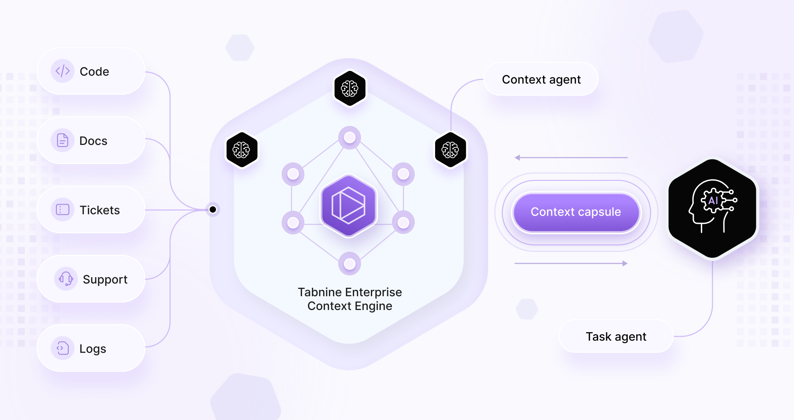

**Tabnine 发布企业上下文引擎：AI 编码工具缺失的基础设施层**

> 过去两年，AI 模型以惊人的速度进步。更大的模型、更快的推理、更强的 Agent，大幅提升了 AI 能生成什么。但在真实的企业开发环境中，许多组织发现了一个不同的现实：模型能力本身并不能保证 AI 有用。原因很简单——大多数 AI 系统不理解它们所处的环境。

**企业 AI 中缺失的一层**

大多数组织从模型和应用程序的角度思考 AI 系统。模型生成输出。Agent 或应用程序将输出交付给用户。**但在模型和企业环境之间，一个重要层一直缺失。**

**AI 需要结构化上下文，才能在复杂生产系统中安全有效地运行。**

Enterprise Context Engine 提供了那个缺失的层。**它持续分析和建模组织的软件环境——包括仓库、服务、依赖关系、API、文档和架构关系。** 这些信息被结构化后，AI 系统可以访问，从而能够在整个系统的上下文中推理变更。

**不是操作孤立的文件或文档，AI 获得了它正在工作的环境的结构化地图。**

**为什么上下文对工程团队很重要**

没有结构化的企业上下文，AI 生成的代码通常需要大量人工修正才能安全部署。

工程负责人经常报告几种常见模式：
- AI 生成的 PR 需要多轮审查才能合并
- 高级工程师花大量时间纠正架构问题
- 依赖关系和下游影响被遗漏
- 策略和合规检查在事后进行

**这些问题不是因为模型能力不足。它们是因为模型缺乏对所修改系统的情境感知。**

Enterprise Context Engine 通过让 AI 系统访问其所处环境的结构化知识来改变这种动态。**当 AI 理解架构和依赖关系时，生成输出的质量会大幅提升。** 工程团队可以更早地发现破坏性变更。影响分析变得更快更可靠。代码审查更聚焦更高效。策略执行可以在变更到达生产之前发生。

**增强开发者已经在使用的 AI 工具**

许多工程团队已经采用了 AI 编码工具，如 **Claude Code、Cursor、Copilot 和其他 AI 开发助手**。这些工具显著提高了开发者生产力——帮助开发者更快地写代码、生成测试、解释不熟悉的代码、加速日常开发任务。

然而，这些系统通常对企业级环境的可见性有限。**它们可以访问文件、提示词和检索到的文档，但通常缺乏对整个系统如何组合在一起的结构化理解。**

**Enterprise Context Engine 不是替代这些工具，而是补充它们。**

通过提供仓库、服务、API、依赖关系和架构关系的结构化表示，**Context Engine 让 AI 工具能够以对系统更深入的理解来操作。**

例如，当 AI 生成代码变更时，Context Engine 可以帮助确定：
1. 该变更是否影响下游服务
2. 哪些 API 或契约可能受到影响
3. 变更是否违反架构模式或策略
4. 哪些团队拥有受影响的组件
5. 是否引入了依赖关系或安全约束

这让开发者可以继续使用他们偏好的工具，同时给这些工具提供更智能操作所需的企业上下文。**Enterprise Context Engine 不是替换 AI 编码助手，而是让它们变得更好。**

**Enterprise Context Engine 如何工作**

Enterprise Context Engine 构建并维护一个持续更新的组织软件环境表示。包括：
- 仓库结构和代码关系
- 服务架构和系统边界
- 跨项目依赖图
- API 契约和集成点
- 所有权和运维元数据
- 策略和合规约束

这些信息被组织成一个结构化的知识模型，AI 系统可以查询和推理。**由于上下文持续更新，AI Agent 和编码助手可以使用系统的最新理解，而不是静态的文档快照。**

**结果是一个能够在完整环境的上下文中推理软件变更的 AI。**

**为企业设计**

企业组织需要的不仅仅是强大的模型。它们需要治理、控制和部署灵活性。

Enterprise Context Engine 的设计满足了这些需求。它支持跨 SaaS、VPC、本地和隔离环境部署。它与现有开发者工作流和 CI/CD 流水线集成。**它允许在开发期间而非部署后进行策略执行和合规验证。**

**最重要的是，它允许组织使用他们选择的 AI 工具，同时添加企业规模所需的结构化上下文。**

**企业 AI 的新基础**

企业 AI 的下一个阶段将不仅仅由模型创新来定义。**它将由允许这些模型在复杂生产系统中安全有效运行的基础设施来定义。**

就像数据仓库通过提供对组织数据的结构化访问来改变分析一样，**上下文基础设施将通过给模型提供它们所交互环境的结构化理解来改变 AI。**

Enterprise Context Engine 是迈向那个未来的一步。通过给 AI 系统提供对架构、依赖关系和组织约束的结构化理解，企业可以超越实验阶段，开始实现 AI 在软件开发中的全部潜力。

---

**一点观察**

1. 这是一篇典型的企业产品发布文章。Tabnine 的定位很聪明——不是"又一个 AI 编码工具"，而是"让现有 AI 编码工具更好的基础设施层"。这种"不做替代者，做增强者"的叙事策略，避免了与 Claude Code、Cursor、Copilot 的直接竞争，同时让自己成为这些工具的"必选搭档"。

2. 文章反复强调的"结构化上下文"概念，本质上是在解决 Agent 编码中最核心的问题：AI 没有对代码库的全局理解。这和之前那篇"Loop Engineering"文章里提到的"没有 skills 的循环每次从零开始"是同一个问题的不同角度。Tabnine 的答案是从外部注入结构化知识，而不是让 Agent 自己积累。

3. 但需要指出的是，Tabnine 的这个 Context Engine 目前只有一张架构图、没有技术细节。它怎么构建依赖图？怎么保持实时更新？查询延迟是多少？和现有 MCP 协议的关系是什么？这些关键问题文章都没有回答。作为产品定位文章，它成功建立了"需要这个层"的认知；作为技术方案，它还停留在概念阶段。

4. 一个有趣的行业信号：Tabnine 选择在 2026 年 3 月发布这个产品，正值 MCP 被全行业采用、各模型供应商都在推长上下文的时候。Tabnine 的赌注是：无论上下文窗口多大，企业都需要一个独立于模型的结构化知识层。这个判断和之前那篇"Your Context Window Is Rented Space"的核心论点完全一致。

---

参考：<a href="https://www.tabnine.com/blog/introducing-the-tabnine-enterprise-context-engine/" style="color:#888888;">https://www.tabnine.com/blog/introducing-the-tabnine-enterprise-context-engine/</a>
