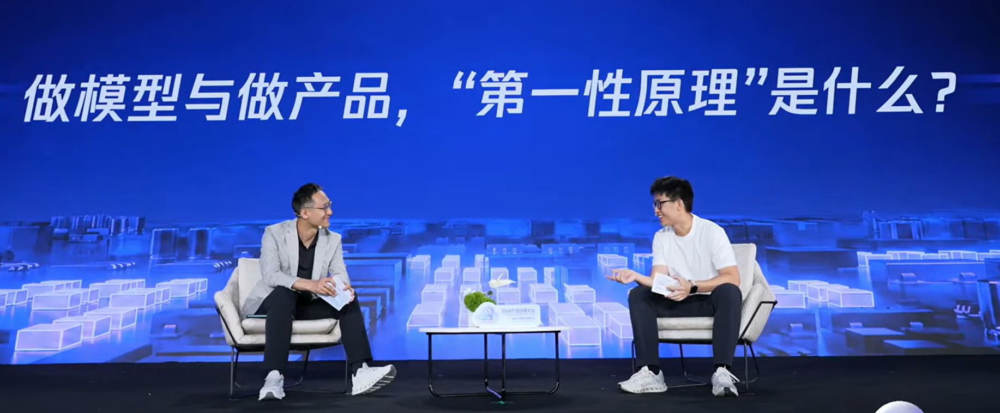

> 6 月 5 日，2026 腾讯云 AI 产业应用大会上，腾讯集团高级执行副总裁、云与智慧产业事业群 CEO 汤道生与腾讯首席 AI 科学家、混元大语言模型及 AI Infra 负责人姚顺雨首度同台对话，主题为「腾讯 AI 的下半场」。这是姚顺雨自 2025 年 12 月加入腾讯以来，首次在公开场合与腾讯高管深度对谈。

> 这场近一小时的对话没有 PPT，没有产品发布，就是两个人坐着聊——聊模型、聊产品、聊组织，也聊方法论和信任。

---

**核心观点摘要**

**1. AI 下半场：从找方法到找问题**

姚顺雨提出，预训练和后训练的成熟让行业拥有了一个「万能锤子」，方法论不再是瓶颈。**真正的稀缺资源是好问题、好场景、好环境。** AI 下半场的核心不是技术能力，而是识别哪些问题值得解决。

**2. 均衡三角：Foundation × Product × Frontier**

姚顺雨将 AI 下半场定义为三大支柱的均衡构建：基础模型（Foundation）要扎实，产品（Product）要让技术产生价值，前沿探索（Frontier）要注入探索精神。三者缺一不可。

**3. Co-Design 的核心是信任，不是流程**

模型团队追求能力上限，产品团队追求用户需求满足，目标天然有不一致的地方。姚顺雨举例：混元团队曾派后训练最强骨干去支援元宝，即使自身预训练还没准备好——**这个动作让产品团队意识到模型团队是真的在为产品着想。**

**4. 从「预制菜」到「开放式厨房」**

汤道生总结 AI 时代的产品逻辑变化：PC 和移动互联网时代的产品是功能驱动，用户点选「预制菜」；AI 时代是开放式服务，产品方不知道用户会问什么，必须借助模型的理解、推理和工具调用能力来应对。

**5. AI 是长期游戏，下半场才刚刚开始**

姚顺雨判断：ChatGPT 和 Claude Code 不会是唯一的超级应用，**「今天可能就像 70 年代 PC 刚刚产生的时候」**。AI 将走向多元而非单一路径，多模态、具身智能等领域还有大量空间未被填满。

**6. 性价比第一是性能，不是架构**

面对 Token 焦虑，姚顺雨反直觉地指出：**用更强的模型一次做对，比用弱模型反复试错更省钱。用一个更小但比肩大模型性能的模型，在大部分任务上做到强鲁棒性，在中国更有价值。**

**7. 腾讯 AI 慢了吗？**

汤道生坦诚回应：多业态的组织中快慢并存，有失败有探索。但长跑中**丰富的场景和数据上下文（Context）是腾讯的核心壁垒**。姚顺雨则从更宏观的视角判断：**如果下半场才刚刚开始，就不存在「完了」这一说。**

---

**对话全文实录**

**汤道生：**
> 今天我们两个对话，可能是一个比较新的形态，如果有什么出乎意料的，我想也是给大家一个惊喜。
>
> 顺雨，你加入腾讯前，我记得我问过你一些问题——为什么下半场会选择来腾讯？而且你认为 AI 下半场最重要的是什么？

**姚顺雨：**
> 首先解释一下什么叫做「下半场」，我最近感觉这个词有点被滥用。这个概念是我去年的一篇博客提出来的。
>
> 其实我觉得在去年之前，AI 已经发展了几十年，但更加重要的是怎么去解决问题、去寻找好的方法。最近方法论已经变得非常成熟，但寻找问题变得更加困难。
>
> 举个例子，过去我们发明 AlphaGo 这样的方法去下围棋，但这个方法只适合下围棋或者各种棋类。你会为了翻译做一个特别的模型，但它只能做翻译，不能做其他事情。
>
> **但有了预训练和后训练之后我们发现，我们像有了一个万能锤子，它可以砸任何钉子。它是一个通用方法论，可以解决各种各样的问题，反而更困难的是怎么寻找好的问题去解决。**
>
> 我觉得加入腾讯很重要的一点，就是这里有很多好问题、有很多产品。好的产品能解决第一个问题：我们做预训练和后训练之后，到底要把它应用在什么地方产生价值。第二个是环境非常重要，如果没有好的环境，Agent 没办法去做各种各样的事情。我觉得最重要的是 context——无论是企业还是个人。**模型越来越擅长把一个非常复杂的输入变成输出，很多时候你的竞争壁垒就在于你有没有最原始的输入，你知不知道这个人到底在干什么，你知不知道这个企业各种各样的信息。** 这一点我觉得腾讯有非常强的优势。
>
> 但我觉得这只是第二大的原因。最重要的原因是文化。我记得第一次跟你聊天，包括和其他总办老板聊天的时候，第一印象就是大家都非常诚实——哪里做得好，哪里做得不好，非常直白，不会掩盖。这种坦诚是我第一印象。
>
> 第二个，腾讯总体是一个基于 trust（信任）而不是基于 metric（指标）去运转的公司，这一点对于做 AI 非常重要。包括我们的文化有非常 low ego、非常 solid 的一面，这些文化对于长期做一个 AI 的组织是非常重要的，包括我们对长期主义的坚持。
>
> 所以 AI 下半场最重要的是什么？我个人觉得，我们应该在中国建立一个长期的、基于 AGI 的组织。今天的 AI 主要有三部分：
>
> 第一是 Foundation——我们怎么样把预训练和后训练最基础的东西做得非常 solid。第二是 Product——我们怎么样把这样的技术真正为人和社会产生价值。第三是 Frontier——我们怎么样探索新的研究范式、探索新的机会。
>
> **我觉得最重要的是，要构建一个非常均衡的三角形组织。**

**汤道生：**
> 你提到的聊的过程中感受到的真诚或者务实的氛围，也是经常我跟客户交流得到的反馈。我觉得我们的做事方式、做产品的理念，其实也是实事求是的。毕竟 AI 赛道是长跑，我觉得有时候认知也很重要，做得好的和不好的都得认，但关键是一个多维度的竞赛。
>
> 你刚刚提到模型跟产品，产品可以说提供一个环境，里面要给模型提供 context 上下文。我想问一个问题，我们平时开会提得比较多的一个词是 Co-Design——怎么把产品和模型能够比较紧密地结合起来？尤其今天有这么多丰富的产品，从元宝到 AI 搜索，到企业里的智能客服、智能营销，还有 CodeBuddy、WorkBuddy 这样的产品，其实对于模型依赖很深。你怎么思考 Co-Design 这个方式？

**姚顺雨：**
> 有三点。
>
> 首先，Co-Design 的前提是模型本身要做得 solid，有很多 foundational 的工作要做好。预训练是一个相对产品 agnostic 的事情，它最大的特点就是它是一个可泛化学习过程，它的进步可以带给各种各样下游任务持续的价值提升。**后训练我觉得最重要的一点是要设立好正确的 Eval。中国大家有个不好的倾向是喜欢刷榜，但我觉得更重要的是如何实事求是地基于产品、基于真正的应用，构造更加真实的 Eval。**
>
> 第二，要意识到实用性价值是大于刷榜价值的。我们跟各种各样的产品进行了深度 Co-Design，很关键一点就是要产生相互信任。
>
> 第三，**LLM 时代和过去的 AI 最本质的区别就是泛化性。** 在 LLM 之前，做翻译产品只要把翻译数据做得特别好就行，做围棋程序只需要围棋的数据。但是今天，即使你想只做一个 Coding Agent，你会发现其实需要的不仅是 Coding Agent 的数据，你需要非常好的聊天能力、非常强的搜索能力、非常强的指令遵循能力、非常强的推理能力——它其实是非常复合的 data taxonomy。
>
> 这个事情的推论是，有很多产品的体系化地方会有比较大的优势。比如我们和元宝的 Co-Design 使模型产生很强的聊天和搜索能力，这样的能力又可以被迁移到 ima 和 WorkBuddy 其他的产品。这些产品提供不同的数据，数据之间又可以相互泛化，形成一个像网络一样的体系。这一点的价值越来越重要。

**汤道生：**
> 我记得我们早期做元宝的时候还碰到多轮遵循的问题，真正在产品里面大家使用所需要的能力，确实好像跟 benchmark 还有蛮大的差异。

**姚顺雨：**
> 其实我记得第一次跟您聊的时候，你跟我讲了很多过去的经历，从 QQ 空间、QQ 秀，到 QQ 音乐，到云到现在的元宝。你做过各种各样的产品，to C 也有，to B 也有。我比较好奇，你觉得你做产品的第一性原理是什么？哪些经验和价值是不变的？哪些东西是变的？

**汤道生：**
> 我觉得最终做产品还是本着用户到底有什么需求，我到底怎么去解决他的痛点，怎么去给用户或者客户创造价值。在不同的时代、甚至不同的行业，你做一个产品还是需要能够给用户带来价值，他才会买单、才会使用。底层的逻辑其实没有这么大的变化。
>
> 但确实，在 AI 时代做产品跟以前有蛮多不一样的地方。
>
> **在 PC 互联网、移动互联网时代，我们做产品很多时候想的是通过功能来满足用户的需求，好像是一些「预制菜」，用户只能在里面去点。但在 AI 时代做产品，它的那种开放式的服务形态就会带来很不一样的要求和挑战。** 作为产品方你也不知道用户会问什么，所以要充分利用模型能力去理解用户的需求，通过大模型的逻辑推理、调用工具的能力，来应对这种开放式的需求。
>
> 甚至也包括你刚刚提到的 Eval。以前做产品有很清晰具体的功能描述，瀑布式的流程也比较清晰。但做 AI 产品，最大的变化是整个流程可能都要重新设计。**尤其今年大部分的代码都由 AI 生成，工程师可能会花更多的时间去做架构设计，把写代码的工作都交给 AI 了，然后定期去指导、修正。** 测试也要左移，更前置去想清楚针对各种案例的 Eval 环境，以及对开放式答案的对齐。

**汤道生：**
> 我问一下混元 3，大家都在说 Hy3 preview 是你腾讯的首秀，具体混元 3 做了什么改变？

**姚顺雨：**
> 其实我觉得没有什么秘密。今天做大模型从某种程度来说是比较 trivial 的事情，我们应该把 Infrastructure 做好，把数据做好，算法的部分反而是比较简单的。
>
> 第一，我们把 Infrastructure 重建了，无论是预训练还是强化学习。第二是我们把数据和 Eval 做了很大的改变——如何去定义更真实的问题，如何丰富数据的 taxonomy，如何提高数据的质量，这是一个永无止境的追求。第三，很多决策——包括怎么招人、怎么设立模型的节奏、怎么每天做很多 trade-off——没有一个很清晰的公式，是一个很 taste driven 的事情。
>
> 我很好奇您对 Co-Design 是怎么想的，你觉得哪些事情是应该模型做的，哪些是产品应该做的？

**汤道生：**
> 我觉得 Co-Design 在不同阶段其实是一直在变化的，随着模型能力的升级而变化。
>
> 给我一个比较深的感受是怎么去对齐。产品可能要针对某个方向去解决一些问题，模型到底怎么做去满足这个需求？数据应该怎么标注、到什么颗粒度？什么是好的标注、什么是不好的标注？因为有一些地方要奖励，有一些地方要惩罚。还有 Eval——如果产品认为好的产品体验，评测是不认同的话，大家做出来的产品就会不一致。
>
> **所以 Co-Design 给我的感觉，更多是在项目组里面不同的角色参与到产品的设计，怎么让多个角色能够对于一些开放式问题有比较好的对齐。如果没有做到这样一个对齐，你会发现产品的行为会不可预测。**

**姚顺雨：**
> 其实最难的一点是要建立 trust。说到底，做模型的目标和做产品的目标有很多 align 的部分，也有很多不 align 的部分。模型的人希望能力越强越好，产品的人觉得用户需求越满足越好。天然有很多不 align 的部分，很重要的一点是要有换位思考的能力。
>
> 有一个很重要的细节：我们当时派了后训练最强的骨干力量去帮助元宝把后训练做好。当时我们自己的预训练还没有准备好，但是我们知道维护元宝这样的产品以及它的 DAU，对我们接下来做模型也非常非常重要。当时很多算法同学不理解，我需要去很努力解释。但现在看起来，**这样一个动作让产品团队意识到模型的同学是真的在为产品着想。** 这对于我们之后的合作，包括 Hy3 preview 在元宝上成功上线，起到了非常重要的作用。最难的部分反而是怎么样建立信任、怎么样换位思考。

**汤道生：**
> 你是 ReAct 架构的提出者，博士研究也是围绕着语言智能体展开的。你几年前的一些观点到今天兑现了吗？

**姚顺雨：**
> 那天我挺感慨的，重新读了自己的博士论文。我的博士论文标题叫《Language Agent: from next token prediction to digital automation》，是 2019 年的。
>
> 那个时候就是 GPT-2 时代，它只能做 next token prediction，产生一段话不太连续，有很多毛刺。当时我的想象力比较狂野——我觉得 GPT 有一天潜力不仅仅在于吐出下一个 Token，而在于把世界上所有的事情全部 automate。我当时想的还不够大，我想的是 digital automation，但现在看起来也有可能是 digital and physical automation。
>
> 我博士期间主要做两部分。第一部分是如何建立一个 Agent 方法论，最重要的工作是 ReAct。我记得 2022 年 7 月某一天晚上，当我第一次把 Palm 2 的 API 和当时手写的一个 Wikipedia API 连在一起，它第一次可以基于网页回答问题并且多轮交互的时候，我感觉就像微弱的电灯突然亮了的感觉。**据我所知，那是人类第一次把 LLM 和互联网连在一起并且做多轮交互。**
>
> 另一部分工作是定义 digital automation 的任务，比如 WebShop——第一个基于互联网的 Web Agent task，以及 InterCode 和 SWE-bench——最早的 Coding Agent 任务。现在看起来，Agent 技术最重要的两个部分确实是外部 Agent 和 Coding Agent。
>
> 我博士论文结尾的 future work 写了四个方向：train models for Agent、robust deployment、scientific discovery、help human。我很感慨，我现在很幸运确实在做当时列的 future direction。

**汤道生：**
> 技术的发展往往超乎预期。智能体今天大家都说需要消耗很多 Token，这对于混元做下一代模型研发，你觉得什么是你的侧重？

**姚顺雨：**
> 毫无疑问，Agent 或者 Coding Agent 像预训练一样，是不得不做的事情，是最基础能力。Coding Agent 非常本质的一个原因，是它有点像图灵完备的事情——当你有能力去控制自己的 file system，当你有一个 container 的时候，其实你是一个完整的 system。
>
> 我们做的方法可能会有几个区别。第一，即使今天 Coding 已经是最重要的事情，我们还是会强调体系的全面化。**我始终认为要把 Coding 做好，其实需要远远不止 Coding 的数据，也需要聊天、推理，各种各样不同的东西，因为大模型最重要的点是泛化性。**
>
> 第二，产品作用越来越重要，如何利用好线上回流，是每个模型厂商都在应对和思考的问题。
>
> 第三，我觉得还需要更多想象力。无论是技术演进、产品演进，还是下一个范式演进，我们需要做探索性甚至不确定性的工作。

**汤道生：**
> 从产品侧，大家越来越多有 Token 焦虑的声音。怎么可以让模型在解决某个问题时 Token 效率更高？

**姚顺雨：**
> 在中国讨论性价比更多讨论模型架构，但其实它是很复杂的体系。
>
> **最重要的是 performance。** 很多人跟我说，最后发现用 OPUS 这样的模型比用更差的模型更省钱，因为更快地把事情做对了，也省了人的精力。**如果你的 performance 好，性价比才是最关键的。** 尤其今年，很多简单任务的 robustness 会变得更加重要——一次把相对简单任务做对，这可能是性价比更关键的部分，不仅是模型架构。
>
> 第二部分是成本本身。中国是领先于世界的，我们做大量工作优化成本。成本最重要的事情是怎么用一个更小的模型把更高的价值任务做好，在这基础上做架构创新。**如果我们做一个相对较小的模型，但比肩大模型性能，而且在大部分任务上做很强的 robustness，这在今天的中国可能更有价值。**

**汤道生：**
> 我也想再问一个大家讨论比较多的问题。很多人都会提到腾讯慢，说在 AI 上面我们没有及时抓住一些机会。你觉得我们真的慢了吗？到底下半场是什么？

**姚顺雨：**
> 我觉得 AI 今天有两个重要判断。
>
> 第一个，AI 是一个短期游戏还是长期游戏？在硅谷大家蔓延很多情绪——几年后所有人都要失业，AI 要取代所有人的工作，我们要赶快赚两年钱退休。但很显然我们的判断是：**AI 是一个长期游戏。其实 AI 刚开始，下半场才刚刚开始。我不认为 ChatGPT 和 Claude Code 会是唯一的 super App，那是一个非常灰暗的世界。肯定会有源源不断新的机会诞生。**
>
> 第二个判断，它会是个更线性还是多元的游戏？过去几年大家能看到的是 pre-training、post training、Agent、Coding Agent，似乎有一个非常清晰的主线，所有人都在做一样的事情。但到底未来变得更单一还是更多元？我个人看法会变得更多元。**毫无疑问 Coding Agent 生产力会变得更加重要，但它只是刚刚开始的事情。这个世界还有很多空间没有被填满。多模态、具身智能，很多很多新的事情都在发生，或者刚刚发生。**
>
> **过去模型、产品做了很多探索，走了很多弯路，我觉得这是正常的。你如果没有做过一个事情，第一次做肯定有曲折。但更重要的事情是能不能诚实面对自己，能不能 Be Real，能不能看到 feedback 然后去改变，能不能保持耐心——这个事情是下半场最重要的事情。**

**汤道生：**
> 我们是一个非常多业态的公司，有很多产品分布在很多赛道，同时也有很多团队在推进不同的项目。毫无疑问，在这样一个复杂的组织里面，有一些地方可能我们做得快了，有的地方做得慢了，有一些地方可能会做失败、在探索。所以我觉得这些提醒都非常好，确实有一些地方我们可以做得更好。**但就像你说的，这是一个长跑，是一个马拉松。腾讯还是有非常丰富的场景。**
>
> 我看时间其实都超时了。我想首先感谢顺雨今天的分享。我们刚才围绕做模型、做产品，谈到了 Co-Design，谈到了 Agent 的演进，也提到了组织变革、行业的机会。今天我们的对谈到这里，谢谢顺雨，感谢大家！

---
参考：https://www.youtube.com/watch?v=8O--CjQ_CaY
