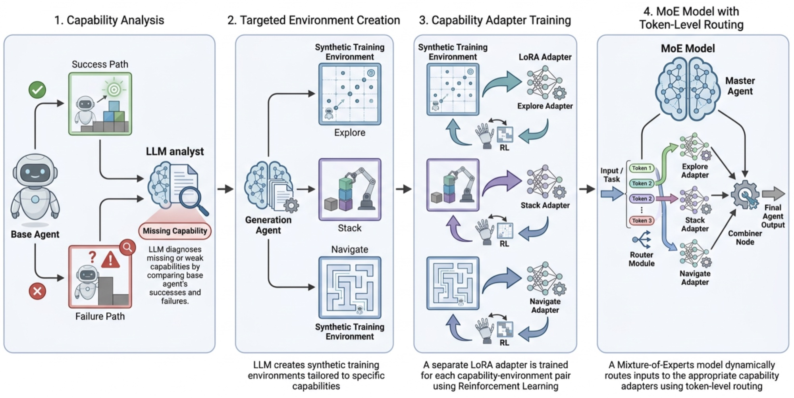
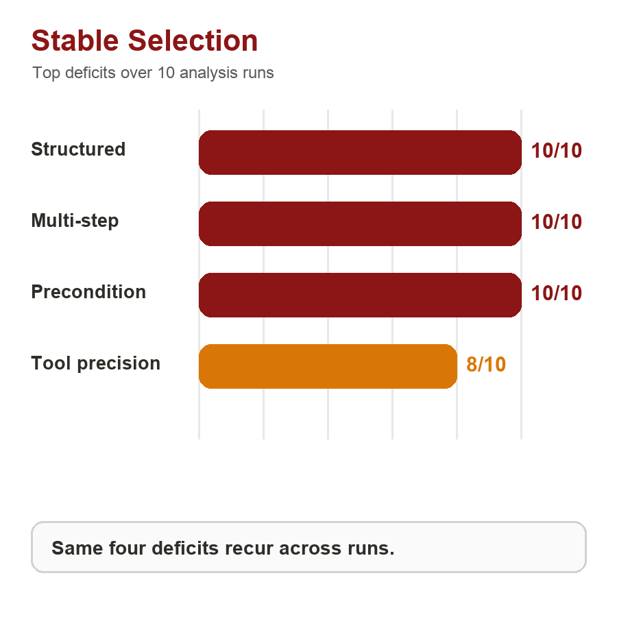
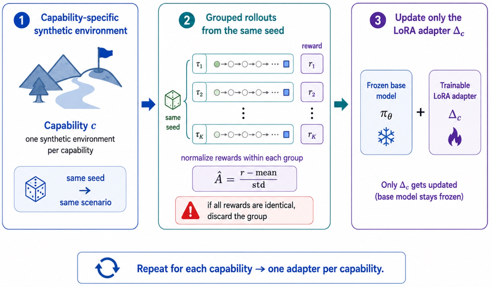
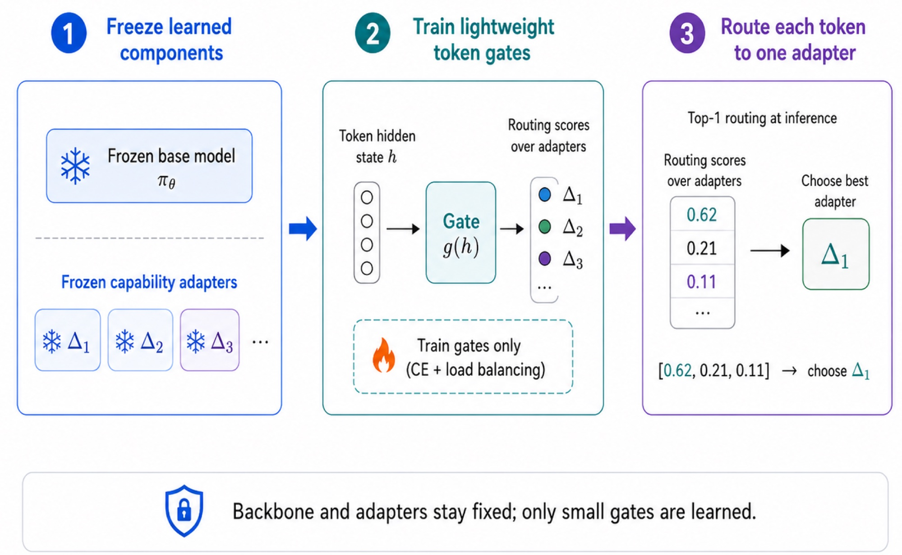
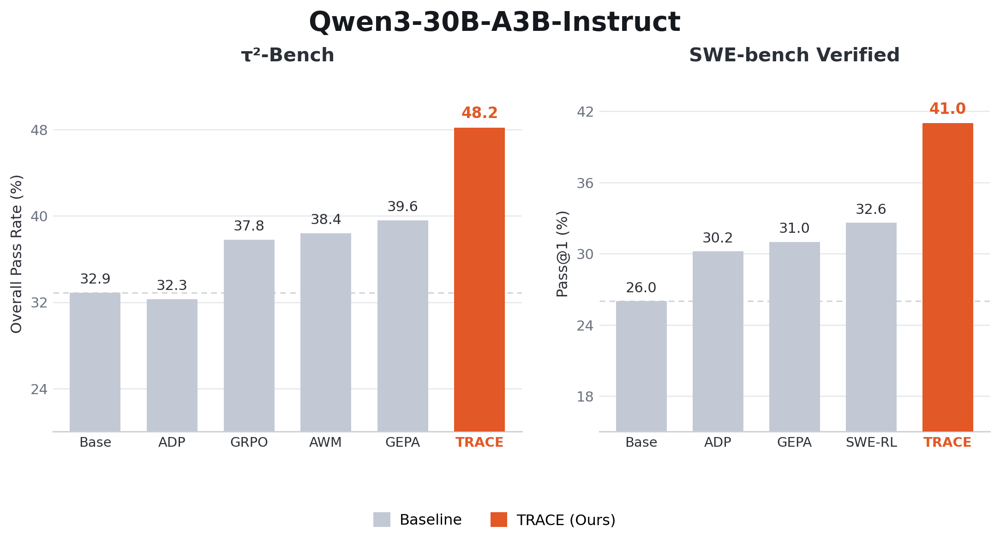
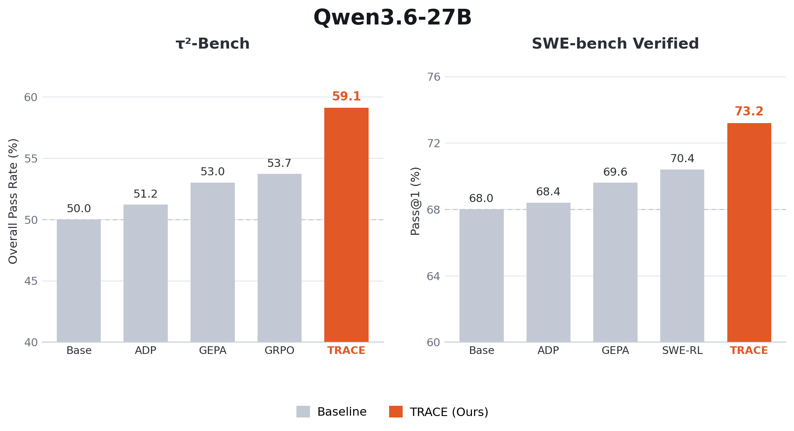
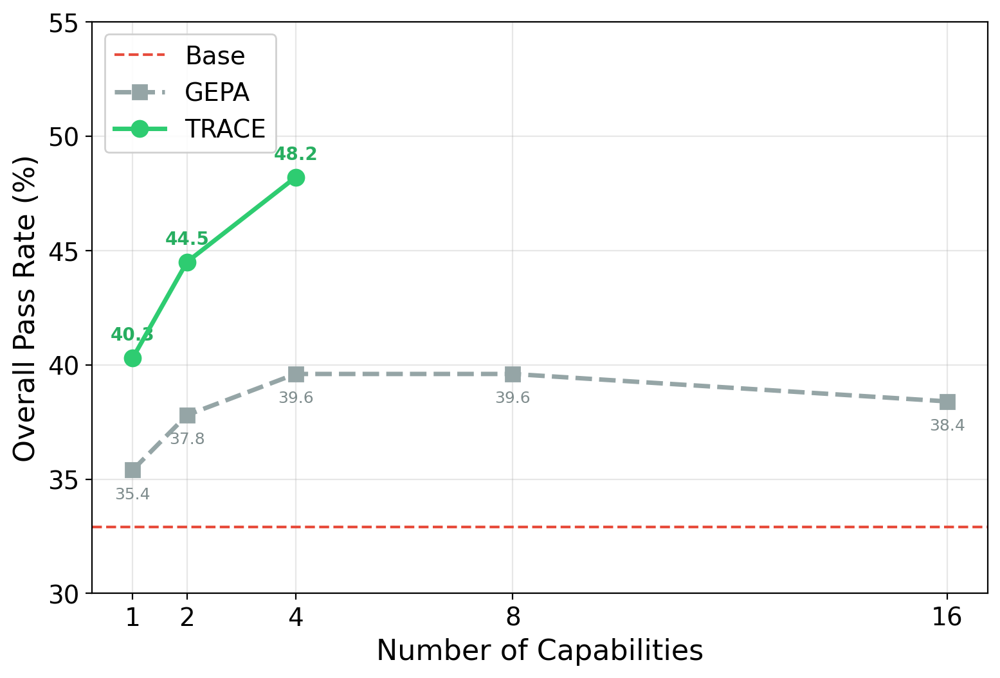

<strong style="font-size:16px;color:#1a6ba0;">要点速览</strong>

- <strong>失败不随机</strong>：智能体在目标环境反复失败，往往只因少数几个「缺的能力」。TRACE通过对比成功与失败轨迹，自动诊断出这些能力缺口  
- <strong>一对一训练</strong>：为每个缺失能力合成一个可验证合成环境，用GRPO各训一个LoRA适配器（约5% 参数），再用token级MoE路由组合  
- <strong>效果炸裂</strong>：Qwen3-30B-A3B上 τ²-Bench +15.3分（32.9→48.2）、SWE-bench Verified Pass@1 +15分（26.0→41.0），用不到四分之一rollout超最强外部基线8分以上  
- <strong>开源逆袭</strong>：同一个流程搬到Qwen3.6-27B，SWE-bench Verified达73.2% Pass@1，27B开源权重压过GPT-5.2-Codex（72.8%）  
- <strong>核心配方</strong>：部署智能体、观察它反复失败在哪、把失败转成恰好修复它们的训练信号，回路里无需人工筛技能/环境/奖励

---

## 为什么智能体总以相同的方式失败？

智能体LLM在目标环境中失败，常常只是因为它们缺了环境要求的、可复用的能力：在行动前检索出正确的客户记录、在调用会改变状态的工具前先验证前置条件、或是在一个大仓库里定位到正确的函数。两种主流修法，算力都用得很差。

直接在目标环境上做RL / SFT，给出的是稀疏且混杂的监督：一条轨迹整体失败，但奖励从不指明到底缺了哪个底层技能。

大范围的合成数据则没有针对性：预算里很大一部分，花在了模型已经具备的能力上。

关键观察是，失败并非随机。当我们分析一个基础智能体的rollout时，少数同一批缺项，解释了绝大多数失败的轨迹。这让失败变得可操作：与其在整个环境上训练，我们可以把每一个反复出现的缺项，变成它自己那份稠密、可验证的训练信号。

## 一张图看懂TRACE

TRACE把「反复出现的智能体失败」转成「面向能力的训练环境」，分四步闭环：

TRACE管线。(1) 一个LLM分析师对比基础智能体的成功与失败轨迹，诊断出缺失的能力。(2) 一个生成智能体为每个能力创建一个带种子、可验证的合成环境。(3) 在每个环境上用RL各训练一个独立的LoRA适配器。(4) 一个混合专家模型把每个token路由到正确的能力适配器

### Step1：通过对比找到缺失的能力，而不是靠猜

我们收集基础智能体在目标环境中的rollout，把它们分成成功（𝒟⁺）和失败（𝒟⁻）两个集合。一个分析智能体读取工具调用、观测和最终回复，归纳出一份标准的能力词典，然后给每一对「轨迹—能力」打上NA、PRESENT（具备）或LACKING（缺失）的标签。一个能力c只有在「它的缺失集中在失败中」且「能解释足够多的失败」时，才会被保留：

Δ̂(c) = R̂⁻(c) − R̂⁺(c) ≥ 0.20

Cov(c) = #{缺失c的失败轨迹} ÷ #{失败轨迹} ≥ 0.10

其中R̂±(c) 是c在失败 / 成功轨迹中缺失的比率。在 τ²-Bench上，这给出了四个缺项：**结构化数据推理、多步任务完成、前置条件验证、工具调用精度**。

失败是集中的，诊断也很稳定。在10次独立的分析运行中，几乎每次都选出同一组四个缺项（左），且每一个都覆盖了很大比例的失败rollout（右）。少数几个可训练的缺项，就能解释大多数失败，这恰恰让「有针对性的训练」值得做

### Step2：为每个能力合成一个可验证的环境

对每一个被保留的能力，一个LLM生成智能体都会创建一个带种子、程序化生成的合成环境，它在保留目标环境工具schema与交互格式的同时，把这个能力单独隔离出来。因为每个任务实例都从一个种子生成，奖励都可以从工具参数、状态变化、最终答案或补丁中自动验证，不需要人工标注，奖励回路里也没有LLM裁判。结果是一份比原始环境稠密得多的学习信号，在原始环境里，成功同时依赖许多种能力。

### Step3：用GRPO为每个能力各训练一个LoRA适配器

每个能力都得到自己那份「冻结基座 + LoRA适配器」（约占骨干参数的5%），在它自己的合成环境上用GRPO训练。把适配器分开训练很重要：它避免了把几种能力坍缩进同一次纠缠的更新里，也给了我们可解释的专家，之后可以组合，也可以检视。

能力GRPO。同一rollout组共享同一个种子（因此也是同一场景），所以组内的奖励差异反映的是策略本身，而不是任务难度。奖励在每组内做归一化，且只更新该能力的LoRA适配器 Δc，基础模型保持冻结

### Step4：用token级别的MoE路由组合这些适配器

一个真实任务会交错多种能力：一个客服智能体先读结构化数据，再验证一个前置条件，然后发出一次精确的工具调用，全都发生在同一条轨迹里。token级别的路由，让模型能在一条轨迹的中途切换专家。在 τ²-Bench上，top-1路由效果最好：48.2%，而top-2是47.0%，top-4是45.1%。

MoE组合。在骨干和所有能力适配器都冻结的情况下，我们只用交叉熵 + 负载均衡目标，训练轻量的token级别门控（总计约49.2万参数）。推理时，每个token以top-1被路由到单一的能力适配器

## 主要结果

我们在 τ²-Bench（50条航空 + 114条零售客服工作流，看通过率）和SWE-bench Verified（500个真实GitHub issue，看Pass@1）上评测，骨干模型用Qwen3-30B-A3B-Instruct-2507和Qwen3.6-27B。基线包括：直接在目标环境上做GRPO、AWM、ADP、GEPA提示词优化，以及SWE-RL。对于SWE-bench，TRACE的能力环境是在一份互不相交的SWE-Smith划分上训练的。

Qwen3-30B-A3B。TRACE把基础模型在 τ²-Bench上提升 +15.3分、在SWE-bench Verified上提升 +15.0分Pass@1，分别比最强的外部基线高出 +8.6和 +8.4分

Qwen3.6-27B。同一个流程迁移到更强的骨干：τ²-Bench上59.1%、SWE-bench Verified上73.2% Pass@1，用一个27B开源权重模型，超过了GPT-5.2-Codex（72.8%）在SWE-bench榜单上的成绩

Qwen3.6-27B这个结果值得多说几句。TRACE把一个27B的开源权重骨干，从68.0% 提升到SWE-bench Verified上73.2% 的Pass@1，这让它超过了GPT-5.2-Codex（72.8%）、GLM 5和Claude 4.5 Sonnet在公开榜单上的成绩。**没有前沿级别的预训练，没有专有的脚手架：这个差距纯粹是靠「诊断模型不能做什么，然后恰好训练那些能力」来弥合的。**

## 能力会扩展，提示词会触顶

有两件事很突出。第一，**训练胜过告知**：GEPA能在提示词里描述出缺失的能力，这有帮助（+6.7分），但单个训练出来的能力适配器，已经超过了通用目的的AWM和ADP，而四个训练出来的能力，比最好的提示词高了 +8.6分。第二，有针对性的环境样本效率很高：因为每个合成环境恰好奖励一种能力，每一次rollout都携带了「它是为哪个缺项而建」的信号，而不是把信用稀释到整个任务上。

左：每新增一个训练出来的能力，τ²-Bench就单调提升（40.3 → 44.5 → 48.2），而往一个优化过的提示词里继续加能力描述，会在39.6附近触顶。知道该做什么，不等于有能力去做它。右：在1,280次rollout时，TRACE已经超过了目标环境GRPO和GEPA用5,120次才达到的水平，用不到四分之一的rollout，拿到了更高的终分

## 为什么组合很重要

给定相同的合成环境，你怎么把学到的东西整合起来，和「数据本身」一样重要。把所有东西蒸馏进一个适配器，无论用SFT还是多能力GRPO，都会把不同的技能坍缩进同一次纠缠的更新里，并留下7分以上的潜力没发挥出来。分开的专家，加上一个学出来的token级别路由器，既能保留每一种能力，又能在正确的步骤部署正确的那个。

## 要点

**T1：失败对比是可操作的。** 对比成功与失败的轨迹，识别出的是「可训练的缺项」，而不是泛泛的错误类别。这个诊断在多次分析运行中都很稳定，而且少数几个缺项就覆盖了大多数失败。

**T2 — 有针对性的合成环境很高效。** 围绕单一能力构建的可验证环境，提供的监督远比稀疏的终端任务奖励稠密。TRACE用不到目标环境GRPO和GEPA四分之一的rollout，就超过了它们。

**T3 — 组合式适配很重要。** 每个能力一个LoRA专家，避免了把多种技能坍缩进同一次更新；token级别的MoE路由在每一步选出正确的专家，比最好的单适配器方案高出 +7.3分。

更广义地说，TRACE是一份「面向特定环境的智能体自我改进」配方：部署一个智能体，观察它在哪里反复失败，再把这些失败转化成恰好能修复它们的训练信号，回路里不需要人工去筛选技能、环境或奖励。

<strong style="font-size:15px;color:#8b6f4c;">结语</strong>

- 「对比成功与失败轨迹来定位能力缺口」这套思路不新，但TRACE把它做成了全自动闭环，且诊断在多次运行中稳定，这让它真正可工程化，而不只是个观察  
- 真正的杠杆在「一对一合成环境 + 组合」：把缺项拆成独立专家再路由，比堆一个大一统适配器多捞出7分以上。这给「小模型靠后训练补短板、正面刚前沿大模型」提供了一条可见的路径  
- 27B开源权重在SWE-bench上压过GPT-5.2-Codex，说明很多榜单差距不是「模型不够大」，而是「没被精准训练过」。诊断缺失能力，往往比加参数更划算

---

参考：https://hgkang02.github.io/trace-blog/
