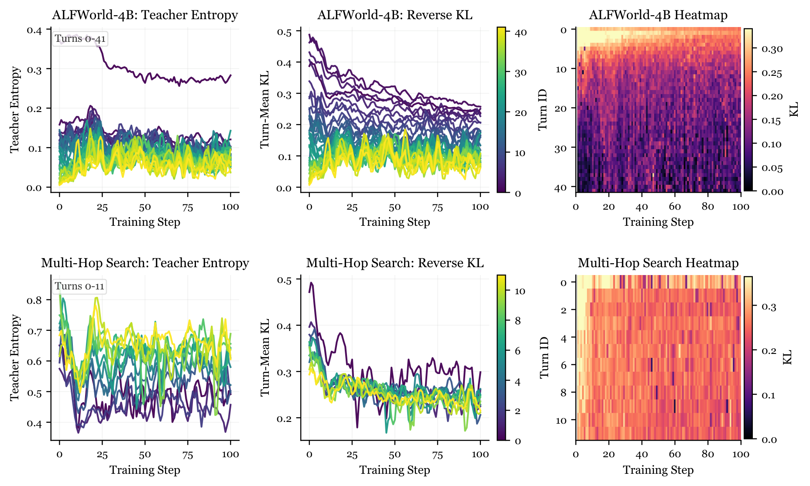
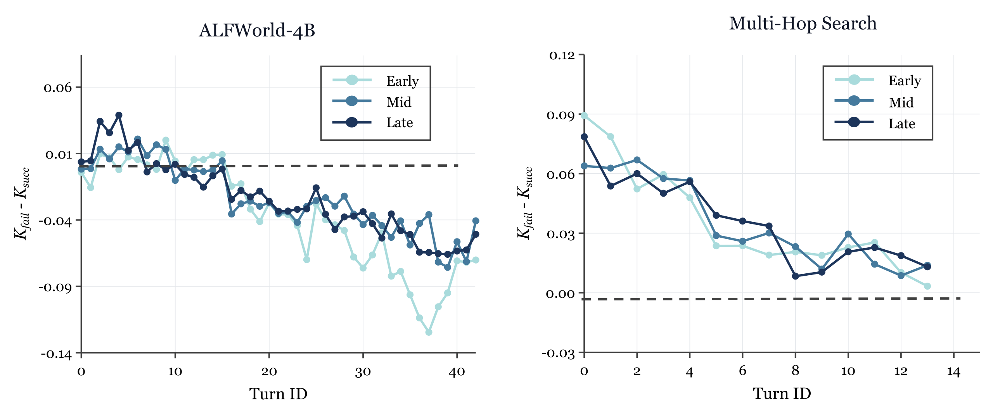
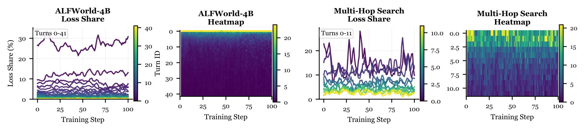
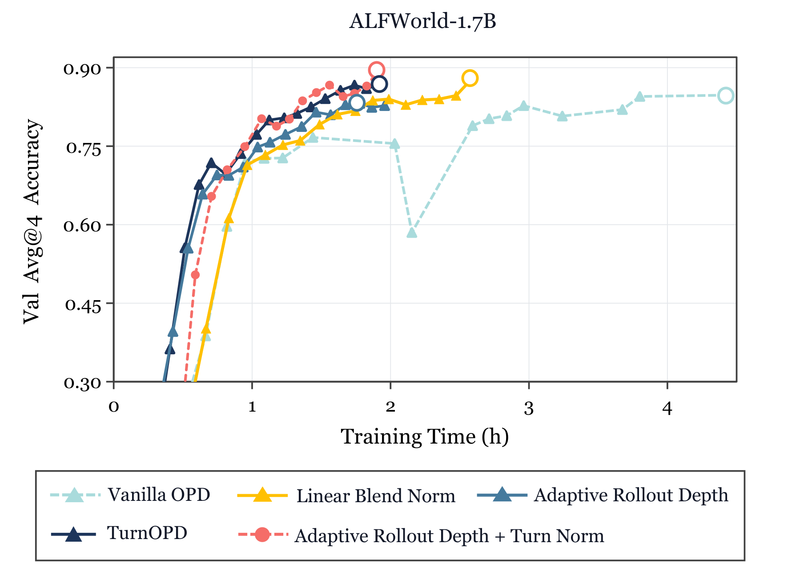

<strong style="font-size:16px;color:#1a6ba0;">要点速览</strong>

- <strong>问题</strong>：在线策略蒸馏（OPD）用于长程智能体时效率极低，算力和梯度都被浪费在浅层回合和低信号尾部回合上。  
- <strong>诊断</strong>：原始 OPD 存在两道错配，反向 KL 信号严重前载，最深的第三个回合只分到 3.6%–4.5% 的 KL 损失；深层 KL 还会因「污染—压缩」机制失去判别力。  
- <strong>方法</strong>：TurnOPD 用两个预算控制器，自适应截断 rollout 深度，并把 KL 损失从 token 级逐步转向回合均衡监督。  
- <strong>结果</strong>：在 ALFWorld、WebShop、Multi-Hop Search 上，同等时钟预算下准确率全面占优，训练最高提速 2.29 倍（4.42h→1.93h）。

---

## 引言与背景

语言模型正越来越多地作为 Agent 部署，承担规划、工具调用和环境交互。在线策略蒸馏（OPD）给这类 Agent 提供了一套有前景的训练框架：学生自己采样 rollout，更强的教师（Teacher）在被访问的状态上用反向 KL 目标逐 token 监督，监督始终保持在策略上（on-policy），且反馈密集，避开了稀疏奖励。

但把 OPD 直接搬到长程多回合任务上会出问题。一次 rollout 不是一段扁平文本，而是跨多个回合、带环境状态变化的交互轨迹：早期决策影响后续所有状态，靠后的回合往往藏着关键但稀少的决策。仅靠 token 级反馈，无法为所有决策点提供恰当的监督。

本文的核心判断是：**长程 Agent 的 OPD 里，监督的单位不应该是扁平的 token 位置，而是演化中的交互轨迹里、由回合（turn）所条件的决策。**

TurnOPD 的核心视角：标准 OPD 固定 rollout 深度、在整条轨迹上平均 KL，常把算力浪费在低价值的尾部回合，并把损失压在浅层 token 上；TurnOPD 基于回合级统计同时预算 rollout 深度与 KL 聚合。

论文在 ALFWorld、WebShop、Multi-Hop Search 三个基准上验证了这一点，学生从任务专用的 GRPO 教师蒸馏而来。TurnOPD 在 ALFWorld-1.7B 上把 100 步训练时钟从 4.42 小时砍到 1.93 小时，同时把 Same-Step Avg@4 从 83.0 提到 86.3，最高训练提速 2.29 倍。

## 相关工作

在线策略蒸馏的早期方案 MiniLLM、GKD 面向通用 LLM 文本生成，后续工作把它视作 KL 约束的策略优化，并引入稳定目标分布、教师熵、放松模仿约束等技巧。诊断类研究已指出长轨迹上的密集监督不可靠，TCOD 引入轨迹长度课程、SOD 在步骤级对工具推理重加权，都说明「面向 Agent 的 OPD 需要的远不止一个扁平序列目标」。

长程 Agent 基准本身也已从受控环境走向真实计算机使用：ALFWorld 连接文本规划与具身环境，WebShop 研究接地电商导航，再到 Mind2Web、WebArena、OSWorld、SWE-bench、BrowseComp 等。它们的共同结构是一条有状态、跨回合变化的交互轨迹，而非单条回复。

## 预备：多回合 OPD

一个学生 Agent 与环境多回合交互。回合 t 观测 o_t，以完整历史为条件生成响应 r_t（含推理与工具参数），环境再把可执行部分映射为下一观测 o_{t+1}。一条 rollout 是直到任务完成或到达最大视野为止的交互轨迹。

OPD 下，学生为提示 x 采样自身 rollout，冻结的教师 π_T 在学生访问过的前缀上做 token 级监督。这区别于离线蒸馏：教师是在当前学生诱导出的历史上查询，而非仅在教师自己生成的演示上。目标用反向 KL：

L_OPD(θ) = E_{x,τ}[ (1/Σ_i m_i) Σ_i m_i · KL( π_θ(·|s_i) ‖ π_T(·|s_i) ) ]

其中 s_i 是 token i 之前的完整前缀（含历史观测、学生响应与当前部分响应）。

## 诊断：监督信号在回合轴上的错配

长程 OPD 表面是序列上的教师匹配损失，实则是交互轨迹上的优化。作者从三个角度拆解了「监督到底落在哪、多可靠、拿走了多少预算」。

**原始回合级 KL 严重前载。** 在 ALFWorld（Qwen3-4B 学生 / Qwen3-8B-GRPO 教师）和 Multi-Hop Search（Qwen3.5-2B 学生 / Qwen3.5-9B-GRPO 教师）上跑 100 步原始 OPD，逐回合看平均反向 KL：早期回合起始 KL 很大，前 20–30 步内快速下降，长尾后期回合更低更噪。单一平均 KL 完全无法刻画这种非平稳、依赖任务的结构。

左：逐回合平滑教师熵；中：逐回合平滑反向 KL；右：原始逐回合反向 KL 热力图。ALFWorld 行用 Qwen3-4B 学生，Multi-Hop Search 行用 Qwen3.5-2B 学生。信号明显前载且随训练变化。

**深层 KL 失去结果判别力。** 定义 G_t = K_t^fail − K_t^succ（失败轨迹与成功轨迹在该回合的平均 KL 之差）。直观上失败 rollout 应需要更多纠错，G_t 应为正。但 ALFWorld 上 G_t 大多为负且随深度递减：成功轨迹反而有更高 KL，因为失败轨迹很快陷入循环或模板化模式，两个模型都觉得下一 token 很平凡，人为压低了 KL；成功轨迹遍历更多样状态，教师的纠错更少被压缩。Multi-Hop Search 上 G_t 符号正确，但分离力集中在早期，深度越大越弱。

反向 KL 按回合的结果分离力。正值表示失败轨迹 KL 更大。ALFWorld 上深层 G_t 转负，说明深层 KL 不是干净的成果预测信号。

**「污染—压缩」机制。** 作者用一个分解解释上述歧义：在回合 t 的上下文 c 下，下一 token 分布有一部分被上下文强制决定（重复串、格式约束、复制实体、闭合分隔符等），记为共享的强制组件 p_F，剩余是师生可能真正分歧的自由组件。可证：

KL(π_S ‖ π_T) ≤ (1−λ(c)) · KL(p_S^free ‖ p_T^free)

即原始 KL 捕捉到的自由分歧比例 ρ(c) ≤ 1−λ(c)。随着 rollout 变长，自回归正自条件让强制质量 λ(c) 增大，测得的 KL 衰减可能只是「压缩」加剧，而非策略分歧真的消失。失败轨迹的刻板模式使其 λ 系统性高于成功轨迹（λ_t^fail > λ_t^succ），这解释了为何 G_t 会转负并随深度单调下行。

**损失预算集中在浅层。** 轨迹级归约给每个 token 相同权重，但实现的 KL 损失质量份额由 token 数和该处 KL 共同决定。结果在 ALFWorld-4B 上，仅回合 0 就吃掉约四分之一 KL 预算，前三个回合近一半，最深的第三个只分到 3.6%–4.5%；Multi-Hop Search 上前三个回合占 38%–40%，深层第三个仅 11%–13%。

轨迹级 KL 目标下逐回合的 KL 损失份额。左为逐回合平滑曲线，右为原始 step×turn 损失份额热力图。损失高度集中在早期回合。

由此引出两个错配：**外部错配**，固定 rollout 深度忽略了纠错信号和存活数量随回合剧变，把算力浪费在信号不可靠的深处；**内部错配**，轨迹级归一化把 KL 压在简单浅层回合，让深层有信息量的决策挨饿。

## 方法：TurnOPD

TurnOPD 用两个预算控制器分别应对两道错配：一个自适应预算 rollout 深度（管「收集多少交互」），一个渐进式把 KL 损失从轨迹级转向回合均衡（管「在已收集 token 上怎么分配监督」）。

**自适应 rollout 深度预算。** 存在一个不可观测的最优视野 H*（过浅探索不足、过深浪费算力），TurnOPD 用两个互补信号在线估计它：H_ctrl = max(H_eff, H_cov)。

效率臂 H_eff 把跨回合的反向 KL 视为存活者加权的蒸馏质量分布：m_t = [K_t]_+ · (n_t/n_0)，q_t = m_t / Σ_j m_j，H_eff = round(Σ_t t·q_t)。它自适应响应，监督质量集中在浅层时保持浅、纠正确实尾巴延伸到深层时自动加深。

覆盖臂 H_cov 防止过度截断，取成功条件完成深度的 p 分位数（p=0.80），保证 rollout 至少覆盖 80% 的成功轨迹。控制器是因果的：用周期性全长度探针 rollout 更新这两个统计量（被截断的 rollout 不计入深度估计，否则会偏置），常规训练步只用当前上限 Ĥ_k，再经指数滑动平均平滑得到下一回合实际深度。

**渐进式回合归一化损失预算。** 标准轨迹级权重 q_t^traj = n_t/Σ_j n_j，均匀回合级权重 q_t^turn = 1/T，最终权重取线性插值：

q_t^blend = (1−α) q_t^traj + α q_t^turn

混合系数 α 绑定到归一化训练进度（progress = k/K）。初期 α=0，损失跟随 token 质量保证稳定；随训练推进 α 增大，监督平滑转移到更平等地覆盖所有回合，专治后期深层决策欠训练。

## 实验与结果

在 ALFWorld、WebShop、Multi-Hop Search 上，用三对师生（ALFWorld：Qwen3-1.7B/4B 学生 + Qwen3-8B-GRPO；WebShop：Qwen3-1.7B + Qwen3-8B-GRPO；Multi-Hop Search：Qwen3.5-2B + Qwen3.5-9B-GRPO）对比原始 OPD、TCOD-F2B 与 TurnOPD，在最少时间（Least-Time）与同一步（Same-Step）两种机制下评估。

主结果等时效率曲线。横轴为累计训练时间，TurnOPD 在每类任务上都把准确率—时间前沿向外推。

**准确率与效率双优。** 最少时间设定下，TurnOPD 在所有任务与模型组合上拿到最高的整体 Avg@4；同一步设定下也大多匹配或超越最佳基线。在 ALFWorld-1.7B 上达到 86.29（原始 OPD 83.00、TCOD-F2B 80.06）；Multi-Hop Search 上原始 OPD 在同一步有微弱优势，但 TurnOPD 的最少时间准确率最佳。训练时间上，ALFWorld-1.7B 从 4.42h 降到 1.93h，Multi-Hop Search 2.94h vs 4.45h，WebShop 1.24h vs 1.57h。

| 任务 / 学生 | 方法 | Least-Time Avg@4 | Same-Step Avg@4 | Same-Step 时钟(h) | 加速比 |
|------|------|------|------|------|------|
| ALFWorld / 1.7B | Vanilla OPD | 73.52 | 83.00 | 4.42 | 1.00× |
| ALFWorld / 1.7B | TCOD-F2B | 80.06 | 80.06 | 1.87 | 2.37× |
| ALFWorld / 1.7B | TurnOPD | **85.60** | **86.29** | **1.93** | **2.29×** |
| ALFWorld / 4B | Vanilla OPD | 90.79 | 91.81 | 2.86 | 1.00× |
| ALFWorld / 4B | TurnOPD | **91.73** | **92.21** | **2.16** | **1.33×** |
| Multi-Hop / 2B | Vanilla OPD | 45.77 | 47.82 | 4.45 | 1.00× |
| Multi-Hop / 2B | TurnOPD | **47.24** | 47.24 | **2.94** | **1.51×** |
| WebShop / 1.7B | Vanilla OPD | 76.98 | 81.65 | 1.57 | 1.00× |
| WebShop / 1.7B | TurnOPD | **82.80** | **82.80** | **1.24** | **1.26×** |

值得注意的是，在 Qwen3-4B 学生下，TurnOPD 的整体 Avg@4 甚至超过了 ALFWorld 的教师参考（90.75）。

**控制器确实在按诊断信号工作。** 回放 H_eff（效率臂）与 H_cov（覆盖臂）的动态：ALFWorld 上一旦成功轨迹出现，覆盖约束迅速主导、鼓励更长的 rollout；WebShop 始终保持适度覆盖下界；Multi-Hop Search 上两臂之间动态转移。H_eff 保证非平凡效率，H_cov 阻止控制器选过短、覆盖不足的 rollout。

rollout 深度诊断回放：存活者加权 KL 质心 H_eff、成功覆盖下界 H_cov，以及取二者最大值的 EMA 视野 Ĥ。三者随训练步自适应变化。

## 消融分析

在 ALFWorld-1.7B 上拆开两个控制器，看清各自的分工。

**组件分解。** 仅自适应深度（保持轨迹级 KL）把时钟从 4.42h 砍到 1.96h，但准确率略降到 82.8，说明缩短深度本身不解决损失分配问题；仅线性 KL 混合（保持全视野）把准确率提到 85.1，但耗时 2.59h，说明它直接改善了优化却没省算力。完整 TurnOPD 二者结合，拿到最佳准确率 86.3，同时匹配自适应深度的低时钟 1.93h，并在训练中期进度更快。

ALFWorld-1.7B 组件消融（左）与干预分解表（右）。自适应深度提供效率杠杆，线性 KL 混合提供优化杠杆，组合给出最佳准确率—时间权衡。

| 配置 | 深度预算 | KL 混合 | Avg@4 | 时钟(h) |
|------|------|------|------|------|
| Vanilla OPD |  |  | 83.0 | 4.42 |
| + 自适应深度 | ✓ |  | 82.8 | 1.96 |
| + 线性 KL 混合 |  | ✓ | 85.1 | 2.59 |
| TurnOPD | ✓ | ✓ | **86.3** | **1.93** |

**KL 归一化方案对比。** 轨迹级 KL 稳定但强烈偏向浅层（深层第三个仅 3.2/0.7/1.2% 预算）；硬回合级 KL 瞬间给深层约三分之一预算但突变、早期易过度加权不可靠估计；线性混合更平滑，α 从 0.17 升到 0.83，深层预算从 12.8% 增至 27.7%，取得最佳 Same-Step Avg@4。

**覆盖下界敏感性。** 分位数 p 直接控制目标深度：p 越大终成功率略高、视野更深、时间更长（全总体 CDF 下 p=0.6 在 1.66h 达 85.1，p=0.8 在 1.83h 达 85.8）。CDF 来源显著影响效率，全总体 CDF 更激进（纳入停滞在最大深度的失败轨迹、高估所需深度），需配更低的 p 才能匹配成功条件 CDF。这说明控制器在一般设定下也鲁棒。

## 结论

长程 Agent 的 OPD 里，原始方案把算力花在低产出的尾部回合、把损失压在浅层 token 上。TurnOPD 用回合级预算同时自适应 rollout 深度、并把 KL 归一化渐进转向回合均衡，在三大基准上把准确率—时间前沿推到原始 OPD 之外。其更宽的启示是：长程 Agent 的监督单位不应是扁平 token 位置，而是交互轨迹内、由回合所条件的决策。

<strong style="font-size:15px;color:#8b6f4c;">结语</strong>

「污染—压缩」视角点破了一个常见误区：深层 KL 变小不等于学生学会了教师，可能只是自回归上下文把真正的策略分歧压缩进了强制组件。用原始 KL 当回合价值信号会严重误导优化方向。  
TurnOPD 的价值不在某个惊艳的新模块，而是把「回合」作为一等公民接入了 OPD 的资源分配，深度和损失两件事各管各的杠杆，工程上干净、可调。  
对做长程 Agent 训练的人，最该带走的结论是：先诊断信号在回合轴上的分布，再决定截断深度与损失权重，比盲目拉长 rollout 或堆算力划算得多。

---

参考：https://arxiv.org/abs/2607.05804
