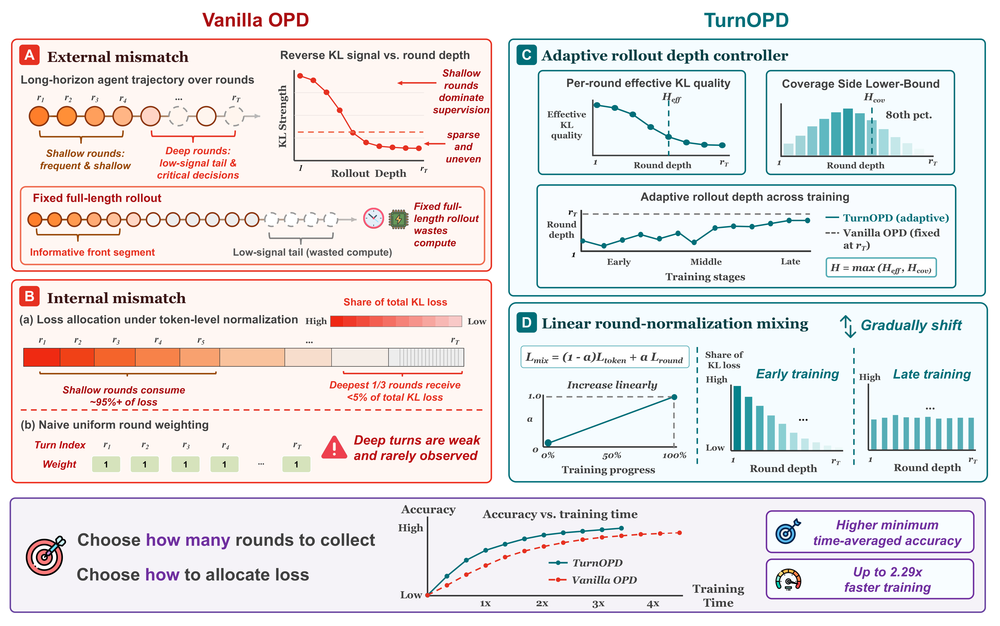
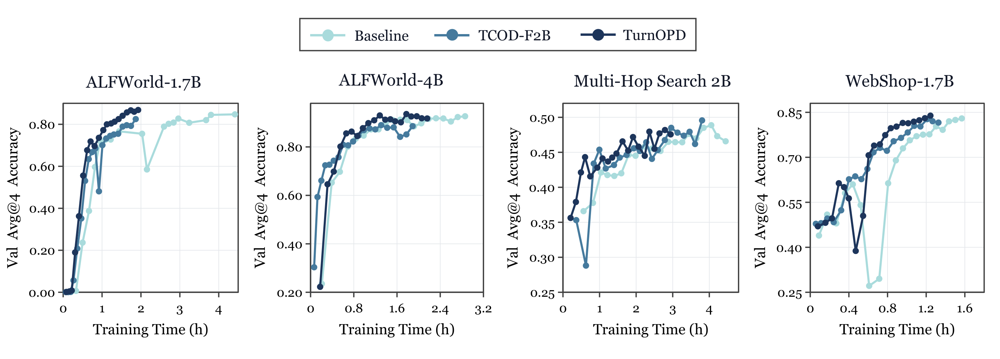
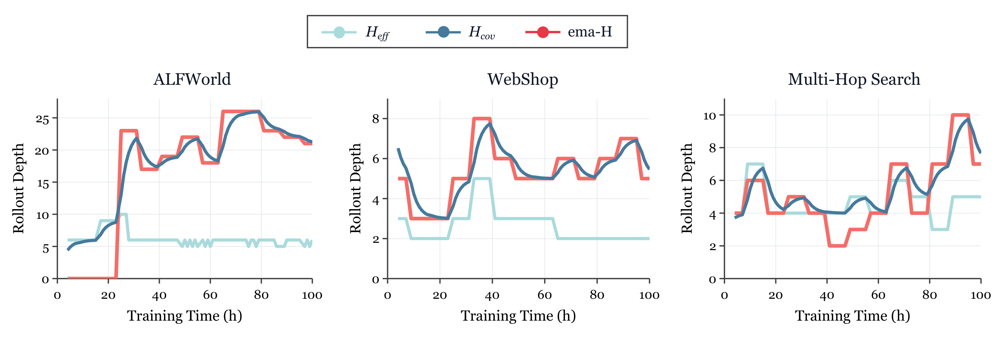

<strong style="font-size:16px;color:#1a6ba0;">要点速览</strong>

- **问题**：在线策略蒸馏（OPD）用于长程 Agent 效率极低——算力浪费在低价值的尾部回合，梯度压在浅层 token 上。  
- **诊断**：原始 OPD 有两道错配。反向 KL 信号严重前载（最深的第三回合仅分到 3.6%–4.5% 的 KL 损失）；深层 KL 还因「污染-压缩」机制失去判别力。  
- **方法**：TurnOPD 用两个预算控制器，自适应截断 rollout 深度，并把 KL 损失从 token 级逐步转向回合均衡监督。  
- **结果**：ALFWorld、WebShop、Multi-Hop Search 上同等时钟预算准确率全面占优，训练最高提速 **2.29×**（4.42h→1.93h）。

---

## 引言与背景

语言模型越来越多作为 Agent 部署，承担规划、工具调用与环境交互。OPD 给这类 Agent 提供了一套前景训练框架：学生自己采样 rollout，更强的教师（Teacher）在被访问的状态上用反向 KL 逐 token 监督，反馈密集且始终 on-policy，避开了稀疏奖励。

但把 OPD 直接搬到长程多回合任务会出问题：一次 rollout 是跨多回合、带环境状态变化的交互轨迹，早期决策影响后续所有状态，靠后的回合往往藏着关键但稀少的决策。仅靠 token 级反馈，无法为所有决策点提供恰当监督。

**核心判断：长程 Agent 的 OPD 里，监督单位不应该是扁平 token 位置，而是交互轨迹中由回合（turn）所条件的决策。**

TurnOPD 视角：标准 OPD 固定 rollout 深度、在整条轨迹上平均 KL，常把算力浪费在低价值尾部回合；TurnOPD 基于回合级统计同时预算 rollout 深度与 KL 聚合。

## 诊断：监督信号在回合轴上的两道错配

**错配一（外部）：固定 rollout 深度浪费算力。** 逐回合看平均反向 KL，信号严重前载——早期回合 KL 很大，20–30 步内快速下降，长尾后期更低更噪。固定深度把算力花在了信号不可靠的深处。

**错配二（内部）：轨迹级归一化让深层决策挨饿。** 轨迹级归约给每个 token 相同权重，但实现的 KL 损失份额由 token 数和该处 KL 共同决定。ALFWorld-4B 上仅回合 0 就吃掉约 1/4 KL 预算，前三个回合近一半，最深的第三回合只分到 3.6%–4.5%。

**「污染-压缩」解释为什么深层 KL 不可信。** 随着 rollout 变长，自回归上下文把越来越多的 next-token 分布强制决定（重复串、格式约束、复制实体等），测得的 KL 衰减可能只是「压缩」加剧，而非策略分歧真的消失。失败轨迹的刻板模式使其强制比例系统性更高，所以失败轨迹 KL 反而更低——深层 KL 不是干净的成果预测信号。

由此引出两个错配：**外部错配**（深度固定，浪费算力于信号不可靠处）与**内部错配**（KL 压在浅层，深层有信息量的决策挨饿）。

## 方法：TurnOPD

用两个预算控制器分别应对两道错配：

**1. 自适应 rollout 深度预算。** 在线估计最优视野 H* = max(H_eff, H_cov)。
- 效率臂 H_eff：把跨回合反向 KL 视为存活者加权的蒸馏质量分布，自适应决定深度——监督集中在浅层时保持浅，纠错尾巴延伸到深层时自动加深。
- 覆盖臂 H_cov：取成功条件完成深度的 80 分位数，防止过度截断。
- 控制器因果：用周期性全长度探针 rollout 更新统计量（被截断的不计入，否则偏置），常规步只用当前上限，再经 EMA 平滑。

**2. 渐进式回合归一化损失预算。** 标准轨迹级权重 q_t^traj = n_t/Σn_j，均匀回合级权重 q_t^turn = 1/T，最终取线性插值：
q_t^blend = (1−α) q_t^traj + α q_t^turn
混合系数 α 绑定训练进度：初期 α=0 跟随 token 质量保证稳定，随训练推进 α 增大，监督平滑转移到平等覆盖所有回合，专治后期深层决策欠训练。

## 实验与结果

在 ALFWorld、WebShop、Multi-Hop Search 上，用三对师生对比原始 OPD、TCOD-F2B 与 TurnOPD，按最少时间（Least-Time）与同一步（Same-Step）两种机制评估。

主结果等时效率曲线。横轴为累计训练时间，TurnOPD 在每类任务上都把准确率-时间前沿向外推。

**准确率与效率双优。** TurnOPD 在所有任务与模型组合上拿到最高 Least-Time Avg@4，Same-Step 也大多匹配或超越最佳基线。

| 任务 / 学生 | 方法 | Least-Time Avg@4 | Same-Step 时钟(h) | 加速比 |
|------|------|------|------|------|
| ALFWorld / 1.7B | Vanilla OPD | 73.52 | 4.42 | 1.00× |
| ALFWorld / 1.7B | TCOD-F2B | 80.06 | 1.87 | 2.37× |
| ALFWorld / 1.7B | **TurnOPD** | **85.60** | **1.93** | **2.29×** |
| ALFWorld / 4B | Vanilla OPD | 90.79 | 2.86 | 1.00× |
| ALFWorld / 4B | **TurnOPD** | **91.73** | **2.16** | **1.33×** |
| Multi-Hop / 2B | Vanilla OPD | 45.77 | 4.45 | 1.00× |
| Multi-Hop / 2B | **TurnOPD** | **47.24** | **2.94** | **1.51×** |
| WebShop / 1.7B | Vanilla OPD | 76.98 | 1.57 | 1.00× |
| WebShop / 1.7B | **TurnOPD** | **82.80** | **1.24** | **1.26×** |

ALFWorld-1.7B 上 TurnOPD 的 Same-Step Avg@4 达 86.29（原始 83.00、TCOD 80.06）；4B 学生下甚至超过教师参考（90.75）。

**控制器确实按诊断信号工作。** ALFWorld 上成功轨迹一出现，覆盖约束迅速主导、鼓励更长的 rollout；WebShop 保持适度覆盖下界；Multi-Hop 上两臂动态转移。H_eff 保证效率，H_cov 阻止选过短、覆盖不足的 rollout。

rollout 深度诊断回放：存活者加权 KL 质心 H_eff、成功覆盖下界 H_cov 及二者最大值的 EMA 视野 Ĥ，随训练步自适应变化。

## 消融分析

在 ALFWorld-1.7B 上拆开两个控制器：

| 配置 | 深度预算 | KL 混合 | Avg@4 | 时钟(h) |
|------|------|------|------|------|
| Vanilla OPD |  |  | 83.0 | 4.42 |
| + 自适应深度 | ✓ |  | 82.8 | 1.96 |
| + 线性 KL 混合 |  | ✓ | 85.1 | 2.59 |
| **TurnOPD** | ✓ | ✓ | **86.3** | **1.93** |

仅自适应深度把时钟砍到 1.96h 但准确率略降（缩短深度不解决损失分配）；仅线性 KL 混合把准确率提到 85.1 但耗时 2.59h（改善了优化却没省算力）。二者结合才拿到最佳准确率同时匹配低时钟。

## 结论

长程 Agent 的 OPD 里，原始方案把算力花在低产出尾部回合、把损失压在浅层 token 上。TurnOPD 用回合级预算同时自适应 rollout 深度、并把 KL 归一化渐进转向回合均衡，在三大基准上把准确率-时间前沿推到原始 OPD 之外。更宽的启示：**长程 Agent 的监督单位应是交互轨迹内由回合所条件的决策，而非扁平 token 位置。**

<strong style="font-size:15px;color:#8b6f4c;">结语</strong>

「污染-压缩」视角点破一个误区：深层 KL 变小不等于学生学会了教师，可能只是自回归上下文把策略分歧压缩进了强制组件。用原始 KL 当回合价值信号会严重误导优化方向。  
TurnOPD 的价值不在惊艳新模块，而是把「回合」作为一等公民接入 OPD 的资源分配，深度和损失各管各的杠杆，工程上干净、可调。  
对做长程 Agent 训练的人，最该带走的结论是：**先诊断信号在回合轴上的分布，再决定截断深度与损失权重，比盲目拉长 rollout 或堆算力划算得多。**

---

【传送门】 
<a class="normal_text_link mp_article_text_link" href="https://mp.weixin.qq.com/s/s0Ovn3_tnbbl9jxfAC3WLg" target="_blank" data-linktype="2">阿里Sparse Attention on CXL替代RDMA做KV Cache解耦 推理2.1×吞吐, 9.7×TTFT</a> 
<a class="normal_text_link mp_article_text_link" href="https://mp.weixin.qq.com/s/HnGKVp45C-GApBJ-LleP6g" target="_blank" data-linktype="2">小米MiMo罗福莉:8卡GPU让1T参数模型跑出1000 TPS , FP4+DFlash+TileRT全解</a> 
<a class="normal_text_link mp_article_text_link" href="https://mp.weixin.qq.com/s/FTsibdpbEjvoPWtxGqgxkQ" target="_blank" data-linktype="2">小米MiMo罗福莉后训练新范式MOPD: 多教师同策略蒸馏，多领域无损</a> 
<a class="normal_text_link mp_article_text_link" href="https://mp.weixin.qq.com/s/OoHu1yeuh1gzgCfEiPvDuQ" target="_blank" data-linktype="2">RL的下一个大突破：不是优化可验证问题而是把'不可验证'领域变</a> 
<a class="normal_text_link mp_article_text_link" href="https://mp.weixin.qq.com/s/nVqW9acA7NN1zeALDwRAsw" target="_blank" data-linktype="2">Google新论文RubricEM: 评分标准引导的深度研究Agent训练框架</a> 
<a class="normal_text_link mp_article_text_link" href="https://mp.weixin.qq.com/s/OqtF6ZaWQNu3o-VAWLfqbg" target="_blank" data-linktype="2">榨干GPU性能：流水线解码消除GPU气泡，推理吞吐提升35%</a> 
<a class="normal_text_link mp_article_text_link" href="https://mp.weixin.qq.com/s/3btXHAVd8_x5CM5CWETc2g" target="_blank" data-linktype="2">Agent卷向AI Infra: SGLang团队用硬核Agent优化框架和CUDA Kernal性能</a> 
<a class="normal_text_link mp_article_text_link" href="https://mp.weixin.qq.com/s/2eWh5jZJPHsv0wi9km2nVg" target="_blank" data-linktype="2">NVIDIA TriAttention解读: KV Cache压缩最大的问题不是算法而是两个Infra</a> 
<a class="normal_text_link mp_article_text_link" href="https://mp.weixin.qq.com/s/6uimwhjj_HlWTOB4m2FNrQ" target="_blank" data-linktype="2">Hermes Agent大师之路</a> 
<a class="normal_text_link mp_article_text_link" href="https://mp.weixin.qq.com/s/-JYim8I-W-hWWNwkxWTWUg" target="_blank" data-linktype="2">Anthropic Harness实践：Claude Code如何征服百万行级代码库?</a> 
<a class="normal_text_link mp_article_text_link" href="https://mp.weixin.qq.com/s/azqWoS3uB4S8jPvyIAucuA" target="_blank" data-linktype="2">Hermes Agent大师指南：从零到全自动Agent系统</a>

---

参考：https://arxiv.org/abs/2607.05804
