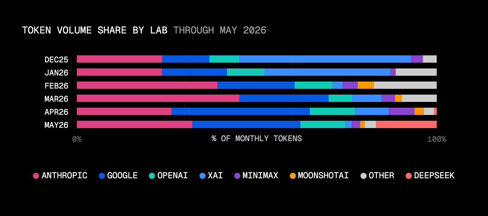
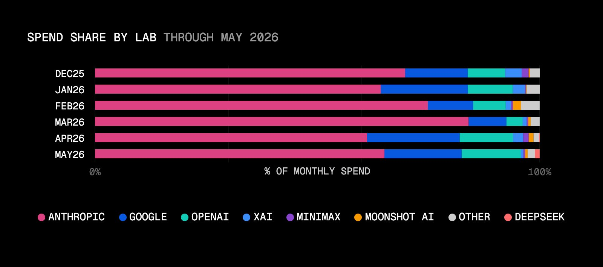
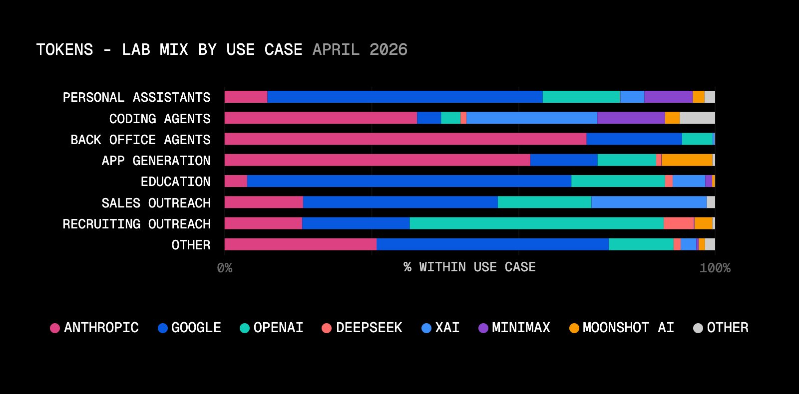
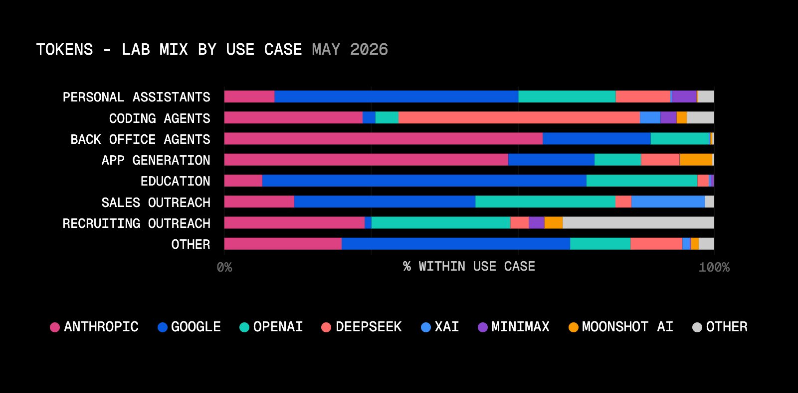
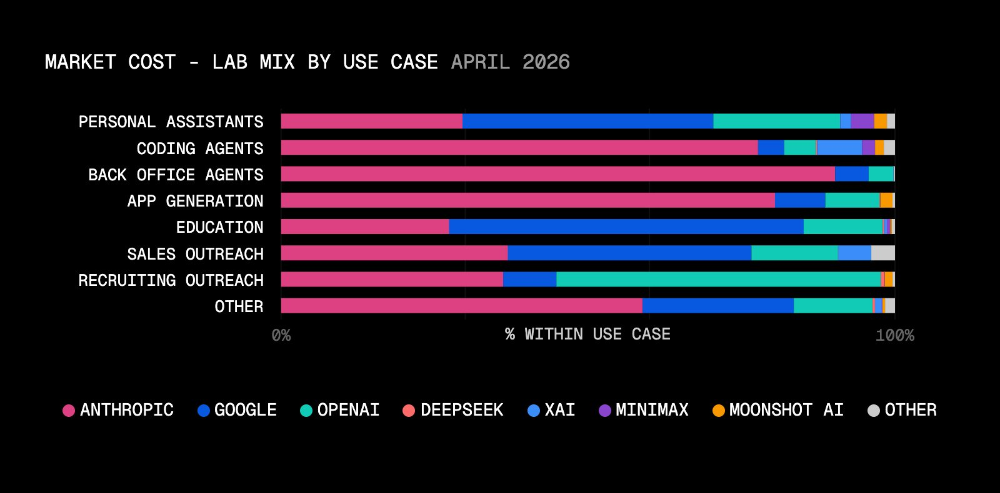
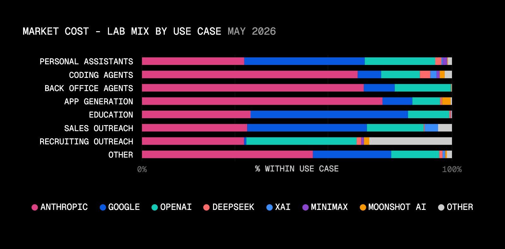
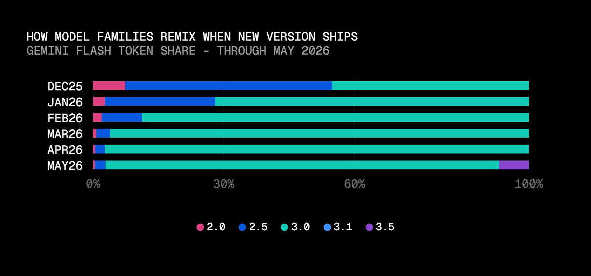
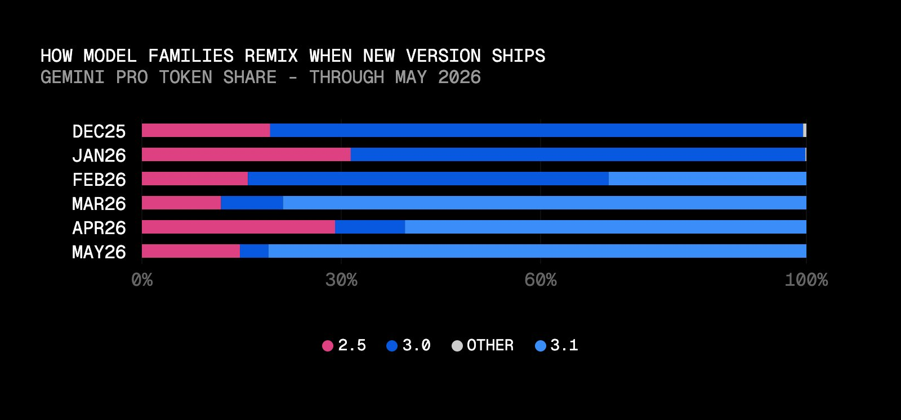

# Tokens争夺战：DeepSeek超越OpenAI冲入Tokens用量Top3，Anthropic独霸消费份额65%

Vercel AI Gateway 每月在生产应用和 AI 实验室之间路由数万亿 token，这份数据独立于排行榜和基准测试，展示的是真实的 AI 使用情况。

## 5 月生产指数概要

- AI Gateway 总 token 量环比增长 20%，总支出环比增长 43%。**客户每 token 平均支付的价格比 4 月高了近 20%。**
- DeepSeek 的 token 份额在一个月内从不到 1% 跃升至 17%，**但其支出份额仍维持在 1% 左右。**
- **Anthropic 的支出份额从 61% 增长到 65%，** 在所有高价值使用场景（AI 应用生成、后台 Agent、编码 Agent）中占据 70–80% 的支出。
- **成本意识意味着更智能的低成本模型与前沿模型之间的路由策略。** 客户在选择哪个模型做哪项工作时更加审慎，同时整体使用量仍在攀升。

上个月，关于 token 预算失控的新闻占据了科技头条：Uber 在 Q1 后不久就烧光了年度 Claude Code 预算，Amazon 关闭了 KiroRank 以遏制无生产力的 tokenmaxxing。**虽然成本失控是真实问题，但本月报告显示，生产场景的支出仍在增长。**

## 5 月数据揭示的两个洞察

- **低成本模型进入生产环境：** 新模型以让老牌实验室显得更贵的价格点发布，而且能力足以进入生产组合。
- **支出在增长，但模型组合更智能：** 团队仍在增加 token 预算，但他们在实施更智能的路由策略，让每一美元产生更多价值。

## 低成本模型首次获得大规模生产流量

从 2 月到 4 月，AI Gateway 上各实验室的流量分布变化缓慢，但 5 月 DeepSeek V4 的发布彻底改变了 token 份额格局。**4 月几乎不存在的低成本市场，在 5 月成为 AI Gateway 按流量计算的第三大供应商，且对整体支出影响甚微。**

4 月，DeepSeek 占 AI Gateway token 量的不到 1%，支出不到 0.2%。**5 月，其流量份额跃升至 17%，排名第三，超过 OpenAI。** 几乎所有流量来自两个模型：deepseek/deepseek-v4-flash 和 deepseek/deepseek-v4-pro，两者均在 5 月发布。

## 支出视角：另一面故事

**支出数据讲述了另一半故事。** 尽管 DeepSeek 的 token 份额在一个月内增长到 17%，但其成本份额仍接近 1%。

DeepSeek V4 Flash 定价为每百万 token 输入 $0.14 / 输出 $0.28，比同类 Anthropic 模型便宜约 20–50 倍，比 Qwen 3.6 Plus 和 Kimi K2.6 等其他性价比旗舰便宜 8–12 倍。**如此巨大的价差下，团队迅速采用了 V4 Flash。**

**价格本身不足以在一个月内让 DeepSeek 的流量发生如此大的变化——这意味着团队在将 DeepSeek V4 与现有评测体系对比后，发现其输出质量足够好，可以上线，而不仅仅是便宜到值得一试。**

**性价比模型在 AI Gateway 上一直存在，但从未达到如此规模的份额——这意味着 DeepSeek V4 是第一个在其价格点上达到生产工作质量门槛的模型。**

## 前端模型支出增长更快

**即使在低成本市场流量增长最快的同时，昂贵端在美元增长上更快。**

Anthropic 的 token 份额从 26% 增长到 32%，支出份额从 61% 增长到 65%。OpenAI 的 token 份额维持在 13% 左右，但支出份额从 12% 微升至 13%（基于更大的总量），**说明客户在 5 月为每 OpenAI token 支付了更多。**

**即使有 DeepSeek 拉低平均值，5 月的平均 token 成本反而更高了。** 这是因为需要前沿模型的工作增长速度快于不需要的工作。

## AI 编码 Agent：低成本 vs 前沿的分裂最明显

- DeepSeek 驱动了该细分市场 49% 的 token 量，**但仅占 4% 的成本。**
- Anthropic 驱动了 28% 的 token 量，**和 70% 的成本。**

**低成本模型已成为生产工作流的重要组成部分，但前沿模型的使用仍在增长，推动了整体支出的上升。**

## Anthropic 统治高价值场景

**前沿模型每 token 成本在上升，客户仍在买单。** Anthropic 继续在支出上领先，5 月占据 Gateway 总支出的 65%，在所有高价值使用场景中占 70–80%。

**整体支出增长表明，5 月 AI 需求仍在增长，但团队通过路由策略对预算施加了更精准的控制。** 他们把廉价、高流量的工作交给低价模型，在质量最关键的地方使用前沿模型。

## Gemini 3.5 Flash 涨价后无人迁移

Gemini 3.5 Flash 在 5 月发布，定价高于 Gemini 3.0 Flash，**但大规模迁移并未发生。** 到月底，3.5 仅占 Flash 系列 token 的 7%，而 3.0 Flash 占 90%。

**与 2–3 月 Gemini 3.1 Pro 的快速采用相比，3.5 Flash 的缓慢迁移表明，对 3.0 Flash 满意的团队目前不愿为更高成本买单。**

## 优化策略

**本月报告表明市场对价格敏感度在提高，即使整体支出和 token 量在增长。** 这意味着开发者正在寻找让每一美元产生更多价值的方法。

数据揭示了两种优化策略：

1. 使用 DeepSeek 便宜但能力足够的 V4 系列处理低风险、高流量任务
2. 选择推迟模型家族升级，直到 ROI 合理

**路由策略让团队能够实时调整模型组合和预算，因为各实验室正在为生产 AI 工作负载的不同层次展开竞争。**

---
参考：DeepSeek enters the fight for token volume, Anthropic continues to dominate spend

## 一点观察

DeepSeek V4 是第一个在「足够便宜」的同时「足够好」的模型——**这才是真正的转折点。** 此前性价比模型一直存在，但从未有人越过生产质量的门槛。V4 做到了，而且是在比同类便宜 20–50 倍的前提下。这不是降价竞争，这是质量门槛的重新定义。

智能路由正在从「高级技巧」变成「标配」。**不是选一个模型用到底，而是按任务分派：** DeepSeek 处理 49% 的编码 Agent token 量却只花 4% 的钱，Anthropic 拿 28% 的 token 量却花 70% 的钱——高价值任务依然在用最贵的模型。**这种分工越精细，整体效率越高。**

Gemini 3.5 Flash 涨价后几乎无人迁移，说明市场对「小幅涨价」的容忍度极低。**但 Anthropic 涨价（每 token 均价上涨）却没问题——因为用户认为其价值对等。** 这传递了一个信号：涨价可以，但必须让用户觉得值。
