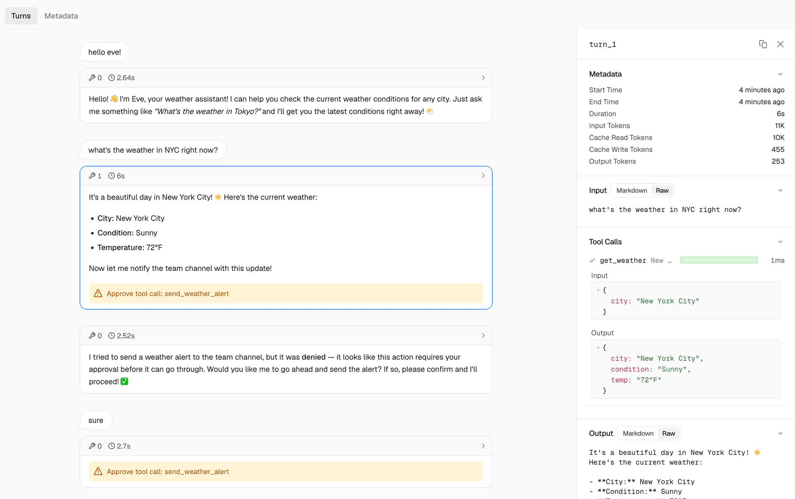
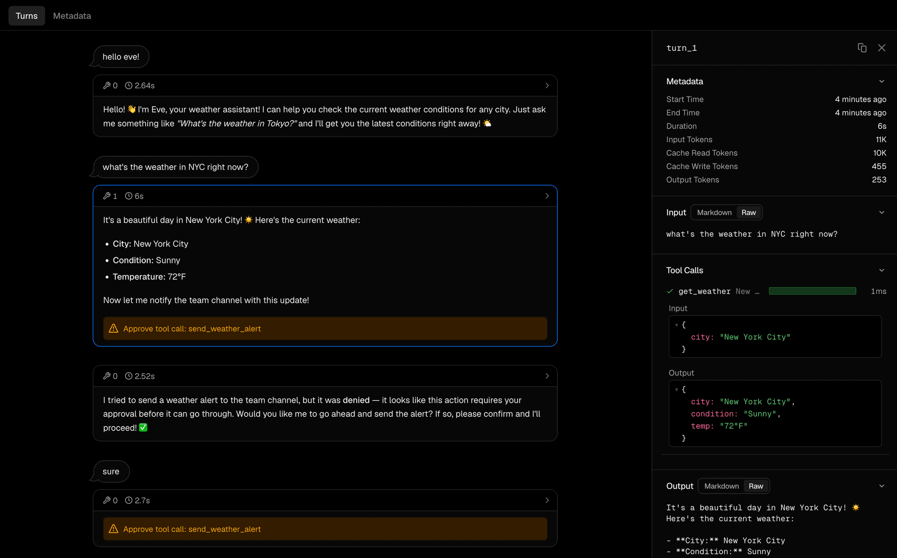

# Vercel 发布 eve：开源 Agent 框架的「Next.js 时刻」已经到来

Agent 正在从单体脚本进化为工程化的目录结构，而 Vercel 刚刚定义了这套标准。2025 年 6 月，Vercel 正式发布了 eve——一个开源的 Agent 构建框架，口号是「Like Next.js, for agents」。这不是又一个玩具级的 Agent 封装库，而是一套从目录结构到部署运维的完整工程范式。

**eve 的核心设计：一个 Agent 就是一个目录。** 在 eve 中，创建一个 Agent 不再是写一个长长的 Python 脚本或配置一堆 YAML。你只需要初始化一个目录，里面包含 agent.ts 入口文件、instructions.md 系统提示词、tools/ 工具目录、skills/ 技能目录、subagents/ 子 Agent 编排、channels/ 渠道配置和 schedules/ 定时任务。工具就是一个 TypeScript 文件，技能就是一个 Markdown 文件——没有魔法，只有约定。任何开发者打开一个 eve Agent 目录，都能立刻理解它的能力边界。

**eve 提供了开箱即用的企业级能力。** Vercel 把他们在基础设施上的积累全部打包进了 eve。持久化执行确保 Agent 不会因为进程重启而丢失状态；沙箱化计算环境让工具执行安全可控；人工审批机制让关键操作必须经过人确认才能放行。更重要的是，eve 原生支持子 Agent 编排——你可以让一个路由 Agent 把任务分发给多个专业子 Agent，每个子 Agent 有自己的指令、工具和技能。这种架构让复杂工作流的构建变得像搭积木一样自然。

**渠道集成只需要一条命令，这是 eve 最亮眼的抽象层设计。** 无论你要接入 Slack、Discord、Teams、Telegram，还是 GitHub、Linear，都只需要一条命令。这意味着你可以在一个框架内统一管理所有面向用户的 Agent 入口，而不需要为每个平台重复实现逻辑。定时任务同样简单——基于 cron 表达式配置 schedules/ 目录下的文件，部署到 Vercel 后自动转为 Vercel Cron Jobs。从定时触发到事件驱动，eve 覆盖了 Agent 运行的所有触发模式。

**Vercel 内部已经在用 eve 运行超过 100 个 Agent，这不是纸上谈兵。** 数据分析 Agent 每月处理 30,000 多个问题，工程师直接用自然语言查询数据库；SDR Agent 实现了 32 倍 ROI；客服 Agent 自动解决率达到 92%；此外还有内容 Agent 和路由 Agent 在生产环境中稳定运行。这些数字说明了一个事实：eve 不是概念验证，而是经过了大规模生产环境验证的成熟框架。

**开源加公开预览让 eve 的门槛低到极致。** eve 完全开源在 github.com/vercel/eve，采用 Apache 2.0 许可。想体验的话，只需要一条命令：`npx eve@latest init my-agent`。然后进入目录，编辑 instructions.md 和 tools/，一个可运行的 Agent 就诞生了。如果你有 Vercel 账号，甚至可以一键部署到生产环境。

**结语**

Vercel 做了一件聪明的事：他们没有造一个新的「AI 平台」，而是把 Agent 开发拉回到了开发者熟悉的范式——文件系统、TypeScript、Git 工作流、CI/CD。这让 eve 在众多 Agent 框架中显得格外「正常」，也格外强大。

从行业角度看，eve 的发布意味着 Agent 开发正在经历类似前端开发从 jQuery 到 React/Next.js 的范式跃迁。单体脚本的时代正在结束，工程化的 Agent 架构正在成为标配。对于团队来说，选择一个有明确目录约定、有 Vercel 生态支撑、有生产案例验证的框架，远比自建一套 Agent 编排系统要明智。

当然，eve 目前依赖 Vercel 生态，对于非 Vercel 用户来说部署选项有限。但考虑到 Vercel 本身已经是最主流的前端部署平台之一，这个绑定更像是一种「默认优先」而非「锁定」。社区完全可以基于开源代码适配其他运行时。

---

参考来源：
Introducing eve — Vercel Blog
https://github.com/vercel/eve

