

<strong style="font-size:16px;color:#1a6ba0;">要点速览</strong>

- <strong>有损KV Cache不等于「效果差一点」</strong>：每一步解码的微小偏差会指数级累积：KVzip 4×压缩下，250个token后全量KV的正确输出概率只剩0.25%。代码生成中，200行后直接反了  
- <strong>VeriCache把有损压缩当成「草稿生成器」</strong>：用压缩KV快速Draft token，再用全量KV验证纠错。输出与全量KV推理完全一致，但吞吐可达全量KV的4×  
- <strong>两大系统创新让方案成立</strong>：交叉资源交错（压缩KV草稿吃HBM带宽，全量KV验证吃PCIe/网络带宽，两者可重叠流水）和长验证窗口（压缩KV的草稿接受率远高于传统小模型Draft方案）  
- <strong>支持7种压缩方法</strong>：统一的Compressor Interface让任意的token-dropping和量化方法都能接入VeriCache，无需修改调度或验证逻辑

---

KV Cache的体量已经成为长上下文LLM推理的核心瓶颈。过去两年，学界提出了大量KV Cache压缩方法：token丢弃、量化降精度，压缩比从2× 到5× 不等。这些方法确实显著提升了吞吐。

但它们都有一个共同的名字：**有损**。

这篇文章来自芝加哥大学Junchen Jiang团队（第一作者Jiayi Yao），提出了一套名为 **VeriCache** 的推理框架，核心思路简单到令人意外：让有损压缩当Draft模型，全量KV Cache做验证，最终输出与全量KV完全一致，同时将推理吞吐提升至4×。

关键在于，这个「验证」的成本不能吃掉压缩带来的收益。VeriCache用两个系统设计做到了。

---

### 压缩的「隐形代价」：不是小偏差，是指数级崩溃

现有KV Cache压缩的评价标准几乎清一色用token级指标：F1、ROUGE、困惑度、余弦相似度。这些指标对小偏差非常宽容，适合摘要、开放问答等场景。

问题是，代码生成和工具调用不宽容。

KVzip 4× 压缩下，F1仍能维持在75% 以上：看起来还行。但代码格式准确率（输出必须是合法git diff）直接跌到接近0%，函数调用准确率（每个调用名和参数精确匹配）也跌到10% 以下。

**为什么会这样？** 论文给出了一个清晰的数学分析。

每一步解码，压缩KV都会改变注意力权重，使得模型的下一个token分布p_lossy偏离全量KV的分布p_full。这跟采样噪音（temperature）有本质区别：采样噪音是从正确的分布中抽样，只是抽了不同的token；而压缩偏差是**整个分布都错了**，无论怎么重采样都拉不回来。

每个step的KL散度只有约0.023 nats：单个step的偏差几乎不可察觉，压缩模型对正确token仍然分配了98% 的概率。但经过250步解码，累积KL达到约6 nats，这意味着压缩模型生成全量KV正确输出序列的概率只有约0.25%。

**每一步2% 的偏差，放大250步后成了400倍的差距。**

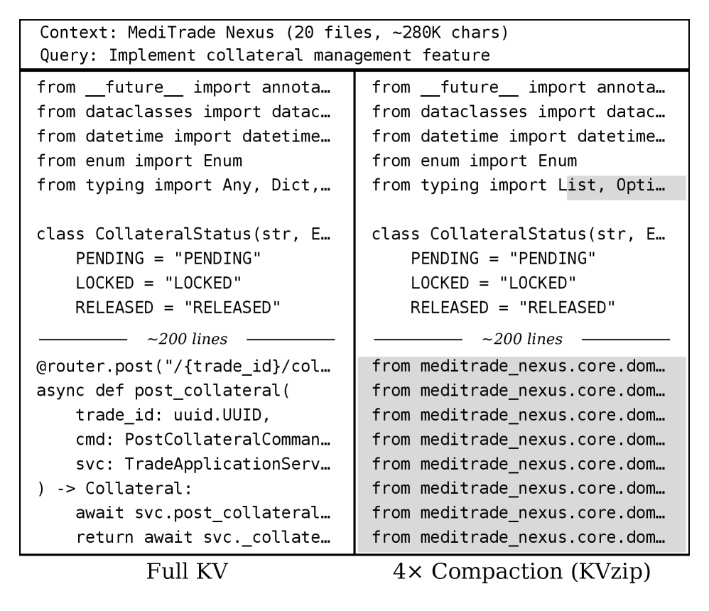
KVzip 4× 压缩下代码生成的灾难：前200行还能跟全量KV一样，之后完全跑偏，输出了错误的实现。

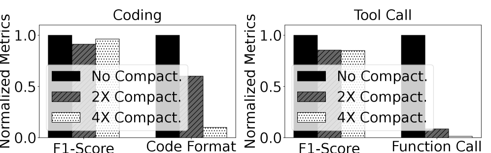
Token级指标（F1）和功能指标（代码格式准确率、函数调用准确率）之间存在巨大鸿沟。F1 > 75%，但功能准确率几乎归零。

---

### VeriCache的核心循环：Draft → Verify → Correct

VeriCache的思路直接借鉴了投机解码（Speculative Decoding），但做了一个关键改动：**Draft模型和验证模型是同一个LLM，只是用了不同的KV Cache版本。**

具体流程分三步：

1. **Draft**：用压缩KV Cache（KV_comp）自回归生成x个候选token
2. **Verify**：用全量KV Cache（KV_full）对这x个token做一次并行前向传播，得到每个位置上「正确的」next-token预测
3. **Accept**：从第一个不匹配的位置开始，接受之前的所有token，并用验证模型的正确token替换那个不匹配的token

这个机制保证：**最终输出与全量KV推理完全一致**（greedy decoding下，零温度）。

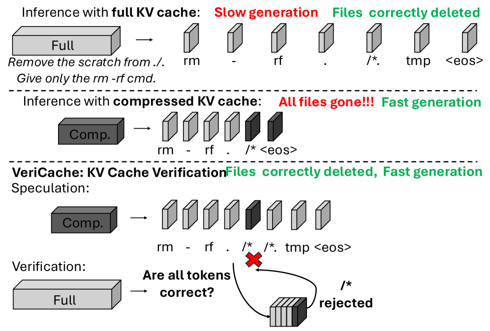
VeriCache的工作流程：压缩KV草稿 → 全量KV验证 → 纠错，确保输出与全量KV完全一致。

---

### 两个系统设计让方案站住脚

直接套用投机解码会出问题：验证阶段需要将全量KV从CPU加载回GPU，这个传输成本很可能吃掉压缩带来的吞吐收益。VeriCache的两个关键设计解决了这个问题。

#### 设计一：交叉资源交错（Cross-resource Staggering）

这是VeriCache最精巧的洞察。压缩KV的Draft过程和全量KV的Verify过程**吃的是完全不同的硬件资源**：

- **Draft**：每次只解码一个token，序列化的向量-矩阵乘法，瓶颈在GPU HBM带宽（模型权重 + 压缩KV的读取）
- **Verify**：需要从CPU把全量KV加载到GPU（PCIe/网络带宽瓶颈），然后做x个token的并行前向传播（GPU算力瓶颈）

两个过程的瓶颈资源是互补的：Draft压满HBM时，PCIe链路在闲着；Verify压满PCIe时，HBM又在闲着。

VeriCache的调度器不做「全部Draft完再全部Verify」的lock-step模式，而是**把验证请求打散混入各轮的Draft中**：每个只有约1/x的请求在验证，其余在草稿。这样PCIe传输可以和HBM读取重叠，资源利用率大幅提升。

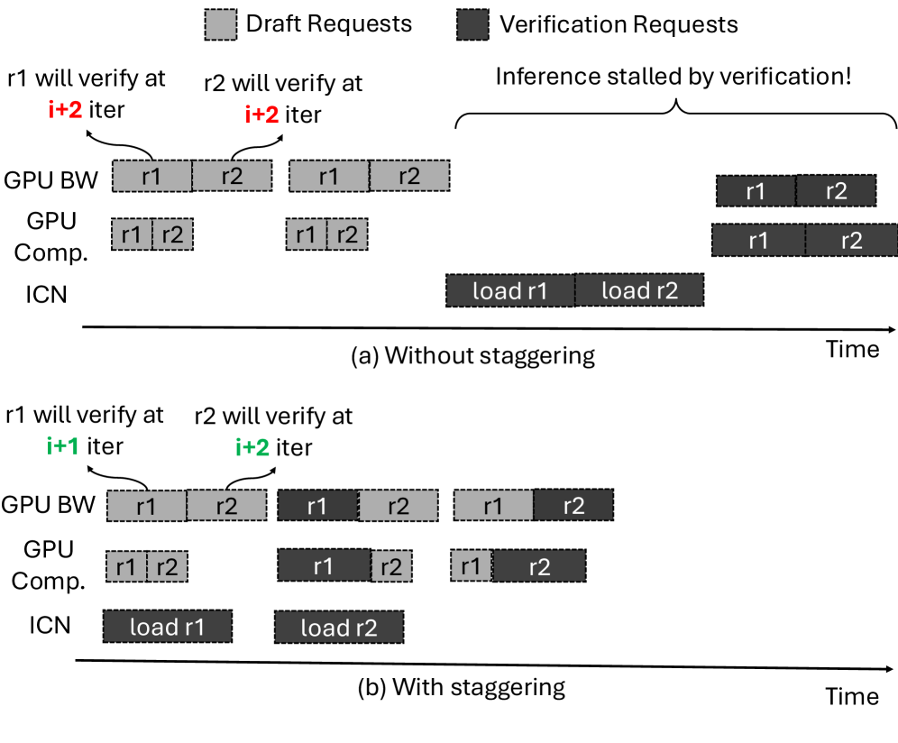
Lock-step（左）vs Staggered（右）调度对比。打散验证请求后，PCIe传输与Draft的前向计算可以重叠，GPU/HBM/Interconnect同时忙碌。

论文给出了一个具体算例：Mistral 24B、10个并发请求、每个请求KV_comp=1GB、KV_full=4GB、Draft长度30。传统lock-step需要把10个验证集中在同一轮，40GB的PCIe传输序列化需要约800ms：是单轮迭代时间的20倍。VeriCache将验证请求打散，每3轮Draft插入一次验证，80ms的PCIe传输可以和当前轮的Draft前向计算完全重叠，峰值HBM占用仅多了一个KV_full。

#### 设计二：长验证窗口摊薄开销

Draft的接受率（acceptance rate）γ 决定了多久需要做一次验证。传统投机解码用小模型做Draft，几个token后分布就跑偏了，接受长度只有2-3个token。

VeriCache不一样：Draft和验证用的是同一个模型，只是KV Cache版本不同，所以分布偏差远小于小模型方案。实测在4× 压缩下，VeriCache的接受率在Draft长度30时仍高于0.8，每次验证能接受约19-23个token（传统方案只有2-3个）。

这意味着每次从CPU加载全量KV的代价被摊薄到20+ 个token上，而不是2-3个token。更长的验证周期 = 更少的全量KV加载 = 更低的PCIe开销。

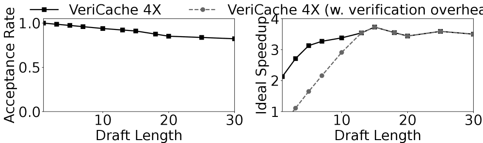
接受率（左）和理想加速比（右）。4× 压缩下Draft长度30时接受率仍 > 0.8，理想加速比可达约3.7×。

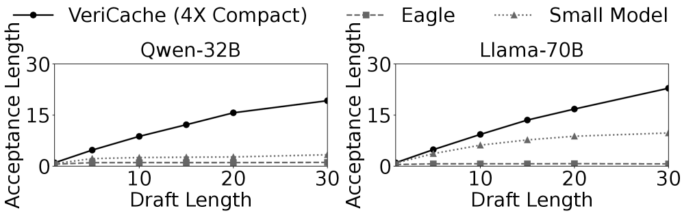
与传统投机解码方案的接受长度对比。VeriCache在Qwen-32B上接受约19个token，Llama-70B上约23个；Eagle只有1-2个，小模型Draft也只有3-10个。

不仅如此，VeriCache还可以与传统投机解码（如Eagle）组合使用：小模型先Draft token，VeriCache用压缩KV验证，再定期用全量KV校正压缩偏差。组合后理想加速比达到4.35×。

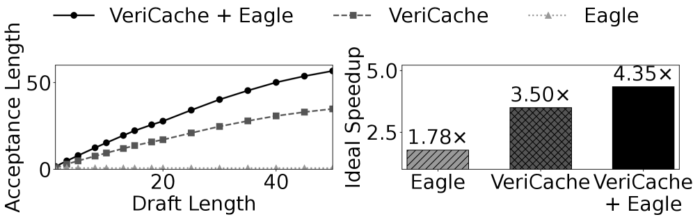
VeriCache + Eagle组合：接受长度提升明显，理想加速比达4.35×。

---

### 两种部署场景：长上下文解码 + 远程前缀缓存

VeriCache支持两种场景：

**长上下文解码**：全量KV保存在CPU内存，GPU只保留压缩KV。验证时通过PCIe将全量KV加载到GPU。

**远程前缀缓存**：在分布式推理场景中，缓存的KV从远端存储节点通过网络传输。存储节点有一个近端GPU（快链路BW_h）和一个远端GPU（慢链路BW_l）。远端GPU用压缩KV做Draft，近端GPU加载全量KV做验证：Draft和Verify跑在不同硬件上，天然解耦。

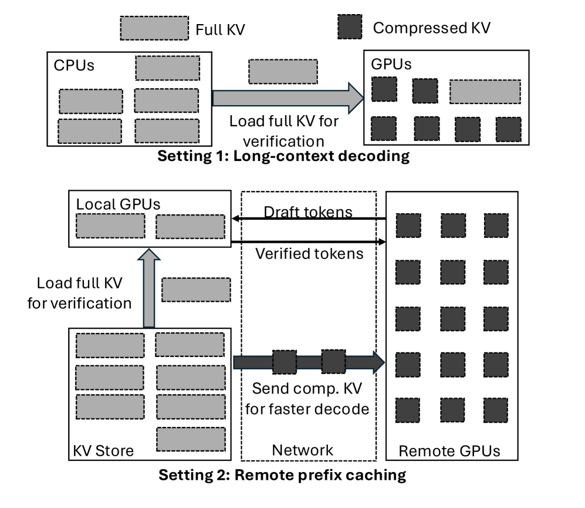
两种部署模式：长上下文解码（上）全量KV在CPU；远程前缀缓存（下）全量KV在本地存储。远端GPU做Draft，近端GPU做Verify。

---

### 统一的Compressor Interface

VeriCache暴露了一个统一的Compressor Interface，任何token-dropping或量化方法只要实现这个接口就能接入：

- **Long-context decoding场景**：KVzip、KIVI、Keyformer、H2O、FastKVzip、KVzap、ExpectedAttention、SnapKV、KVQuant、RotateKV等均已验证
- **Remote prefix caching场景**：CacheGen、KVQuant、KVTC、TurboQuant等流式压缩方法

**一个接口覆盖7种以上压缩方法**，调度、验证、传输逻辑完全不变。之前的工作（MagicDec、QuantSpec、SparseSpec）每个都只支持单一压缩方法。

---

### 实验结果：无损 + 2-4× 吞吐

VeriCache基于vLLM + LMCache实现，在多种模型和工作负载上进行了评估。

**长上下文解码**：VeriCache在Llama-70B上实现1.92×-2.73× 加速（全量KV的102 tok/s → VeriCache的256 tok/s）；在Qwen-32B上最高达到4.26×（叠加Eagle后）。

**远程前缀缓存**：传统投机解码方案不适用于此场景（Draft模型也需要完整KV），而VeriCache在Llama-70B上仍能做到1.33×-2.11× 加速（240 → 485 tok/s）。

**质量对比**：在所有压缩方法上，VeriCache的KL散度保持在0.01 nats以下（仅由硬件非确定性引起），而有损方案的KL可达14+ nats。函数调用准确率：VeriCache在保持全量KV准确率的前提下，达到最快有损方案（KVzip）的59% 以上的吞吐；KVzip在同样吞吐下准确率下降约30个百分点。

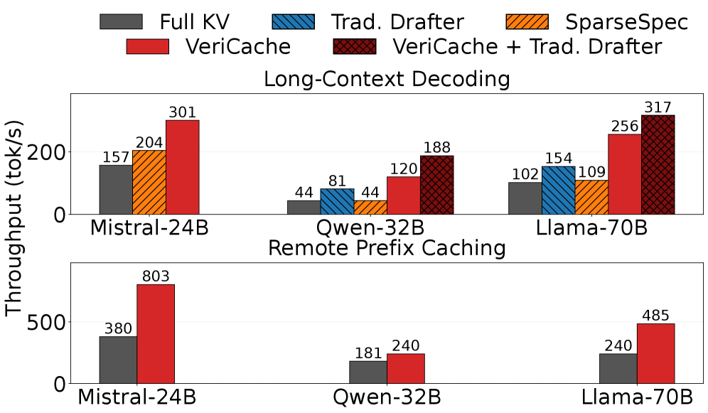
长上下文解码和远程前缀缓存下的解码吞吐。VeriCache（橙/红线）超越所有有损基线，同时保持完全无损的输出质量。

**硬件参数扫频**：当GPU HBM中KV预算从0.74降至0.2时，VeriCache的加速比从1.61× 增至2.71×：全量KV的batch容量比VeriCache的batch崩溃得更快（全量KV吃掉HBM，batch缩到1，而VeriCache的batch只是稍微缩小）。SparseSpec更惨，从1.82× 掉到1.02×：因为它必须在Draft GPU上常驻全量KV。

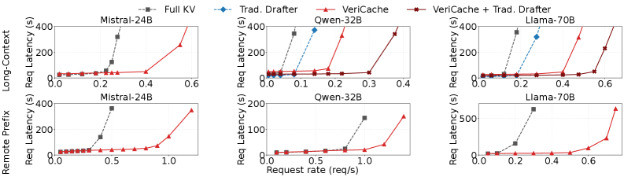
端到端请求延迟vs请求率。VeriCache在两种Pipeline上均保持低延迟，在达到全量KV 2-3× 吞吐的同时延迟仅有小幅增加。

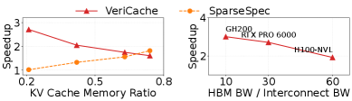
硬件参数扫频：KV预算越紧（左），VeriCache加速比越高（全量KV的batch先崩）；HBM:Interconnect带宽比越低（右，即PCIe更快），加速比也越高。

---

### 结语

<strong style="font-size:15px;color:#8b6f4c;">结语</strong>

VeriCache的核心洞察其实很简单：有损KV Cache的偏差很小（每步 -0.023 nats KL），但绝对不应该被忽视。它不为单个token采样错误负责：那在temperature > 0时本就合理：它为一个系统性偏差负责：每次采样的分布都偏移了正确分布一点点，而自回归会把这一点点放大成灾难。  
这个思路是把「压缩率vs准确率」的trade-off从算法层面移到了系统层面：不是让压缩算法「足够好」，而是让压缩算法「只管提速」，由VeriCache的验证机制保证正确性。这种分层抽象在系统领域屡试不爽，但放在KV Cache压缩这个具体问题上，两个核心设计（交叉资源交错和长验证窗口）确实精准地抓住了瓶颈的本质。  
VeriCache同时支持token-dropping和量化两类压缩方法：不是提出新的压缩算法，而是为所有压缩方法提供了一层「无损加速引擎」。从系统工程角度看，这是比做出一个更好的压缩算法更有价值的贡献。

---

【传送门】 
<a class="normal_text_link mp_article_text_link" href="https://mp.weixin.qq.com/s/TrDau7cG1M7kwsLQNwOpzA" target="_blank" data-linktype="2">揭秘最快的GLM-5.2推理优化技术：如何将吞吐推到 280 TPS</a> 
<a class="normal_text_link mp_article_text_link" href="https://mp.weixin.qq.com/s/UPOlNSnSWBLnxgEFOmWbzg" target="_blank" data-linktype="2">Prompt Cache各厂商策略对比：结合Deep Agents看Cache策略未来的优化方向</a> 
<a class="normal_text_link mp_article_text_link" href="https://mp.weixin.qq.com/s/lcs_gT9vfs0eaW001g2dfg" target="_blank" data-linktype="2">SGLang用Waterfill+LPLB解决DeepEP MoE负载不均，吞吐提升7.3%</a> 
<a class="normal_text_link mp_article_text_link" href="https://mp.weixin.qq.com/s/oq46CcmcBBTlfdCAzaOvhA" target="_blank" data-linktype="2">英伟达硬核4-bit量化: NVFP4将智能压缩到4比特</a> 
<a class="normal_text_link mp_article_text_link" href="https://mp.weixin.qq.com/s/xP1cEoO_plRpWItxhqeQnQ" target="_blank" data-linktype="2">Agent Harness Engineering：为什么Agent可靠性的天花板不是模型，而是基础设施层</a> 
<a class="normal_text_link mp_article_text_link" href="https://mp.weixin.qq.com/s/-xmiwcQP--wVA2iihg28vg" target="_blank" data-linktype="2">Hermes Agent创始团队揭秘：会自我进化的AI智能体</a> 
<a class="normal_text_link mp_article_text_link" href="https://mp.weixin.qq.com/s/SZC06ibLkUU_S2GL5wSPJQ" target="_blank" data-linktype="2">65 行 Prompt，把 AI 编程准确率从 65% 拉到 94%</a> 
<a class="normal_text_link mp_article_text_link" href="https://mp.weixin.qq.com/s/9QtSgk3jn5JSqcCB1ZKinA" target="_blank" data-linktype="2">Anthropic 3亿收购Stainless：CEO详解MCP协议未来</a>

---

参考：
https://arxiv.org/html/2605.17613v1
