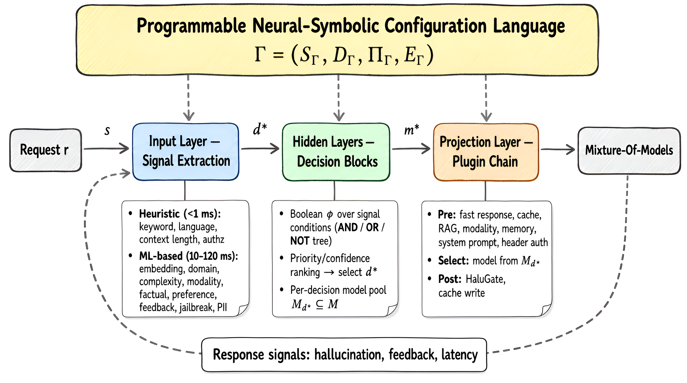
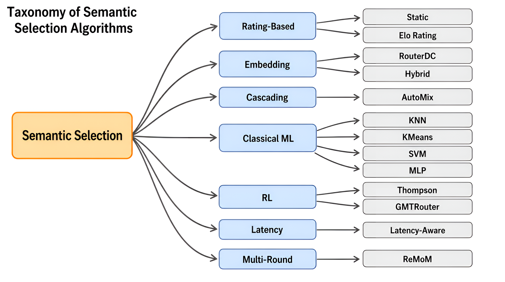
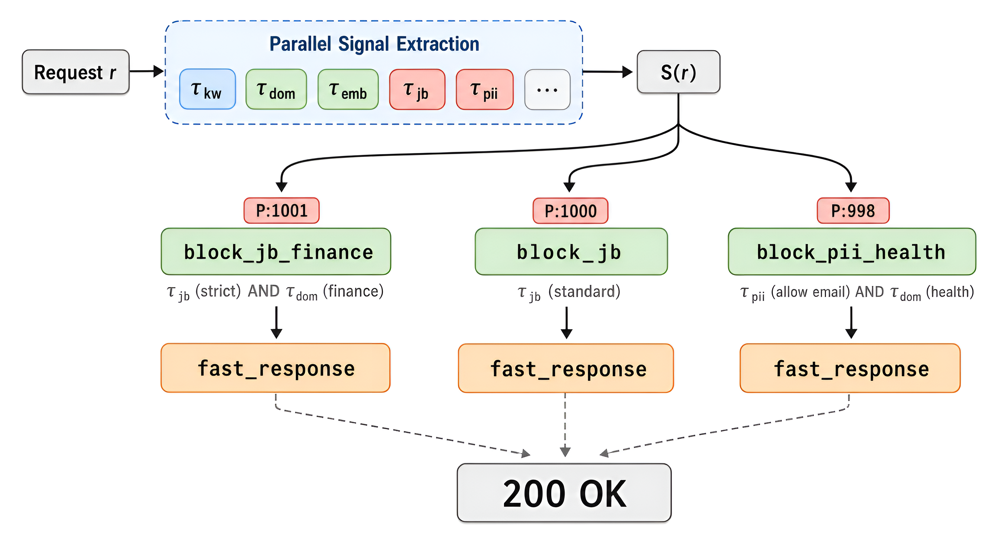

<div style="background:#e8f4fd;padding:14px 16px 10px 16px;border-radius:6px;margin-bottom:18px;">
<div style="text-align:center;margin-bottom:10px;">
<strong style="font-size:16px;color:#1a6ba0;">要点速览</strong>
</div>
<div style="font-size:14px;color:#3f3f3f;line-height:1.75;">
- <strong>可组合信号编排</strong>：13种信号类型（亚毫秒启发式+神经分类器）通过布尔规则组合成任意部署场景的路由策略：同一套系统，换套配置就是不同的路由方案<br><br>
- <strong>13种语义选择算法</strong>：从Elo评分、RouterDC对比学习到AutoMix级联、Thompson Sampling、ReMoM多轮推理：每种Query自动选最合适的模型<br><br>
- <strong>HaluGate + LoRA + ReflectionGate</strong>：门控幻觉检测（省50% 计算）、LoRA多任务分类（省6× 内存）、轻量级情景记忆（零LLM写入开销），三个子系统嵌入路由管道<br><br>
- <strong>DSL即指令集</strong>：带形式语法的配置语言编译到YAML/K8s CRD/Helm，Agent可以从自然语言自动合成路由策略
</div>
</div>

**企业级LLM集群面临一个根本性难题：用户发来一个请求，该交给哪个模型？选贵的浪费成本，选便宜的可能答不对。更别说还要考虑隐私合规、安全过滤、多Provider故障转移这些工程约束。**

vLLM团队刚刚开源了一整套方案：**vLLM Semantic Router (VSR)**，这不是一个简单的"难度路由"，而是一个完整的信号驱动路由系统。它用13种信号（keyword、domain、complexity、jailbreak检测等），通过布尔规则组成部署策略，从13种模型选择算法中选最优模型执行推理。

这篇论文很长（Technical Report，30+ 作者），但架构非常清晰。我们从三个层面拆解：**信号怎么提取、决策怎么评估、生态组件长什么样**。

---

### 一、核心洞察：一个系统，三种配置，不写一行代码

VSR最核心的卖点是 **composable signal orchestration**（可组合信号编排）。什么意思？

运营方只需写一份配置（DSL或YAML），告诉系统"我有哪些信号、什么条件下路由到哪个模型、上哪些插件"，然后同一套代码支持三种截然不同的场景：

- **医疗合规**：激活authz（授权）+ domain + language信号，PII过滤全开，模型只选本地部署
- **成本优化**：激活complexity + embedding + keyword信号，从便宜模型级联（cascade）到贵的，开语义缓存
- **多云企业**：激活domain + modality + authz，用延迟感知算法做加权路由，Provider间故障转移

**同一个二进制，换套配置文件就是不同的路由方案。**

架构分三层：

**Layer 1 — 信号提取**：13种信号，并行评估。启发式信号（keyword、language、context length、authz）亚毫秒完成；ML信号（domain、complexity、jailbreak、PII）10-120ms。关键优化：只计算被决策引用的信号，省50-70% 延迟。


<span style="font-size:12px;color:rgb(153,153,153);">VSR三层架构。输入信号向量s，决策引擎计算布尔公式匹配d*，插件链执行前后处理。闭环反馈信号使系统自适应调整。</span>

**Layer 2 — 决策引擎**：每个决策是一个布尔公式（AND/OR/NOT任意嵌套），功能完备：任何信号空间 {0,1}^N上的路由策略都可以表达。选择策略：优先级法（确定性）或置信度法（数据驱动）。

**Layer 3 — 插件链**：每个决策携带独立的插件链：前置插件（安全拦截、语义缓存、RAG注入、modality路由、记忆检索）→ 模型选择 → 后置插件（幻觉检测、缓存写入）。

论文专门花了一章（Section 4.5）用布尔代数论证决策引擎的功能完备性，还把决策集映射为数字逻辑电路的三种层级（PLA → 通用组合逻辑 → 优先编码器电路阵列），这在路由系统里是很少见的理论深度。

---

### 二、13种模型选择算法：从Elo到ReMoM

信号提取完成后，最关键的一步是**选模型**。VSR集成了13种算法，分为6个家族：

**Rating-Based**：Static（固定评分）和Elo Rating（从RouteLLM借鉴，用用户偏好更新模型Elo分，Bradley-Terry模型算选择概率）。

**Embedding-Based**：RouterDC（双对比学习，把query和模型嵌入同一空间，选余弦相似度最高的）；Hybrid（Elo + 嵌入 + 成本加权）。

**Cascading**：AutoMix（POMDP公式化 ： 从最便宜的模型开始，自验证，不达标就升级）。

**Classical ML**：KNN、KMeans、SVM、MLP（训练在路由记录上，特征向量 = query嵌入 + onehot域标签）。

**Reinforcement Learning**：Thompson Sampling（Beta先验，平衡探索/利用）；GMTRouter（图神经网络，建模用户-query-模型交互）。

**Latency-Aware**：基于TPOT/TTFT百分位统计选最优延迟模型。

**ReMoM (Multi-Round Reasoning)**：最有趣的一个：不是单选一个模型，而是同时派发给多个模型，逐轮合成。操作者指定广度调度（如 [32, 4]），第一轮32个并行调用，第二轮4个合成，最后一轮出最终答案。**这本质上是把路由从"选模型"变成了"编排推理"。**


<span style="font-size:12px;color:rgb(153,153,153);">13种语义模型选择算法的分类体系。按选择机制分为6个家族：评分类、嵌入类、级联类、经典ML、强化学习、延迟感知和多轮推理。</span>

所有算法实现统一接口 `Select: (𝐞_q, z, ℳ, Θ) → (m*, c)`，意味着**不同路由决策可以用不同选择算法**：成本优化的用AutoMix级联，质量敏感的用RouterDC。

---

### 三、安全：信号层整合，零附加延迟

VSR把安全检测放在了**信号层**而不是串行插件层。

> 💡 **核心洞察**：将jailbreak检测和PII检测作为first-class signal，与domain/complexity等信号**并行**评估。墙钟时间由最慢信号主导（~120ms），而不是安全检测额外加120ms。

Jailbreak检测支持两种方法：BERT分类器（单轮精确检测，阈值 θ=0.65）和对**比度嵌入方法**（专为多轮"温水煮青蛙"攻击设计）。对比度方法维护已知jailbreak模式库和良性库，对每个用户消息算 δ = max_j cos(q, j) - max_b cos(q, b)，**多轮取max** 聚合检测逐步升级：即使当前消息无害，只要对话历史中存在任何高风险轮次就触发。

PII检测是token级NER，每种检测规则可配允许列表：医疗场景允许email和phone（用于挂号预约），公共chatbot拦截所有类型。


<span style="font-size:12px;color:rgb(153,153,153);">信号驱动安全架构。jailbreak和PII检测与意图信号并行运行在信号层，零附加延迟。决策用AND/OR逻辑组合安全信号与域信号，实现上下文感知的安全策略。</span>

### HaluGate：不是所有查询都值得检测幻觉

HaluGate是三阶段**门控**流水线：

1. **Sentinel（哨兵）**：轻量级二分类器判断查询是事实型还是创作型。**40-60% 的非事实查询（创意写作、代码生成）直接跳过**，不跑后面的检测
2. **Detector（检测器）**：token级分类器，在模型响应中标记疑似幻觉span
3. **Explainer（解释器）**：NLI模型，区分contradiction（确定幻觉）vs neutral（可能幻觉）

门控效果：假设p_factual = 0.5，HaluGate将平均检测成本降低约50%。

---

### 四、工程：四运行时推理 + LoRA内存优化

**四条推理路径**，全部编译为Rust共享库通过CGo链接到Go路由进程，**不走Python**（无GIL、无IPC延迟）：

| 运行时 | 任务 | 
|--------|------|
| Candle (Rust) | 所有 Transformer 分类：BERT/ModernBERT/DeBERTa，LoRA 热加载 |
| Linfa (Rust) | 经典 ML：KNN/KMeans/SVM，CPU 推理 |
| ONNX Runtime | Embedding 计算，2D Matryoshka 支持层级提前退出和维度裁剪 |
| NLP Binding (Rust) | BM25 + N-gram 模糊匹配，无模型权重 |

论文中使用四条推理路径，全部编译为Rust共享库通过CGo链接到Go路由进程，消除Python运行时开销。

**LoRA多任务分类**对n个分类任务（domain, jailbreak, PII, fact-check等）只用**一个基座模型 + n个小适配器**。n=6时：LoRA方案575MB，独立模型方案3,438MB，省6× 内存。

更关键的是运营简便性：热切换适配器无需重载基座模型，新增任务只需训练新适配器，无需重训练或重新分发基座模型。

---

### 五、DSL即指令集：Agent可自动合成路由策略

VSR定义了一个带形式语法的DSL作为路由配置语言：

```
SIGNAL domain math { mmlu_categories: ["math"] }
SIGNAL keyword urgent { operator: "any", keywords: ["urgent","asap"] }

PLUGIN safe_pii pii { enabled: true, pii_types_allowed: [] }

ROUTE math_route {
  PRIORITY 100
  WHEN domain("math")
  MODEL "qwen2.5:3b"
  PLUGIN safe_pii
}

ROUTE urgent_ai {
  PRIORITY 200
  WHEN keyword("urgent") AND NOT domain("math")
  MODEL "qwen3:70b"
}
```

这不仅是配置文件。论文正式论证了DSL作为 **神经符号推理引擎的指令集**：功能完备性保证任何路由策略都可表达，配置问题变成了**程序合成问题**。

这就是论文标题中 "Signal Driven" + "Mixture-of-Modality" 的深层含义：未来你直接说"把数学题路由到推理模型、紧急问题用大模型、PII过滤只在医疗场景开"，**LLM Agent自动生成DSL配置**，用路由质量反馈做RL优化。

论文正式论证了DSL作为神经符号推理引擎的指令集，功能完备性保证任何路由策略都可表达。

编译流水线支持三个目标：flat YAML（本地开发）、Kubernetes CRD（云原生部署）、Helm values（chart部署）。三级别验证（Syntax/Reference/Constraint）提供IDE级渐进式反馈。

---

### 六、生产验证：Envoy ExtProc + 600+ 合并

VSR通过 **Envoy External Processor (ExtProc)** 协议实现透明拦截：客户端发正常的OpenAI格式请求到Envoy，Envoy通过gRPC流把请求转发给VSR处理后路由到目标后端。客户端不需要做任何修改。

**多Provider协议翻译**是透明的：路由决策按"能力"引用模型（"最佳代码模型"），系统自动翻译为OpenAI/Azure/Anthropic/Bedrock/Gemini各自的消息格式。

生产数据：**600+ merged contributions from 50+ engineers**，已部署为Envoy ExtProc + Kubernetes Operator。

---

<div style="background:#f5f0eb;padding:14px 16px 10px 16px;border-radius:6px;margin-bottom:16px;">
<div style="text-align:center;margin-bottom:8px;">
<strong style="font-size:15px;color:#8b6f4c;">结语</strong>
</div>
<div style="font-size:14px;color:#3f3f3f;line-height:1.75;">
VSR在几个方向上做得确实漂亮。把信息论（熵减）和布尔代数（功能完备性）作为架构的数学基础，不是贴在论文里的装饰，而是贯穿信号提取和决策引擎的设计原则：这比大多数方案里拍脑门定路由规则要扎实得多。<br><br>

最让我感兴趣的是把DSL定位为"指令集"、把配置问题转化为Agent程序合成问题的想法。如果这个方向做成了，企业不再需要一个路由专家手动调规则，而是说一句"把财务类问题走严格安全策略"就能自动生成配置：这对vLLM生态的易用性提升会非常显著。<br><br>

当然，VSR的复杂性也不低。13种信号、13种选择算法、4个推理运行时、3层插件链：这已经是一个不小的平台了。对于只用两三个模型的简单场景，用RouteLLM那种二选一路由可能更合适。VSR真正的用武之地是那些运行几十个模型端点、跨多个云Provider、有严格合规要求的"大集群"。
</div>
</div>

---

<span style="font-size:12px;color:#888888;font-family:'Courier New',monospace;">参考：

https://arxiv.org/abs/2603.04444
https://github.com/vllm-project/semantic-router</span>
