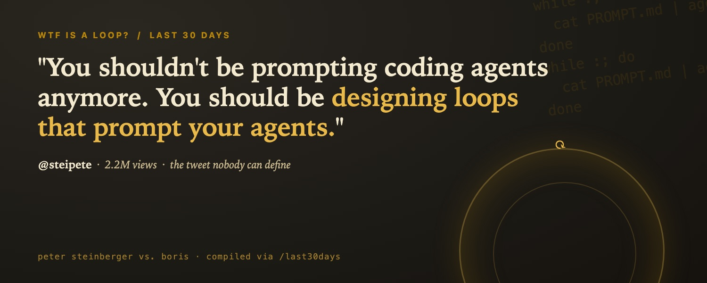

## 那条让 timeline 窒息的推文

OpenClaw之父Peter Steinberger在6月7日发了一条推文，浏览量冲到了220万：

> "这里是你每月一次的提醒：**你不应该再给编码Agent写prompt了。你应该设计loop，让loop给你的Agent写prompt。**"

这段话所有人都引用，但最诚实的回复是Matthew Berman的：

> "除了他和Boris，没人知道。"

AI编程圈当下最热的概念，大多数重复它的人解释不清楚。有一派人高喊prompt engineering已死。另一派——真正写代码的——说了句更接近真相的：

> "这不是ralph/goal loops，那已经过时了。它大概是某种持续编排循环，用来监控其他线程/Agent。"

## Boris提及的Loop是什么

Claude Code之父Boris Cherny在2024年9月把Claude Code当作一个副项目创建出来。6月2日，他在WorkOS举办的Acquired Unplugged活动上给出了关于loop最清晰的定义。

> "现在它又升级了，我想，到了下一层抽象：我不再给Claude写prompt了。我有loop在运行。是它们来prompt Claude，然后决定做什么。我的工作就是写loop。"

所以最直白的版本是这样的：一个小程序，你写它，它替你去prompt编码Agent，读取Agent的输出，判断任务是否完成，不行就再prompt一次。你不再是循环里打字的那个人。你成为这个循环的创作者。模型变成了一个子程序。

Boris把它分成三个阶段，理解他的这个阶梯是最快的入门方式。一年前他是手写代码加自动补全。然后他并行跑五到十个Claude会话，逐个手动prompt。现在他根本不做prompt了。他写那些prompt Claude的循环，几百个Agent读他的GitHub、Slack和Twitter，然后决定下一步该构建什么。他有数据为证。

> "过去30天里，我所有对Claude Code的贡献都是Claude Code自己写的。我落地了259个PR。"

他在2025年11月删掉了IDE，之后再也没打开过。那些大喊"prompt engineering已死"的人忽略了一个细节：他并不是在说工程师过时了。依然有人必须决定构建什么、和客户沟通、协调团队——他说优秀工程师比以往任何时候都重要。**工作没有消失。它只是上升了一个高度：从写代码变成了写那个写代码的东西。**

## Loop内涵的变迁

"loop"这个词下面至少藏着五种不同的东西。以下是顺序排列的演化阶段，从最老到最新，这样大家就不至于鸡同鸭讲了。

**阶段一，学术派的while-loop。** 2022年的ReAct论文正式化了它：模型思考、调一个工具、读结果、重复直到完成。一个模型，一个循环，人类在旁边看着。

**阶段二，2023年的AutoGPT。** 给了它一个目标让它自己prompt自己——然后以永无止境的空转出了名。那次失败为"Agent是玩具"这个观点埋下了几年的种子。

**阶段三，Trash Panda称之为"过时的"阶段：ralph循环。** Geoffrey Huntley在2025年7月发布。简单到近乎侮辱——一个bash单行，把同一个prompt文件反复pipe进Agent。它真正的创新在于纪律：每次迭代都把上下文重置到一个固定的锚文件集合，而不是让对话无限膨胀。Huntley用这个循环、花了大约297美元就构建了一整门编程语言。

**阶段四，产品化。** 2026年春季，Codex和Claude Code都发布了/goal命令，本质上是跑一个ralph循环，直到一个小型校验模型确认任务完成。

**阶段五，才是Boris和Steinberger真正说的东西。** 它是真正的新东西，不只是换个名字。**四件事变了：** loop成了**工作单元**，不再是任务本身；loop开始**监控其他loop**，而且并行、定时地运行；**调度取代了人类启动**，loop运行在你的基础设施上而不是你的注意力(模型)上；**持久性成了显式设计**——基于git的状态和崩溃恢复，因为这些东西必须能在重启后活下来。Ralph假设你的终端一直开着。2026年的版本假设它开不了。所以Trash Panda说对了两次：单Agent的ralph循环已经过时了，而在它之上的多Agent编排循环才是新东西。

## 不过是加了帽子的cron job？ No!

整个研究中最精辟的质疑只有四个字，发在某人对"这是趋势"的激情推文下面：

> "Cron现在改名叫loop了是吧。"

这值得认真回答，不回避，因为它对了一半。没错，调度层就是cron。Boris真的在cron上跑它。Claude Code的/loop命令底层用的就是cron。如果你对整个loop的定义就是"一个按定时器跑的东西"，那好，我们在1975年就发明它了，你可以回家了。

但cron从来没有过中间的那部分。Cron job跑的是一个固定脚本。Loop跑的是一个模型——它看当前状态，决定下一步做什么，做了，检查是否有效，再决定是否继续。决策是Agent的，不是你的，也不是一个硬编码的分支。把它们堆起来，让一个loop调度并监控其他loop，给它们持久化的共享状态，你就得到了cron表达不了的东西。诚实的框架不是"loop是新的魔法"，也不是"loop就是cron"。**它是：loop = cron + 循环体里的决策者，而有趣的工程问题是围绕这个决策者的一切包装——确保它别跑下悬崖。**

## 真正动手建一个loop是什么样

理论够了。入门是一行命令。Claude Code发布了/loop，Boris自己的例子就是标准的起点。粘贴它，改掉名词就行。

```
/loop 帮我看着所有PR。自动修复构建问题；当评论进来时，用一个worktree Agent去修复它们。
```

这是他更完整的配方。几天后，Boris发布了五条在无人值守状态下运行Opus数小时甚至数天的实用建议。

> 经验之谈五条：用auto mode让Claude不再请示权限；用动态工作流让Claude编排成百上千个Agent来完成一个任务；用/goal或/loop让Claude持续推进直到完成；把Claude Code跑在云端这样你可以合上笔记本；确保Claude有端到端自我验证自己工作的能力。

第五条就是炒作文案会跳过而实操者最在意的一个：**一个loop的可靠性只取决于它自我检查工作的能力。**

这就是整个概念的精髓。你没有写步骤。你写了意图和停止行为，循环每一轮去prompt Agent。在TikTok上，这个框架对大众观众表达得很清晰：

> "Loop模式是AI编程从一次性提示转向后台操作的最明显的信号之一。"

深水区是Steve Yegge在2021年1月推出的Gas Town：二十到三十个Claude Code实例，由一个Mayor Agent协调，加上跑持续循环的patrol Agent，状态存储在git中，因此工作不会因崩溃丢失。这就是Trash Panda触及的"持续编排循环监控其他线程"——已发布，开源。

但研究中最实用的教训是：**一个loop只和它自我检查的能力一样好。增长最快的子主题不是编排，而是验证。**

> "你的编码Agent可以跑得很快，但bad commit的积累也一样快。"

Kornas正在发布roborev，一个在后台审查每一个commit并把结果投喂回Agent（上下文还在热乎着）的工具。**一个只写代码、没有反馈的开放loop，是一个生成自信错误的机器。一个写、跑、读结果、修正的loop，才是真正能工作的东西。Loop本身不是魔法。魔法是它内部的反馈。**

## 剧情反转：现在贵的是loop

这时候研究从哲学问题变成了财务问题。对Agent整个神话最犀利的拆解来自一个在一线工作的工程师：

> "我今年交付的每个AI Agent，都是一个for循环、一个LLM调用、和一个try/catch包着JSON解析。唯一带有Agent精神的是月底Anthropic的账单。"

那个账单不是开玩笑。本月实锤：Uber把Claude Code和Cursor的人均月费用上限设为1,500美元——在四个月内烧完了全年AI预算。**当模型写代码几乎免费时，成本转移到了运行它的loop上。**

> "AI编程中最贵的不再是写代码，而是管理Agent loop。"

而每个在生产环境中的人都怕的那种失败模式是停不下来的loop。

> "没有护栏，你会得到无限循环和超出预算几个数量级的账单。"

这就是为什么2026年所有正经关于loop的文章都收敛到同一个三个硬性停止点：最大迭代次数、无进展检测、以及token或美元预算上限。浪漫版本的loop：你写几个循环，一千个Agent一夜之间把公司建好了。**生产版本：你写循环，而你大部分工作是在确保它们能停下来。** Gartner把Agentic AI放在炒作顶峰，实际上只有约17%的组织真正在部署Agent。timeline上的热闹和各自的账单之间的差距，才是真实情况。

## 不是loop，是skill

**Loop是管道。真正的资产是它调用的skill。**

Steinberger另一个反复出现的观点和loop的观点是成对出现的，而且是更持久的一半：**如果你做一件事超过一次，把它变成一个自动化的skill；如果你做了一件难的事，之后把它做成skill，这样下次就是免费的。**一个loop里面没有可复用的skill，它只是在一个陌生人外面套了一个while-true。一个loop调用了一个包含锋利、经过测试、有命名的skill库，才是一个可以复利的系统。

所以"WTF is a loop"的答案不是一个关于prompt engineering已死的暴论。而是这样的：**别再做循环里打字的那个人。** 写一次循环。**给它值得调用的skill和自我检查的反馈。**给它上限，确保它能停下来。让它跑在cron上，你自己去决定下一件该构建什么。Steinberger和Boris从两个角度描述了同一个东西。唯一真正知道的人，是那些已经亲手建过一个的人。

---

## 一点观察

**1. "Loop是管道，skill才是资产"——但谁在定义skill？** 本文讲了一个很动人的观念：把重复做的事封装成skill，让loop去调用。但skill不是天上掉下来的。它需要有人抽象、测试、维护，而且它继承了你所有已知偏见和无知。真正的瓶颈不是写loop，是你有没有足够好的skill。Steinberger自己也知道这一点——他另一个反复的观点就是"做一次，变成skill；做难的，之后也变成skill"。但这话反过来看，如果skill库永远是个人维护的，那它就不可能持续扩大。企业对这件事的热情背后，藏着一个"谁来养skill"的问题。

**2. 成本转移叙事很诚实，但低估了问题。** "模型变便宜了，loop变贵了"这个观察是对的，但仅看token/user账单是短视的。Uber的人均1,500美元上限在组织层面是预算问题，但在个体层面是一个心理问题：当一个人的"试错成本"从几美分变成几百美元时，你的试错行为变了。Loop经济的真正变量不是每一轮花多少钱，而是"持续运行的成本改变了你决定做什么的方式"——这是AI工具定价和工程文化之间的深层张力，几行代码加预算上限解决不了。

**3. 最被忽略的前提是"信任"。** 整篇文章有一个没有明说的假设：你信任loop里的Agent能做出正确决策。对于个人开发者，这个信任是可以构建的（自己跑、自己看、自己修）。但一旦loop进入组织——跨团队、跨repo、跨项目——"信任"就变成了权限和审计问题。Cron在1975年被发明，1975年的cron job不会把自己搞成一个成本黑洞，但2026年的Agent loop会。这也是为什么Gartner的数字只有17%：不是组织不想要，而是它们还没找到信任这个层级的基础设施。

---
<span style="font-size:12px;color:#888888;">参考：WTF Is a Loop? OpenClaw之父Peter Steinberger vs. Claude Code之父Boris Cherny by Matt Van Horn</span>
