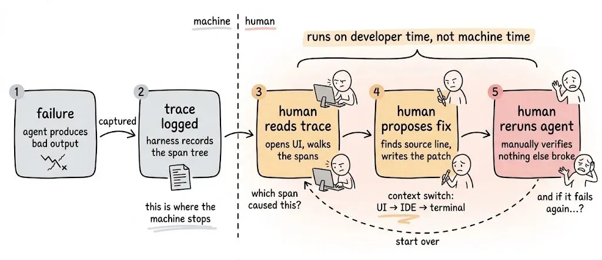
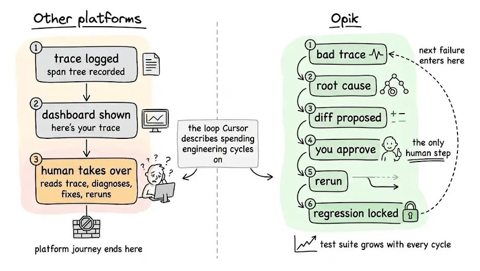
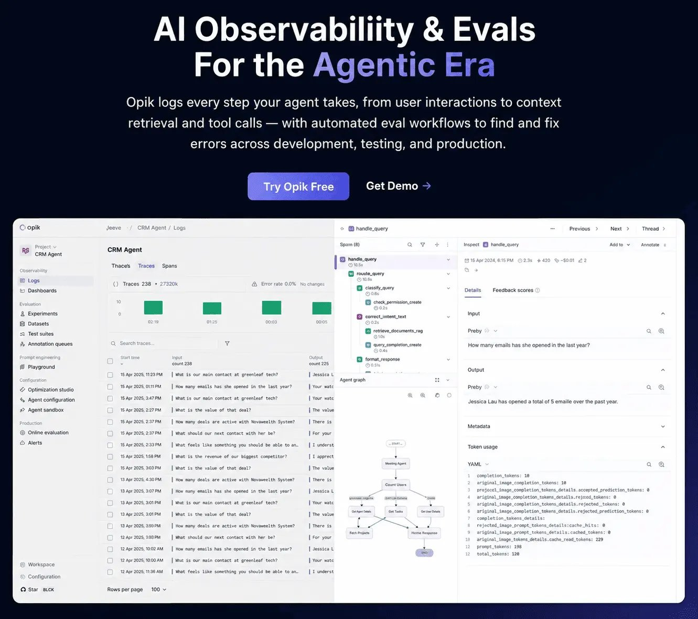
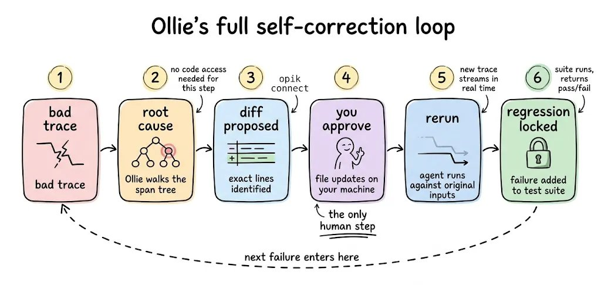
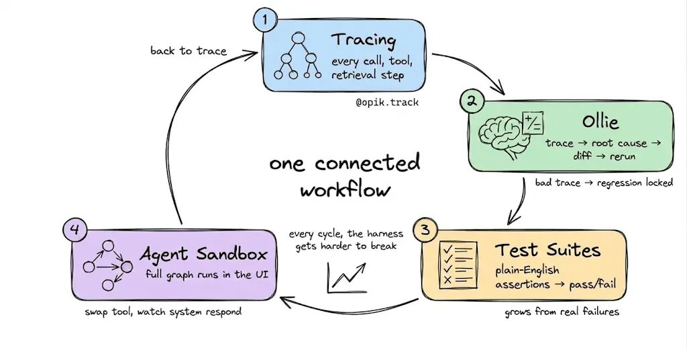
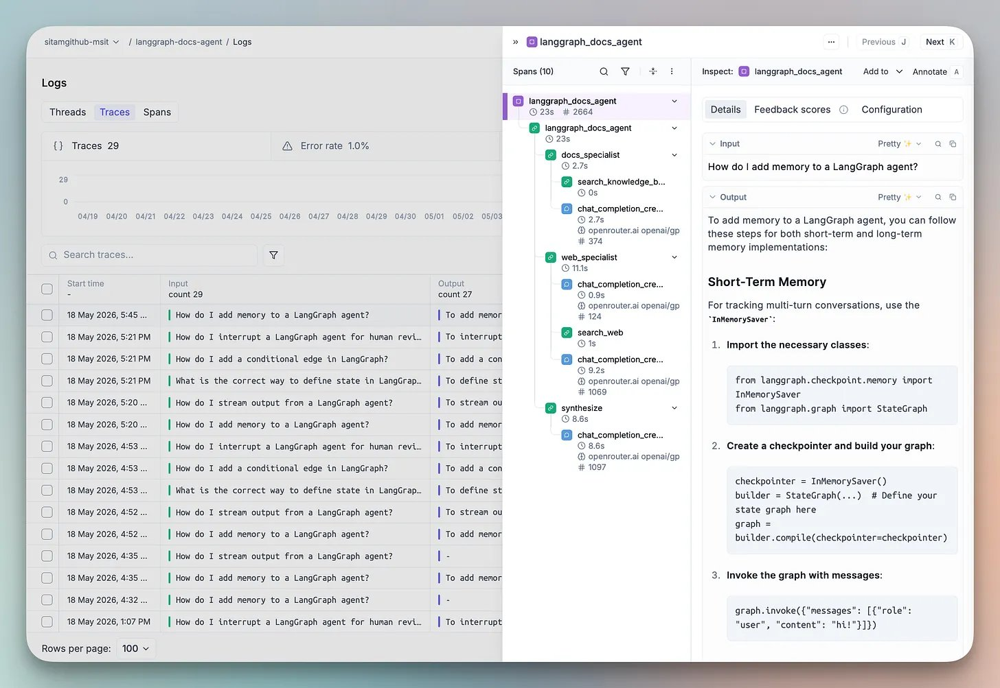
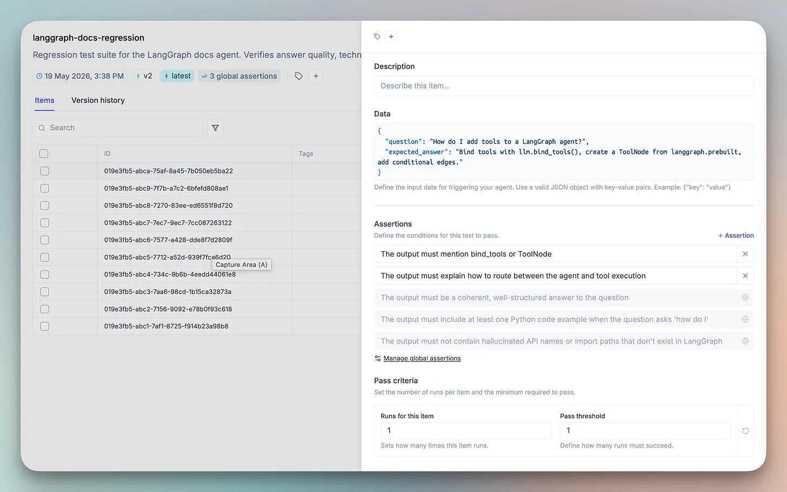
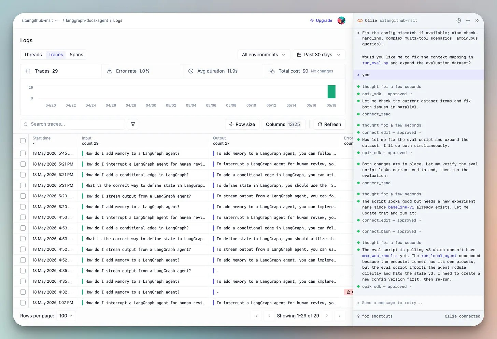
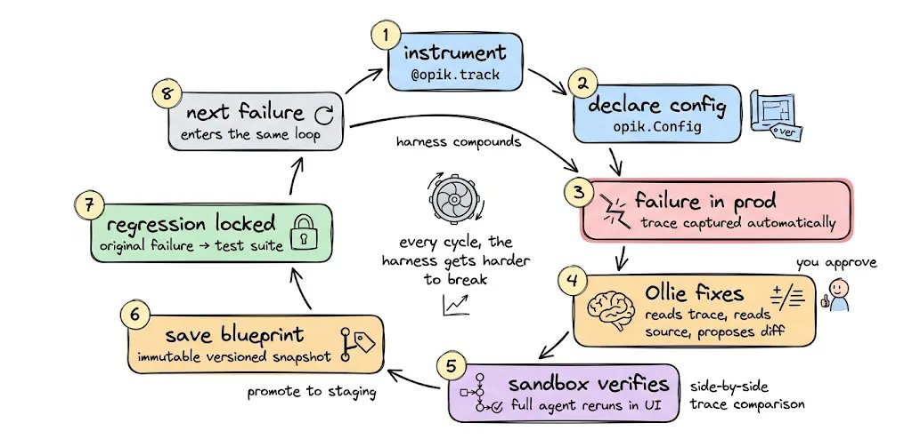

当 Agent 在生产中失败，你的可观测性工具会精确列出它做了什么——但对如何修复几乎只字不提。你能拿到一份干净的 trace：每一次模型调用和工具触发、每一步耗时、以及 token 成本。但你得不到的是：为什么坏了、改动什么能修好、或者下周同一件事不会再发生的任何承诺。

所以你只能逐 span 翻阅 trace，拼凑出问题的理论，手动写一个 patch，然后祈祷它不会把原来跑得好好的功能搞崩。等到新模型发布，带来一批全新的失败模式，你又得从头跑一遍完整的手动循环。

真正的瓶颈不是你的可观测性。是 trace 落屏之后**所有需要发生的事情**。



虚线左边的一切自动运行。虚线右边的一切靠你的时间——这才是生产调试真正所在的地方。

Cursor 最近分享了他们的 Agent 的 Harness 层花了多少工程精力——围绕原始模型包装的提示词、工具和检查层。同一个模型配上更好的 Harness，效果天差地别，而且这项工作永远做不完。

这正是每一个可观测性平台把你留下的位置：它回答「发生了什么」，然后把「为什么发生」「改什么」「怎么防止再次发生」全部交还给你。

这个缺口是今天大多数团队被困住的循环。以下是它为什么持续张着，以及最终需要什么才能关上。

## 为什么现有可观测性在大规模下失效

大多数 Agent 可观测性平台交付一条 trace 就停了。

你拿到一棵 span 树、延迟数字、token 成本、一个仪表盘。你没有的是：为什么失败、修什么、或者不再发生的任何保证。

- 「发生了什么」→ 平台处理
- 「为什么发生」→ 手动
- 「这是修复方案」→ 手动
- 「这不会再次发生」→ 手动

这在 2023 年是合理的产品。对于今天在生产中运行 Agent 的团队，它是错误抽象。

问题不断自我加速。每一次模型升级都引入新的失败模式。每一个新工具都增加新的边缘情况。Harness 变得越来越复杂，比任何团队手动追踪和修复的速度都快。

以下是做到这一点的技术栈。



大多数平台停在仪表盘，剩下的交给你。右侧是 Opik 自己运行的循环。

## Opik：Agent 时代的 AI 可观测性与评测

Opik 是一个开源的 AI Agent 和 LLM 应用的日志、调试和优化平台。它的核心设计前提是：这个循环应该自动化，而不是靠人来填补。

### 四层技术栈

Opik 的架构是一个连接起来的工作流：

**Trace → Ollie 诊断 → Ollie 提出修复 → 修复应用并验证 → Test Suite 锁定失败为回归测试 → 回到 Trace**

这四个层不是独立功能。它们在一个自动关闭的循环中互相供能。

#### 第 1 层：Tracing

每一次 LLM 调用、工具调用和检索步骤都用单个装饰器自动插桩：

```python
import opik

@opik.track
def my_agent(query: str):
    # your agent logic here
    ...
```

开箱即用支持 LangGraph、CrewAI 和 50+ 框架。每条 trace 记录了激活的 Agent 配置，确保后续重现时能完整复现。

#### 第 2 层：Ollie

其他所有可观测性平台停在你看到 trace 的地方。Opik 从 trace 走到修复代码——靠的是 Ollie。

Ollie 是一个内置于 Opik 的编码 Agent。一个 Agent，完整上下文。





Ollie 不需要代码访问就可以读取 span 树、识别失败模式、解释跨多次 LLM 调用的因果链。问它「为什么最终答案忽略了检索到的上下文？」它走完整棵 span 树，定位根本原因。

从项目根目录运行 `opik connect`，Ollie 升级为完整代码修复模式：

- 读取你的源文件
- 定位出问题的具体行
- 提出 diff；不经你的明确批准不改变任何东西
- 你批准后，Ollie 会针对原始失败 trace 中的输入重新运行你的 Agent，流式输出新 trace 供并排对比，并将原始失败案例锁定到测试套件中

**Bad trace → root cause → diff → approve → rerun → regression locked**



从坏 trace 到锁定回归测试的完整路径，你批准是唯一的一个人工步骤。

#### 第 3 层：Test Suites

大多数 eval 工作流：构建一个标注数据集，定义一个数值指标，比较浮点数。这个模式对研究者有用。它不符合工程师看待质量的方式。

Opik 用纯英文断言替代它：

```python
suite = opik.TestSuite("crm-agent-v2")
suite.add_assertion("The response must include specific deal details, not just a count")
suite.add_assertion("The response must never reveal unauthorized information")
suite.run_tests()
```

Opik 在底层将这些转换为 LLM-as-a-judge 检查。每个测试用例干净地 pass/fail。





改变工作流的部分：**每一个你调试的失败 trace 自动成为新的测试用例**。套件从真实生产故障中增长，而不是某人提前写的合成场景。

每一轮循环，Harness 都更难被打破。

但即使测试套件不断增长，你仍然需要一个安全的地方在发布前测试改动。这就是第 4 层做的事。

#### 第 4 层：Agent Sandbox

大多数 playground 是 prompt playground。你改一条 system prompt，重新运行一次 LLM 调用。这回答的是错误的问题。

生产中的问题是：**当我改变这个时，整个 Agent 图会发生什么？**

Opik 的 Agent Sandbox 在 UI 内端到端运行完整的插桩 Agent。改一条 prompt、换一个模型、加一个工具，然后观察整个系统在完整 span 树上的响应。每一次沙箱运行都产生一条完整的 Opik trace。

非开发者利益相关者——PM、领域专家、QA——可以安全地测试配置，而无需碰 git。

### 飞轮的实际运转

这些层不是独立功能。它们是一个循环。

用 `@opik.track` 插桩。声明 `opik.Config`。生产中出错了。Ollie 读取 trace，读取你的源码，提出修复。你批准。Ollie 在 Sandbox 中针对原始失败输入重新运行 Agent。修复通过。保存为新的 Blueprint。环境指针推到 staging。原始失败被锁定为回归测试。





下一个失败进入同一个循环。

**每一轮循环，Harness 都更难被打破。**

### 关闭循环

停在 trace 的可观测性在 Agent 简单时是有意义的。一旦它们进入生产，真正的工作是 trace 之后的一切——而那是 Opik 替你运行的部分，而不是放在你的盘子上。

整个技术栈开源，包括 Tracing、Ollie、Test Suites、Agent Sandbox、一个包含 6 种算法的 Agent Optimizer，以及 50+ 框架集成，项目在 GitHub 上已超过 19,300 星。

三行命令自托管：

```bash
git clone https://github.com/comet-ml/opik
cd opik
./opik.sh
```

Cursor 描述的那个人工循环，正是 Opik 自己关闭的那个——从一条坏 trace 一直到锁定回归测试。

如果你在生产中运行 Agent，值得一看。

---

**一点观察**

这是一篇典型的「作者亲历视角 + 产品定位」文章。@akshay_pachaar 用 Cursor 的 Harness 工程代价作为引子——这是一个聪明的叙事策略，因为 Cursor 在开发者社区有很高的可信度，用它做类比锚点能让读者对「失败 trace 需要多少人工修复」产生直觉。

值得指出几个结构性问题。第一，类比精度：Opik 说的「自动修复」本质上是通过 Ollie 这个编码 Agent 读你的源码、定位问题、提议 diff——这本身就是一个 Agent，它自己的失败模式怎么办？如果 Ollie 建议了一个不正确的修复，谁来修 Ollie？工具层自身引入的复杂度没有被讨论。第二，Test Suite 的断言写了「不要泄露未经授权的信息」，这在 demo 里简洁有力，但生产级 eval 的挑战从来不在「写断言」而在「怎么知道你漏掉了哪些断言」。实战中大多数灾难都不是你已经想到的检查没通过，而是你没想到需要检查的东西。第三，文章的许多技术细节放在 2023 年会很惊艳，但在 2026 年，这类的 Agent 可观测性方案（trace → 修复 → 自动回归）已经逐渐成为行业标配而非差异化能力。不过，Opik 完成度很高，开源社区活跃（19K+ stars），单靠这一点，就值得在生产中跑 Agent 的团队认真看一眼。

---

<span style="font-size:12px;color:#888888;">参考：Your Agent Harness Should Repair Itself</span>
